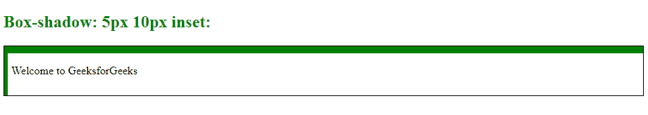
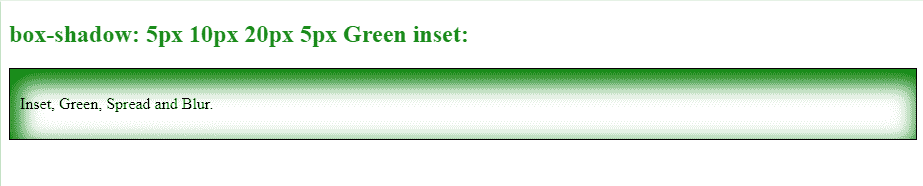

# 如何使用 CSS 设置嵌入阴影？

> 原文: [https://www.geeksforgeeks.org/how-set-the-inset-shadow-using-css/](https://www.geeksforgeeks.org/how-set-the-inset-shadow-using-css/)

## 介绍

在 CSS 中，`box-shadow` 属性在元素的框架周围添加阴影效果。我们可以在用逗号分隔的元素周围设置多个效果。一个 `box-shadow` 被定义为元素的 X 和 Y 相对偏移值，模糊和扩散半径，以及颜色。

在本文中，我们将学习如何使用 CSS 设置嵌入阴影。`inset` 属性将外部阴影更改为内部阴影。

**注意：** 默认情况下，阴影在框外生成，但是通过使用 `inset` 我们可以在框内创建阴影。

## 语法

**语法：**

> `box-shadow: h-offset v-offset blur spread color | inset;`

## 方法

要给元素添加 `inset` 阴影，我们将使用 `box-shadow` 属性。在 `box-shadow` 属性中，我们将定义 `h-offset` 值（对于水平阴影效果是强制的），然后是 `v-offset` 值（对于垂直阴影效果是强制的）。

我们也可以给出 `blur` 效果，并使用模糊和扩散值来扩散阴影。最后，我们将使用 `inset` 关键字来改变帧内的阴影。

## 示例

### 示例 1

**例 1:**

**HTML**

```html
<!DOCTYPE html>
<html>

<head>
    <style>
        #GFG {
            /* For providing border to the element */
            border: 1px solid;
            /* For Padding */
            padding: 10px;
            /* Defining box-shadow property inset */
            box-shadow: 5px 10px green inset;
        }

        h2 {
            color: green;
        }
    </style>
</head>

<body>

    <h2>Box-shadow: 5px 10px inset:</h2>
    <div id="GFG">
        <p>Welcome to GeeksforGeeks</p>
    </div>
</body>

</html>
```

**输出:**



**说明：** 在上例中，我们已经将 `h-offset` 值设置为 `5px`，`v-offset` 值设置为 `10px`，颜色设置为 `green`。

### 示例 2

**例 2:**

**HTML**

```html
<!DOCTYPE html>
<html>

<head>
    <style>
        #GFG {
            /* For providing border to the element */
            border: 1px solid;
            /* For Padding */
            padding: 10px;
            /* Defining box-shadow property as inset */
            box-shadow: 5px 10px 20px 5px Green inset;
        }

        h2 {
            color: green;
        }
    </style>
</head>

<body>

    <h2>box-shadow: 5px 10px 20px 5px Green inset:</h2>
    <div id="GFG">
        <p>Inset, Green, Spread and Blur.</p>
    </div>

</body>

</html>
```

**输出:**



**说明：** 在上例中，我们已经将 `h-offset` 值设置为 `5px`，`v-offset` 值设置为 `10px`，模糊值设置为 `20px`，扩散值设置为 `5px`，颜色设置为 `green`。

## 浏览器支持

<figure class="table">

|  |
| --- |

</figure>