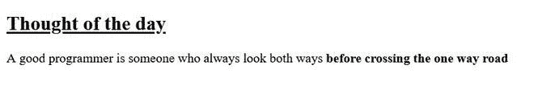

# 如何用CSS加粗文字？

> 原文：[https://www.geeksforgeeks.org/how-to-bold-the-text-using-css/](https://www.geeksforgeeks.org/how-to-bold-the-text-using-css/)

我们知道，在HTML中，我们有 [`<b>`](https://www.geeksforgeeks.org/html-b-tag/) 和 [`<strong>`](https://www.geeksforgeeks.org/html-strong-tag/) 标签来使内容加粗。当使用CSS将一段文本加粗时，我们也有一个适当的属性来做同样的事情。

我们将使用CSS的 [`font-weight`](https://www.geeksforgeeks.org/css-font-weight-property/) 属性来使内容加粗。我们有多种选项来设置文本的粗细程度。

*   **normal:** 是正常的字体粗细。它与 `400` 相同，`400` 是 `bold` 的默认数值。
*   **bold:** 它是加粗的字体粗细。和 `700` 一样。
*   **bolder:** 设置字体粗细比父元素加粗。
*   **lighter:** 设置字体粗细比父元素更轻。
*   **\<number\>:** 一个 `<number>` 值介于 `1` 和 `1000` 之间，含 `1` 和 `1000`（按加粗程度递增顺序）。

当指定 `lighter` 或 `bolder` 时，下图显示了如何确定元素的绝对字体粗细。

| **父元素值 (parent value)** | **更细 (Light)** | **更粗 (Thick)** |
| :--- | :--- | :--- |
| `100` | `100` | `400` |
| `200` | `100` | `400` |
| `300` | `100` | `400` |
| `400` | `100` | `700` |
| `500` | `100` | `700` |
| `600` | `400` | `700` |
| `700` | `400` | `900` |
| `800` | `700` | `900` |
| `900` | `700` | `900` |

## 示例1

以下示例演示了一个简单的文本，该文本使用CSS `font-weight` 属性以粗体表示。

```html
<!DOCTYPE html>
<html>
    <head>
        <style type="text/css">
            h2 {
                font-weight: 700;
                color: green;
            }
            .text {
                font-weight: bold;
            }
        </style>
    </head>
    <body>
        <h2>
          Welcome To Geeks for Geeks
        </h2>
        <p class="text">
          A Computer Science portal for geeks
        </p>
    </body>
</html>
```

**输出：**


## 示例2

以下示例演示了几个使用其他字体粗细属性表示的简单文本。

```html
<!DOCTYPE html>
<html>
    <body>
        <h2 style="font-weight: bold;
                   text-decoration: underline;">
            Thought of the day
        </h2>
        <p style="font-weight: lighter;">
          A good programmer is someone who
          always look both ways
          <span style="font-weight: 900;">
            before crossing the one way road.
          </span>
        </p>
    </body>
</html>
```

**输出：**



## 支持的浏览器

*   Google Chrome 2.0
*   Internet Explorer 4.0
*   Firefox 1.0
*   Opera 3.5
*   Safari 1.3