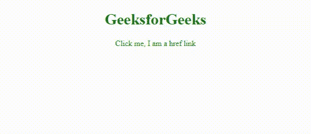
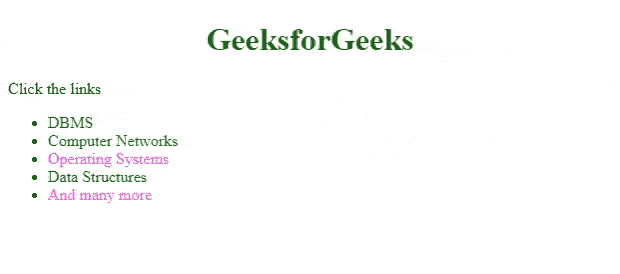
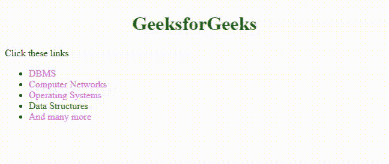

# 如何在 CSS 中改变链接颜色？

> 原文: [https://www.geeksforgeeks.org/how-to-change-link-color-in-css/](https://www.geeksforgeeks.org/how-to-change-link-color-in-css/)

在 `HTML` 中，通过使用锚点标签 `<a>` 将超链接添加到网页中。它创建从当前网页导航到另一个网页的链接。

默认的超文本链接是蓝色的，当鼠标悬停时，它们会有一条下划线。当链接被访问时，它变成紫色。这些默认属性可以更改，并且可以使用不同的 `CSS 属性` 进行自定义。

`示例 1:` 使用 CSS 选择器创建 HTML 链接的基本定制。

## 示例 1：基本链接样式

```html
<!DOCTYPE html>
<html lang="en">

<head>
    <!--Meta data-->
    <meta charset="UTF-8">
    <meta http-equiv="X-UA-Compatible" content="IE=edge">
    <meta name="viewport" 
          content="width=device-width, initial-scale=1.0">

    <style>        
        h1 {
            color: #006600;
            text-align: center;
        }
        a{
            color:#006600;
            text-decoration: none;
        }        
    </style>
</head>

<body>
    <center>
    <h1>GeeksforGeeks</h1>
    <a href = "https://practice.geeksforgeeks.org/home/"> 
      Click me, I am a href link
    </a>
    </center>    
</body>
</html>
```

**输出:**



可以根据状态进一步定制链接。

链接基本上有 4 个状态。

*   未访问 (`a:link`)
*   悬停 (`a:hover`)
*   已访问 (`a:visited`)
*   激活 (`a:active`)

`示例 2:` 我们可以根据链接状态的变化给链接赋予不同的颜色。

## 示例 2：基于链接状态的样式

```html
<!DOCTYPE html>
<html lang="en">

<head>
    <!--Meta data-->
    <meta charset="UTF-8">
    <meta http-equiv="X-UA-Compatible" content="IE=edge">
    <meta name="viewport" 
          content="width=device-width, initial-scale=1.0">

    <style>
        h1 {
            color: #006600;
            text-align: center;
        }

        /* If the link is unvisited you see this color*/
        a:link {
            color: #006600;
            text-decoration: none;
        }

        /* If the link is visited you see this color*/
        a:visited {
            color: rgb(255, 105, 223);
        }

        /* On placing mouse over the link */
        a:hover {
            color: rgb(128, 105, 255);
            text-decoration: underline;
        }

        /* If the click the link,  you see this color*/
        a:active {
            color: rgb(255, 105, 138);
        }
    </style>
</head>

<body>
    <h1>GeeksforGeeks</h1>
    <p>Click the links</p>

    <ul>
        <li><a href="https://www.geeksforgeeks.org/dbms/?ref=ghm">
           DBMS
        </a>
        </li>
        <li><a href="https://www.geeksforgeeks.org/computer-network-tutorials/?ref=ghm">
          Computer Networks</a>
        </li>
        <li> <a href="https://www.geeksforgeeks.org/operating-systems/?ref=ghm">
          Operating Systems</a>
        </li>
        <li><a href="https://www.geeksforgeeks.org/data-structures/?ref=ghm">
          Data Structures</a>
        </li>
        <li><a href="https://www.geeksforgeeks.org/"> 
           And many more</a>
        </li>
    </ul>
</body>

</html>
```

**输出:** 未访问和访问的链接颜色不同。将鼠标放在第二个链接上，我们会看到链接的颜色和样式发生了变化。放置 `a:hover` 的顺序必须在 `a:link` 和 `a:visited` 之后。样式 `a:active` 应该在 `a:hover` 之后。



`示例 3:` 通过应用不同的 CSS 属性，如 `background-color`、`font-size`、`font-style`、`text-decoration` 等，可以进一步设置链接的样式。

## 示例 3：高级链接样式

```html
<!DOCTYPE html>
<html lang="en">

<head>
    <!--Meta data-->
    <meta charset="UTF-8">
    <meta http-equiv="X-UA-Compatible" content="IE=edge">
    <meta name="viewport" 
          content="width=device-width, initial-scale=1.0">

    <style>
        h1 {
            color: #006600;
            text-align: center;
        }

        a:link {
            color: #006600;
            text-decoration: none;
        }
        a:visited {
            color: rgb(255, 105, 223);
        }
        a:hover {
            color: white;
            text-decoration: underline;
            font-size: larger;
            font-style: italic;
            background-color:#006600;
        }
        a:active {
            color: rgb(255, 105, 138);
        }
    </style>
</head>

<body>
    <h1>GeeksforGeeks</h1>
    <p> Click these links</p>

    <ul>
        <li><a href="https://www.geeksforgeeks.org/dbms/?ref=ghm">
          DBMS</a>
        </li>
        <li><a href="https://www.geeksforgeeks.org/computer-network-tutorials/?ref=ghm">
          Computer Networks</a>
        </li>
        <li> <a href="https://www.geeksforgeeks.org/operating-systems/?ref=ghm">
          Operating Systems</a>
        </li>
        <li><a href="https://www.geeksforgeeks.org/data-structures/?ref=ghm">
          Data Structures</a>
        </li>
        <li><a href="https://www.geeksforgeeks.org/">And many more</a> 
        </li>
    </ul>
</body>

</html>
```

**输出:**

