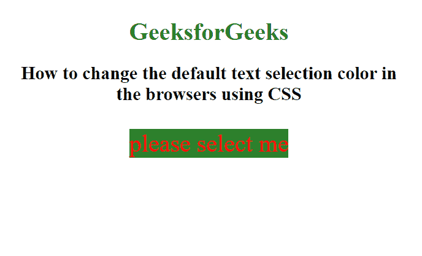

# 如何在使用 CSS 的浏览器中更改文本选择颜色？

> 原文：[https://www.geeksforgeeks.org/how-to-change-text-selection-color-in-the-browsers-using-css/](https://www.geeksforgeeks.org/how-to-change-text-selection-color-in-the-browsers-using-css/)

默认情况下，大多数浏览器以蓝色背景突出显示所选文本。这可以通过使用 CSS 中的 `::selection` 伪选择器来改变。

`::selection` 选择器用于将 CSS 属性设置到用户选择的文档部分（如在文本上点击和拖动鼠标）。该选择器仅支持某些 CSS 属性。这些是 `color`、`background`、`cursor` 和 `outline`。

**语法：**

```css
::selection {
    /* Supported CSS Properties */
}
```

**示例：**

## HTML 代码

```html
<!DOCTYPE html>
<html>
<head>
    <style>
        ::selection {
            color: red;
            background: violet;
        }
    </style>
</head>
<body>
    <center>
        <h1>GeeksForGeeks</h1>
        <h2>
            How to change the default text
            selection color in the browsers
            using CSS
        </h2>
        <p> please select me </p>
    </center>
</body>
</html>
```

**输出：**



**支持的浏览器：** 以下列出了 `::selection` 选择器支持的浏览器：

*   Apple Safari 3.1
*   Google Chrome 4.0
*   Firefox 2.0 `-moz-` 及 62.0
*   Opera 10.1
*   Internet Explorer 9.0