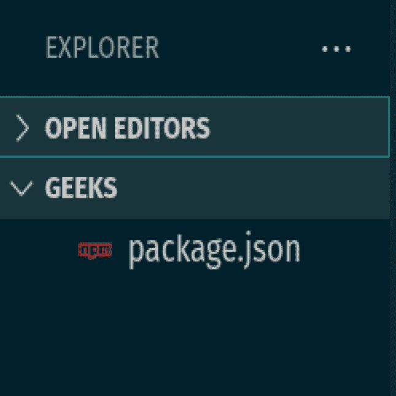
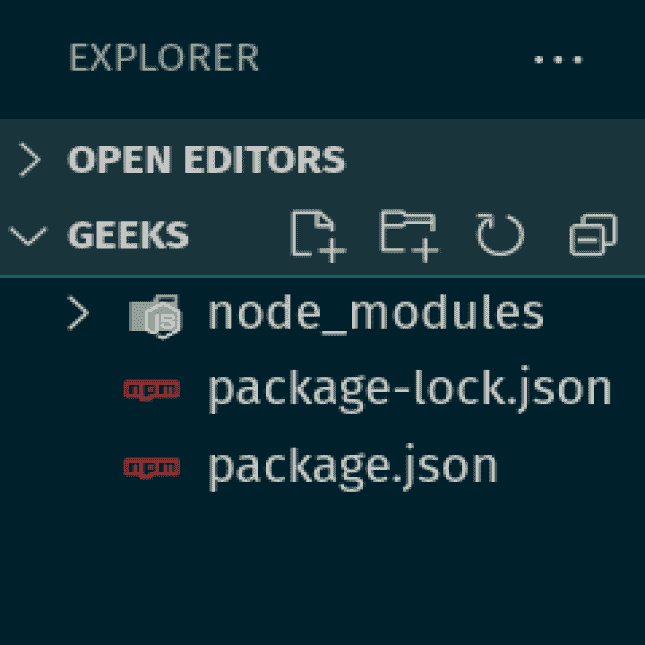
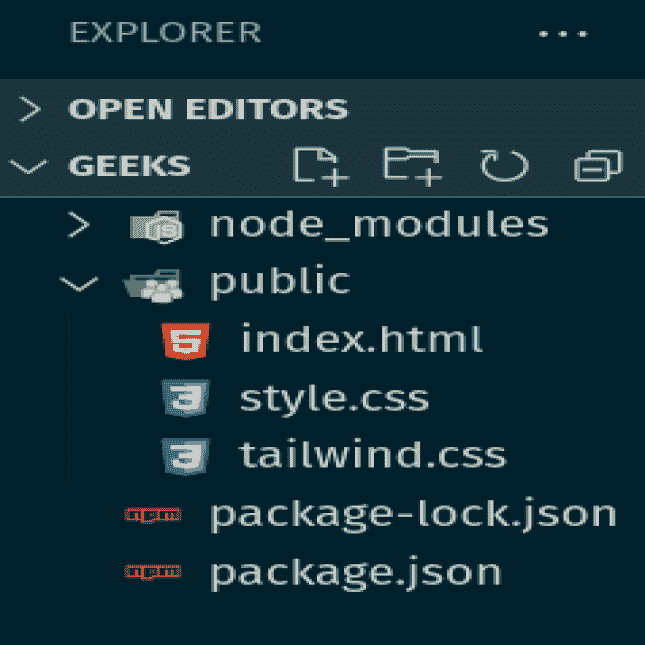
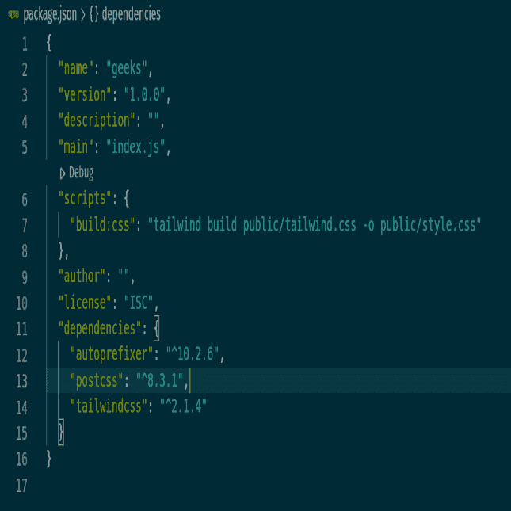
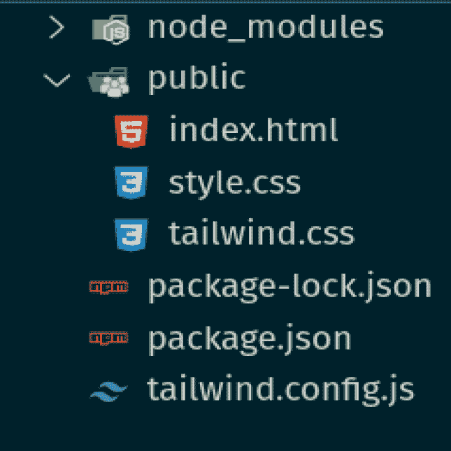
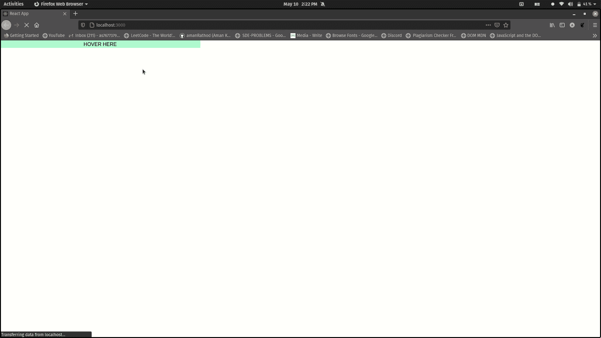
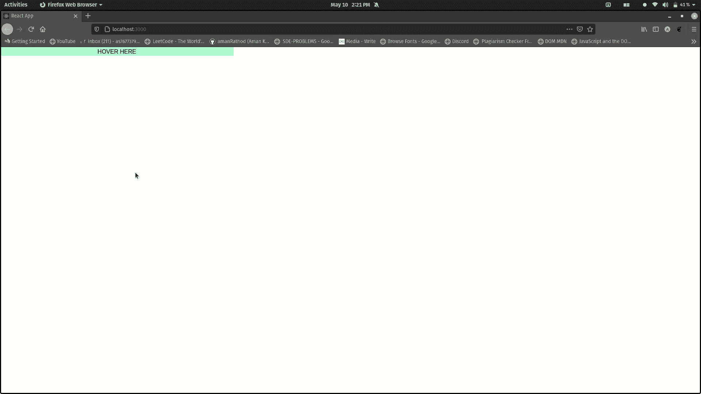

# 如何使用 Tailwind CSS 改变悬停时的宽度？

> 原文：[https://www.geeksforgeeks.org/how-to-change-the-width-on-hover-using-tailwind-css/](https://www.geeksforgeeks.org/how-to-change-the-width-on-hover-using-tailwind-css/)

在本文中，我们将使用 Tailwind 改变**悬停**时的宽度。Tailwind 中没有内置的方法，所以需要自定义 `tailwind.config.js` 文件。让我们在本文中进一步讨论整个过程。

默认情况下，Tailwind CSS 只为宽度实用程序生成响应变量。要修改悬停时的宽度，需要修改 `tailwind.config.js` 文件。下面的步骤是在项目文件夹中添加 `tailwind.config.js` 文件，以便在悬停时改变宽度。

首先你要[安装 Tailwind CSS](https://www.geeksforgeeks.org/css-tailwind-introduction/)。下面给出了安装 Tailwind CSS 的步骤。

**先决条件：** 按照以下步骤将自己的效用类添加到 Tailwind 中。

**步骤 1：** 运行下面的代码到你的文件夹的终端。这将创建 `package.json` 文件。

```bash
npm init
```



**步骤 2：** 将下面的代码复制粘贴到你文件夹的终端。这将为 Tailwind 创建所需的节点模块。

```bash
npm install tailwindcss@latest postcss@latest autoprefixer@latest
```



**步骤 3：** 创建一个公共文件夹，在公共文件夹内添加 `index.html`、`style.css`、`tailwind.css`。



**步骤 4：** 在 `tailwind.css` 文件中添加以下代码。使用这个文件，您可以自定义您的 Tailwind CSS 以及默认样式。Tailwind 将在构建时用所有的样式替换这些指令。它根据您配置的设计系统生成。

```css
@tailwind base;
@tailwind components;
@tailwind utilities;
```

**步骤 5：** 打开 `package.json` 文件，在脚本标签下添加下面的代码。

```json
"scripts": {
   "build:css": "tailwind build public/tailwind.css -o public/style.css"
 },
```



**步骤 6：** 在终端运行下面的代码。这将使用预定义的 Tailwind CSS 代码填充您的 `style.css` 文件。

```bash
npm run build:css
```

**步骤 7：** 最后，运行下面的代码。这将为您的项目生成一个 Tailwind 配置文件，使用当您安装 Tailwind CSS npm 包时包含的 Tailwind 命令行工具。

```bash
npx tailwindcss init
```



**语法：**

```javascript
variants: {
    width: ["responsive", "hover", "focus"]
}
```

**`tailwind.config.js`：** 以下代码是 Tailwind 配置文件的内容。我们只想扩展配置来添加新的值。

```javascript
module.exports = {
    purge: [],
    darkMode: false, // or 'media' or 'class'
    theme: {
        extend: {},
    },

    variants: {
        width: ["responsive", "hover", "focus"]
    },

    plugins: [],
}
```

**示例 1：**

```html
<!DOCTYPE html>
<html class="dark">

<head>
    <link href=
"https://unpkg.com/tailwindcss@^1.0/dist/tailwind.min.css"
        rel="stylesheet">
</head>

<body>
    <div class=" w-1/3 hover:w-4/5 bg-green-200 ">
        <div>HOVER HERE</div>
    </div>
</body>

</html>
```

输出：



**示例 2：** 再次悬停时，要更改高度和宽度，您必须在 `tailwind.config.js` 上添加或修改以下代码。

```javascript
variants: {
    width: ["responsive", "hover", "focus"],
    height: ["responsive", "hover", "focus"]
},
```

```html
<!DOCTYPE html>
<html class="dark">

<head>
    <link href=
"https://unpkg.com/tailwindcss@^1.0/dist/tailwind.min.css"
        rel="stylesheet">
</head>

<body>
    <div class=" w-1/3 hover:w-4/5 
        hover:h-20 bg-green-200 text-center">
        <div>HOVER HERE</div>
    </div>
</body>

</html>
```

**输出：**

