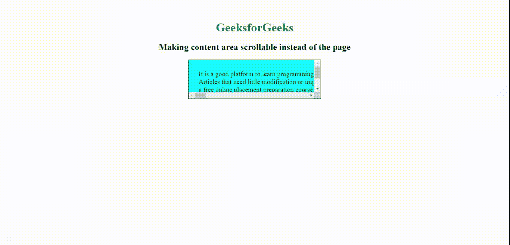

# 如何使用 CSS 创建可滚动的内容区域而不是页面？

> 原文: [https://www.geeksforgeeks.org/how-to-create-content-area-scrollable-instead-of-the-page-using-css/](https://www.geeksforgeeks.org/how-to-create-content-area-scrollable-instead-of-the-page-using-css/)

通过使用 CSS `overflow` 属性，使特定内容区域可滚动。下面列出了 `overflow` 属性的不同值。

*   **可见:** 该属性表示可以在块框外进行渲染，并且不进行裁剪。
*   **隐藏:** 该属性表示 `overflow` 被截断。其余内容将是不可见的。
*   **自动:** 如果溢出被剪切，则自动为其余内容添加滚动条。
*   **滚动:** 该属性指示如果滚动条被剪切，则添加滚动条以查看其余内容。
*   **初始值:** 该属性设置为默认值。
*   **inherit:** 该属性从其父元素继承属性。

我们可以通过将 `body` 的 `overflow` 属性设置为 `hidden` 来禁用页面滚动。在这两个例子中，我们将使用这个属性来禁用页面滚动。

## 示例 1

在本例中，我们使用 `overflow: scroll` 属性使 `div` 可垂直和水平滚动。

### HTML 代码示例

```html
<!DOCTYPE html>
<html>

<head>
    <meta charset="utf-8">
    <meta name="viewport" content="width=device-width, initial-scale=1">
</head>

<style>
    body {
        /* disabling body scrolling */
        overflow: hidden;
        margin: auto;
        background: white;
        margin-top: 4%;
        text-align: center;
    }

    h1 {
        color: Green;
    }

    .scroll {
        /* enable div scrolling */
        overflow: scroll;
        height: 8%;
        background-color: aqua;
        border: 1px black solid;
        padding: 2%;
        width: 300px;
        margin: 0 auto;
        white-space: nowrap;
        font-size: large;
    }
</style>

<body>
    <h1>GeeksforGeeks</h1>
    <h2>Making content area scrollable instead of the page</h2>
    <div class="scroll">
        It is a good platform to learn programming. It is an educational website. Prepare for the Recruitment drive of product based companies like Microsoft, Amazon, Adobe etc with a free online placement preparation course. The course focuses on various MCQ & Coding question likely to be asked in the interviews & make your upcoming placement season efficient and successful. Also, any geeks can help other geeks by writing articles on the GeeksforGeeks, publishing articles follow few steps that are<br> Articles that need little modification or improvement from reviewers are published first. To quickly get your articles reviewed, please refer existing articles, their formatting style, coding style, and try to make you are close to them. In case you are a beginner, you may refer Guidelines to write an Article. It is a good platform to learn programming. It is an educational website. Prepare for the Recruitment drive of product based companies like Microsoft, Amazon, Adobe etc with<br> a free online placement preparation course. The course focuses on various MCQ's & Coding question likely to be asked in the interviews & make your upcoming placement season efficient and successful. Also, any geeks can help other geeks by<br> writing articles on the GeeksforGeeks, publishing articles follow few steps that are Articles that need little modification or improvement from reviewers are published first. To quickly get your articles reviewed, please refer existing articles, their formatting style, coding style, and try to make you are close to them. In case you are a beginner, you may refer Guidelines to write an Article.
    </div>
</body>

</html>
```

**输出:**


## 示例 2

在本例中，使用 `overflow: auto;` 使 `div` 可垂直和水平滚动。

### HTML 代码示例

```html
<!DOCTYPE html>
<html>

<head>
    <meta charset="utf-8">
    <meta name="viewport" content="width=device-width, initial-scale=1">
    <style>
        body {
            /* disabling body scrolling */
            overflow: hidden;
            margin: auto;
            background: white;
            margin-top: 4%;
            text-align: center;
        }

        h1 {
            color: Green;
        }

        .scroll {
            /* enable div scrolling */
            overflow: auto;
            height: 8%;
            background-color: aqua;
            border: 1px black solid;
            padding: 2%;
            width: 300px;
            margin: 0 auto;
            white-space: nowrap;
            font-size: large;
        }
    </style>
</head>

<body>
    <h1>GeeksforGeeks</h1>
    <h2>Making content area scrollable instead of the page</h2>
    <div class="scroll">
        It is a good platform to learn programming. It is an educational website. Prepare for the Recruitment drive of product based companies like Microsoft, Amazon, Adobe etc with a free online placement preparation course. The course focuses on various MCQ & Coding question likely to be asked in the interviews & make your upcoming placement season efficient and successful. Also, any geeks can help other geeks by writing articles on the GeeksforGeeks, publishing articles follow few steps that are<br> Articles that need little modification or improvement from reviewers are published first. To quickly get your articles reviewed, please refer existing articles, their formatting style, coding style, and try to make you are close to them. In case you are a beginner, you may refer Guidelines to write an Article. It is a good platform to learn programming. It is an educational website. Prepare for the Recruitment drive of product based companies like Microsoft, Amazon, Adobe etc with<br> a free online placement preparation course. The course focuses on various MCQ's & Coding question likely to be asked in the interviews & make your upcoming placement season efficient and successful. Also, any geeks can help other geeks by<br> writing articles on the GeeksforGeeks, publishing articles follow few steps that are Articles that need little modification or improvement from reviewers are published first. To quickly get your articles reviewed, please refer existing articles, their formatting style, coding style, and try to make you are close to them. In case you are a beginner, you may refer Guidelines to write an Article.
    </div>
</body>

</html>
```

**输出:**


**注意:** 通过将 `overflow-y` 设置为 `scroll` 和 `auto`，并将 `overflow-x` 设置为 `hidden`，可以只启用垂直滚动。同样对于水平滚动，将 `overflow-x` 设置为 `scroll` 或 `auto`，并将 `overflow-y` 设置为 `hidden`。

## 示例 3

该示例仅用于内容区域的垂直滚动。

### HTML 代码示例

```html
<!DOCTYPE html>
<html>

<head>
    <meta charset="utf-8">
    <meta name="viewport" content="width=device-width, initial-scale=1">
    <style>
        body {
            overflow: hidden;
            margin: auto;
            background: white;
            margin-top: 4%;
            text-align: center;
        }

        h1 {
            color: Green;
        }

        .scroll {
            overflow-y: auto;
            overflow-x: hidden;
            height: 50%;
            background-color: aqua;
            border: 1px black solid;
            padding: 2%;
            width: 500px;
            margin: 0 auto;
            font-size: large;
        }
    </style>
</head>

<body>
    <h1>GeeksforGeeks</h1>
    <h2>Making content area scrollable instead of the page</h2>
```

# GeeksforGeeks平台介绍

这是一个学习编程的优秀平台。它是一个教育网站，提供免费的在线求职准备课程，帮助你准备微软、亚马逊、Adobe等产品公司的招聘。该课程侧重于面试中可能遇到的各种选择题和编程问题，让你的求职季更高效、更成功。

此外，任何用户都可以通过在GeeksforGeeks上撰写文章来帮助其他用户。发布文章需遵循几个步骤：

需要审阅者稍作修改或改进的文章会优先发布。为了让你的文章快速通过审阅，请参考现有文章的格式和编码风格，并尽量使你的文章与之接近。如果你是初学者，可以参考《如何撰写一篇文章》指南。