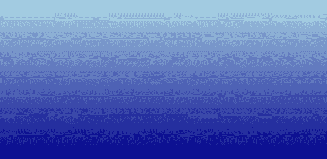
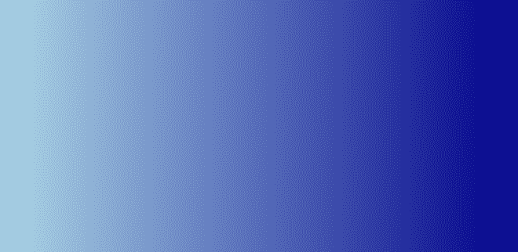
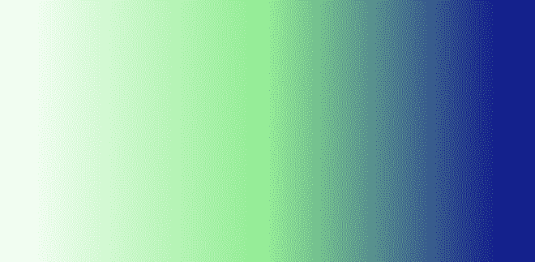
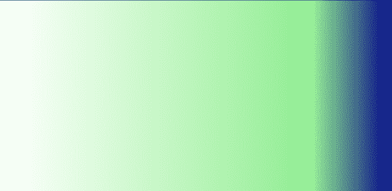

# 如何使用 CSS 创建线性渐变背景？

> 原文: [https://www.geeksforgeeks.org/how-to-create-linear-gradient-background-using-css/](https://www.geeksforgeeks.org/how-to-create-linear-gradient-background-using-css/)

在 `CSS` 中，我们可以使用 [`background-color`](https://www.geeksforgeeks.org/css-background-color-property/) 属性将元素的背景色设置为特定的颜色。有时候我们想在使用 [`linear-gradient()`](https://www.geeksforgeeks.org/css-linear-gradient-function/) 函数设置背景色的时候给元素增加更多的样式。CSS `linear-gradient()` 函数允许您显示两种或多种颜色之间的平滑过渡。

## 语法

```html
background-image: linear-gradient(direction, color1, color2, ...);
```

## 参数

*   **方向:** 指定过渡的方向。默认值为 `180deg`(如果未指定)。
*   **颜色 1:** 指定第一种颜色。
*   **颜色 2:** 指定第二种颜色。

**注意:** 可以指定任意多的颜色。

## 例 1

```html
<!DOCTYPE html>
<html>

<head>
    <style>
        /* Remove the default padding and 
           margin of all HTML tags */
        * {
            margin: 0;
            padding: 0;
        }

        /* Implementation of linear-gradient property */
        #lin_grad {
            /* Set the height of the div to 
               the entire screen */
            height: 100vh;

            /* linear-gradient syntax */
            background-image: linear-gradient(lightblue, darkblue); 
        }
    </style>
</head>

<body>
    <div id="lin_grad"></div>
</body>

</html>
```

**输出:**



## 例 2

这演示了方向的设置。在上面的 HTML 代码中，只需更改头部 CSS 部分的 `background-image` 属性值，如下所示。

```html
background-image: linear-gradient(to right, lightblue, darkblue)
```

**输出:**



## 例 3

这演示了方向在度数上的设置。在上面的 HTML 第一段代码中，只需更改头部 CSS 部分的 `background-image` 属性值，如下所示。

```html
background-image: linear-gradient(135deg, white, lightgreen, darkblue);
```

**输出:**


## 示例 4

这演示了每种颜色的位置的设置。如果您没有指定颜色的位置，它将被放置在其前面的颜色和后面的颜色中间。下面给出的两个梯度是相等的。在上面的 HTML 第一段代码中，只需更改头部 CSS 部分的 `background-image`，如下所示。

```html
background-image: linear-gradient(90deg, white, lightgreen, darkblue)
background-image: linear-gradient(90deg, white 0%, 
        lightgreen 50%, darkblue 100%)
```

**输出:**



让我们改变浅绿色的 `%` 值，看看会发生什么。

```html
background-image: linear-gradient(90deg, white 0%, 
    lightgreen 80%, darkblue 100%)
```

**输出:**

