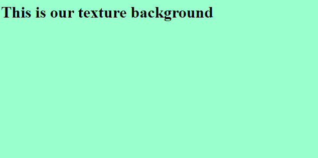

# 如何使用 CSS 创建纹理背景？

> 原文：[https://www.geeksforgeeks.org/how-to-create-texture-background-using-css/](https://www.geeksforgeeks.org/how-to-create-texture-background-using-css/)

## 简介
我们可以使用 CSS 属性，通过使用图像编辑器剪切出一部分背景，来对网页的背景进行纹理处理。应用 `CSS` [`background-repeat`](https://www.geeksforgeeks.org/css-background-repeat-property/) 属性使小图像填充使用它的区域。CSS 提供了许多背景的样式属性，包括给背景、背景图像等着色。背景属性为 `background-color`、`background-image`、`background-position`、`background-attachment`。

## 纹理化背景的方法
使用 CSS 纹理化背景有一些步骤，有例子和说明。

*   使用 `html` 标签创建一个 `html` 文件。

```html
<html>
<head>
    <title>
        Texture Background Using CSS
    </title>
</head>
<body></body>
</html>
```

*   选择我们想要在背景中设置的纹理颜色。将纹理颜色保存为图像格式，如 `.png`、`.jpg` 等。
*   假设我们想使用内部表单 CSS 设置这个网页的背景。所以在 `head` 节写下下面的代码。

```html
<style>
    body {
        background-image: url("BG.jpg");
        background-repeat: repeat/no-repeat;
        background-size: 1600px 840px;
    }
</style>
```

## 示例

```html
<!DOCTYPE html>
<html>
<head>
    <title>
        Texture Background using CSS
    </title>
    <style>
        body {
            background-image: url("https://contribute.geeksforgeeks.org/wp-content/uploads/backgroundimage-1.png");
            background-repeat: no-repeat;
        }
    </style>
</head>
<body>
    <h1>
        This is our texture background
    </h1>
</body>
</html>
```

## 说明
在本代码中，我们通过 `background-image: url("backgroundimage-1.png")` 将图像放置在背景中；可以是 `.jpg` 的形式，也可以是 `.png`。这里，我们不是在背景中重复图像，所以，图像在背景中只显示一次，`background-repeat: no-repeat;` 此语法表示图像不重复。这些命令都是用 CSS 写在 `<style>` 标签里的。

## 输出
