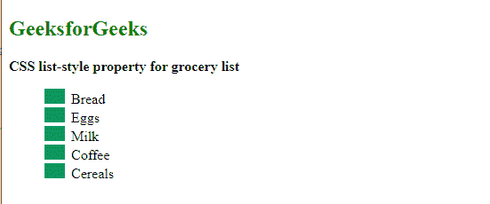
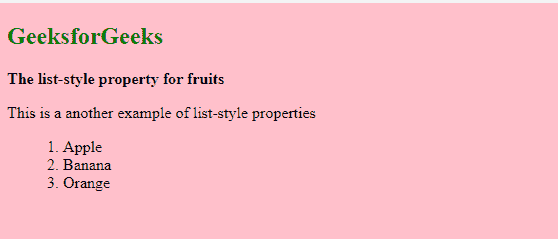

# 如何用 CSS 在一个声明中定义所有的列表属性？

> 原文: [https://www.geeksforgeeks.org/how-to-define-all-the-list-properties-in-one-declaration-using-css/](https://www.geeksforgeeks.org/how-to-define-all-the-list-properties-in-one-declaration-using-css/)

有时一个网页有很好的阅读内容，但是文本的样式看起来不合适，所以它对读者来说变得无聊，最后，他们离开网页。但是当他们阅读具有适当风格和列表的文章时，他们会完全阅读，因为那里陈述的良好视觉效果使他们被文章和阅读吸引。

那么，如何增强网页上的文本和列表的视觉效果和样式呢？CSS 列表属性可以应用于 HTML 列表元素，如 [`CSS list-style-type`](https://www.geeksforgeeks.org/css-list-style-type-property/)、[`CSS list-style-image`](https://www.geeksforgeeks.org/css-list-style-image-property/)、[`CSS list-style-position`](https://www.geeksforgeeks.org/css-list-style-position-property/) 属性，使其具有吸引力和醒目性。

在本文中，我们将学习声明列表属性并设置其样式。

## 类型 HTML 列表

1.  [**有序列表**](https://www.geeksforgeeks.org/html-ol-tag/): 物品列表，每个物品列表都标有数字。
2.  [**无序列表**](https://www.geeksforgeeks.org/how-to-create-an-unordered-list-in-html/): 物品列表，每个物品列表都标有项目符号。

## 样式列表属性

CSS 为最常用的无序和有序列表的样式和格式提供了几个属性。这些 CSS 列表属性通常允许您

*   控制元素的形状或外观。
*   为元素指定图像，而不是项目符号或编号。
*   设置列表中元素和文本之间的距离。
*   指定元素是出现在包含列表项的框内还是框外。

列表属性包含以下属性:

1.  **`list-style-type`**: 指定列表项标记的类型。值可以设置为 `circle`、`square`、`roman` 字符等，默认值设置为 `disc`。
2.  **`list-style-position`**: 指定列表项标记的位置或场所。这些值可以设置为 `inside`、`outside`（默认值）、`inherit` 和 `initial`。
3.  **`list-style-image`**: 指定列表项标记的图像。

**注意:** [`list-style`](https://www.geeksforgeeks.org/css-list-style-property/) 属性是另外三个属性 `list-style-type`、`list-style-position` 和 `list-style-image` 的组合，可以用作这三个属性的简写符号。

## 语法

```css
list-style: list-style-type list-style-position list-style-image | initial | inherit;
```

## 示例 1

以下代码使用图像文件 `"gfg3.png"` 进行子弹造型。

```html
<!DOCTYPE html>
<html lang="en">

<head>
    <meta charset="UTF-8">
    <meta http-equiv="X-UA-Compatible" content="IE=edge">
    <meta name="viewport" content="width=device-width, initial-scale=1.0">
    <title>CSS List style Properties</title>
    <style>
        ul {
            list-style: square inside url("gfg3.png");
        }
    </style>
</head>

<body>
    <h2 style="color:green">GeeksforGeeks</h2>
    <b>CSS list-style property for grocery list</b>

    <ul>
        <li>Bread</li>
        <li>Eggs</li>
        <li>Milk</li>
        <li>Coffee</li>
        <li>Cereals</li>
    </ul>
</body>

</html>
```

**输出:**



## 示例 2

```html
<!DOCTYPE html>
<html lang="en">

<head>
    <meta charset="UTF-8">
    <meta http-equiv="X-UA-Compatible" content="IE=edge">
    <meta name="viewport" content="width=device-width, initial-scale=1.0">
    <title>CSS Style List Properties</title>
    <style>
        body {
            background-color: pink;
        }
        ul {
            list-style: decimal inside none;
        }
    </style>
</head>

<body>
    <h2 style="color:green">GeeksforGeeks</h2>
    <b>The list-style property for fruits</b>

    <p>This is a another example of list-style properties</p>

    <ul>
        <li>Apple</li>
        <li>Banana</li>
        <li>Orange</li>
    </ul>
</body>

</html>
```

**输出:**

