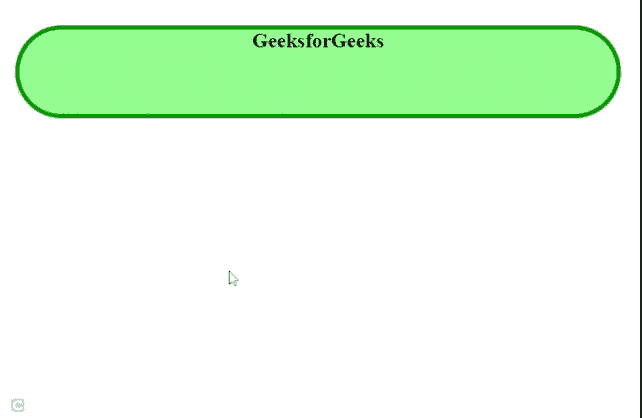

# 如何定义使用 CSS 可动画化的角的形状？

> 原文：[https://www.geeksforgeeks.org/how-to-define-the-shape-of-the-corners-is-animatable-using-css/](https://www.geeksforgeeks.org/how-to-define-the-shape-of-the-corners-is-animatable-using-css/)

任务是使用 CSS 制作所有角落形状的动画。级联样式表是一种用于给网页赋予风格的语言。

## 使用的属性

在本文中，我们将使用以下属性：

*   [`animation:`](https://www.geeksforgeeks.org/css-animations/) 此属性用于将样式的一种形式更改为另一种形式。
*   [`border-bottom-right-radius:`](https://www.geeksforgeeks.org/css-border-bottom-right-radius-property/) 该属性用于定义*右下角*的半径。
*   [`border-bottom-left-radius:`](https://www.geeksforgeeks.org/css-border-bottom-left-radius-property/) 该属性用于定义*左下角*的半径。
*   [`border-top-left-radius:`](https://www.geeksforgeeks.org/css-border-top-left-radius-property/) 此属性用于定义*左上角*的半径。
*   [`border-top-right-radius:`](https://www.geeksforgeeks.org/css-border-top-right-radius-property/) 该属性用于定义*右上角*的半径。
*   [`@keyframes` 规则](https://www.geeksforgeeks.org/css-animation-and-keyframes-property/)：此规则用于在特定时间将从当前样式到新样式的变化逐渐动画化。

## 进场

第一个任务是用样式元素创建基本的 HTML 页面结构。在头部标签中创建样式标签后，我们将添加 `border-bottom-right-radius`、`border-bottom-left-radius`、`border-top-left-radius`、`border-top-right-radius` 属性来设置所有角落的样式，并在 `animation` 属性的帮助下提供动画。

## 示例

### HTML

```html
<!DOCTYPE html>
<html>
  <head>
    <style>
      body {
        text-align: center;
      }
      h2 {
        margin-left: 10px;
        margin-top: 30px;
        margin-right: 15px;
        background-color: lightgreen;
        border: 5px solid green;
        height: 100px;
        animation: mymove 5s infinite;
      }
      @keyframes mymove {
        60% {
          border-bottom-right-radius: 60px;
          border-top-left-radius: 60px;
          border-top-right-radius: 60px;
          border-bottom-left-radius: 60px;
        }
      }
    </style>
  </head>
  <body>
    <h2>GeeksforGeeks</h2>
  </body>
</html>
```

## 输出



所有角落的动画