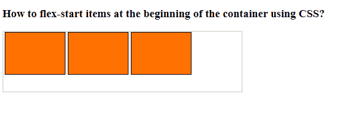

# 如何使用 CSS 在容器的开头灵活启动项目？

> 原文：[https://www.geeksforgeeks.org/how-to-flex-start-items-at-the-beginning-of-the-container-using-css/](https://www.geeksforgeeks.org/how-to-flex-start-items-at-the-beginning-of-the-container-using-css/)

`justify-content` 属性的 `flex-start` 值允许您将项目放在容器的开始处。`flex-start` 指示伸缩方向，而 `start` 指示写入模式方向。允许父容器的子容器在父容器或 `div` 的开始处对齐。

遵循给定的步骤：

**1. 创建 HTML 文件：** 使用一个 `id` 为 `“GFG”` 的 `div`（根据您的选择）。里面有三块 `div`。

**2. 创建 CSS 文件：** 将 `div` 的属性指定为：
*   `display: flex`
*   `flex-direction: row`
*   `justify-content: flex-start`

**示例：**

### 超文本标记语言

```html
<!DOCTYPE html>
<html>

<head>
    <style>
        #gfg {
            width: 400px;
            height: 100px;
            border: 2px solid #ddd;
            display: flex;
            justify-content: flex-start;
            flex-direction: row;
        }

        #gfg div {
            width: 100px;
            height: 70px;
            border: 1px solid black;
            margin: 0px 2px;
            background-color: #ff7100;
        }
    </style>
</head>

<body>
    <h3>
        How to flex-start items at the
        beginning of the container
        using CSS?
    </h3>

    <div id="gfg">
        <div></div>
        <div></div>
        <div></div>
    </div>
</body>

</html>
```

**输出：**

