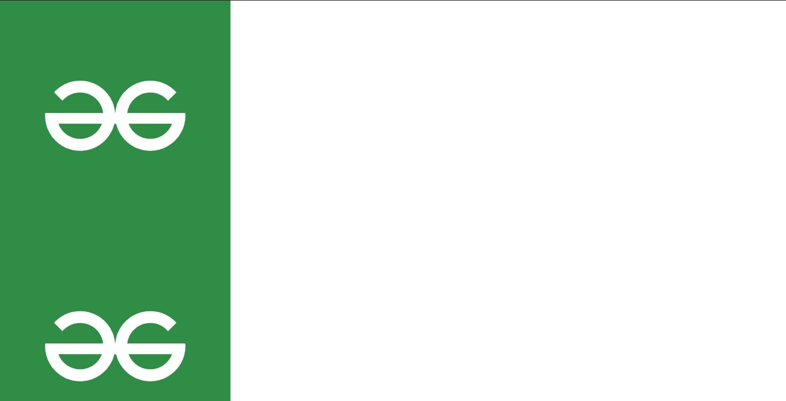

# 如何使用 CSS 纵横重复背景图像？

> 原文: [https://www.geeksforgeeks.org/how-to-repeat-background-image-vertically-and-horizontally-using-css/](https://www.geeksforgeeks.org/how-to-repeat-background-image-vertically-and-horizontally-using-css/)

在本文中，我们将讨论 CSS 的背景图像重复属性。另外，我们将讨论如何在水平和垂直方向重复背景图像。

## 背景-重复

CSS 中的 [`background-repeat`](https://www.geeksforgeeks.org/css-background-repeat-property/) 属性用于水平和垂直重复背景图像。它还决定背景图像是否重复。

该属性用于水平和垂直重复背景图像。如果最后一个图像不适合浏览器窗口，它将被剪切。

### 语法

```html
background-repeat: repeat|repeat-x|repeat-y|
no-repeat|initial|inherit;
```

## 例 1: 水平重复图像

让我们水平重复图像。这里我们将使用之前使用的相同属性。

`repeat-x` 属性用于水平重复背景图像。

### 语法

```html
element {
   background-repeat: repeat-x;
}
```

### 超文本标记语言

```html
<!DOCTYPE html>
<html lang="en">
<head>
    <meta charset="UTF-8">
    <meta http-equiv="X-UA-Compatible" content="IE=edge">
    <meta name="viewport" 
          content="width=device-width, initial-scale=1.0">
    <style>
        body{
            background-image: url("https://media.geeksforgeeks.org/wp-content/cdn-uploads/20210325121930/QNHrwL2q.jpg");
            background-repeat: repeat-x;
        }
    </style>
</head>
<body>

</body>
</html>
```

**输出:** 正如你在输出中看到的，图像现在是水平重复的。

## 示例 2: 垂直重复图像

现在让我们垂直重复图像。`repeat-y` 属性用于设置仅垂直重复的背景图像。

### 语法

```html
element {
   background-repeat: repeat-y;
}
```

### 超文本标记语言

```html
<!DOCTYPE html>
<html lang="en">
<head>
    <meta charset="UTF-8">
    <meta http-equiv="X-UA-Compatible" content="IE=edge">
    <meta name="viewport" 
          content="width=device-width, initial-scale=1.0">
    <style>
        body{
            background-image: url("https://media.geeksforgeeks.org/wp-content/cdn-uploads/20210325121930/QNHrwL2q.jpg");
            background-repeat: repeat-y;
        }
    </style>
</head>
<body>

</body>
</html>
```

**输出:** 现在图像正在垂直重复。
