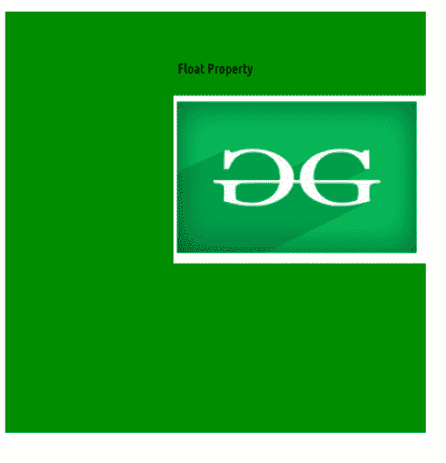

# 如何在 CSS 中设置图像的位置？

> 原文: [https://www.geeksforgeeks.org/how-to-set-position-of-an-image-in-css/](https://www.geeksforgeeks.org/how-to-set-position-of-an-image-in-css/)

您可以使用 [`object-position`](https://www.geeksforgeeks.org/css-object-position-property/) 属性轻松定位图像。您也可以使用一系列其他方式，如 [`float`](https://www.geeksforgeeks.org/what-is-float-property-in-css/) 属性，这将在本文中进一步讨论。

**方法:**

*   **`object-position` 属性:** 指定图像元素如何在其内容框内用 x，y 坐标定位。
*   **`float` 属性:** 指定元素应该如何浮动，并将元素放置在其容器的右侧或左侧。

## 方法 1: 使用 `object-position` 属性

### 语法:

```css
object-position: <position>
```

### 属性值:

*   **`<position>`:** 取 2 个数值，分别对应到内容框左侧的距离(x 轴)和到内容框顶部的距离(y 轴)。

### 注:

*   我们可以使用 `position` 属性将元素与一些 helper 属性 `left`、`right`、`top`、`bottom` 对齐。
*   您可以使用像 `right`、`left`、`center`、`top` 这样的字符串值，或者可以使用像 `200px`、`250px` 这样的像素数值。

### 示例:

```html
<!DOCTYPE html>
<html>
<head>
    <style>
        #object1 {
            width: 500px;
            height: 200px;
            background-color: green;
            object-fit: none;
            object-position: center top;
            /* String value */
        }

        #object2 {
            width: 500px;
            height: 200px;
            background-color: green;
            object-fit: none;
            object-position: 50px 30px;
            /* Numeric value */
        }
    </style>
</head>
<body>
    <center>
        <h2 style="color:green">
            GeeksforGeeks
        </h2>
        <h4>object-position Property</h4>
        
        
    </center>
</body>
</html>
```

### 输出:


`object-position`

## 方法二: 使用 `float` 属性

### 语法:

```css
float: none|inherit|left|right|initial;
```

### 注意:
元素仅水平浮动，即向左或向右浮动。

### 属性值:

*   **`left`:** 将元素放在其容器的右侧。
*   **`right`:** 将元素放在其容器的左侧。
*   **`inherit`:** 元素从其父(`div`、`table` 等…)元素继承 `float` 属性。
*   **`none`:** 元素按原样显示(默认)。

### 示例:

```html
<!DOCTYPE html>
<html>
<head>
    <style>
        #object1 {
            width: 300px;
            height: 200px;
            float: right;
        }

        center {
            width: 500px;
            height: 500px;
            background-color: green;
        }
    </style>
</head>
<body>
    <center>
        <h2 style="color:green">
            GeeksforGeeks
        </h2>
        <h4>Float Property</h4>
        
    </center>
</body>
</html>
```

### 输出:



`float` 属性