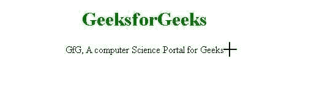

# 如何使用 CSS 在浏览器上设置光标样式？

> 原文：[https://www.geeksforgeeks.org/how-to-set-the-cursor-style-on-browser-using-css/](https://www.geeksforgeeks.org/how-to-set-the-cursor-style-on-browser-using-css/)

CSS 中的 [`cursor`](https://www.geeksforgeeks.org/css-cursor-property/) 属性用于指定鼠标光标指向元素时要显示的类型。默认情况下，所有浏览器的光标都被设置为指针。而如果我们想定制的话，可以借助 CSS 来实现。默认情况下，`cursor` 属性的值设置为 `auto`。此外，没有必要在 `cursor` 属性中提及值 `auto`，因为默认情况下它已经设置为 `auto`。

**语法：**

```css
cursor: value;
```

**属性值：** 指定 `cursor` 属性的值。请查看[这篇](https://www.geeksforgeeks.org/css-cursor-property/)文章，查看 `cursor` 属性的所有值。

**示例：** 在本例中，我们将 `cursor` 属性值设置为十字准线，即 `cursor: crosshair`，将光标显示为十字准线。

## 超文本标记语言

```html
<!DOCTYPE html>
<html lang="en">

<head>
    <style>
        .cursor {
            cursor: crosshair;
        }
    </style>
</head>

<body style="text-align:center;">
    <h1 style="color:green;">
        GeeksforGeeks
    </h1>

    <p class="cursor">
        GfG, A computer Science Portal for Geeks
    </p>

</body>

</html>
```

**输出：**



光标属性示例