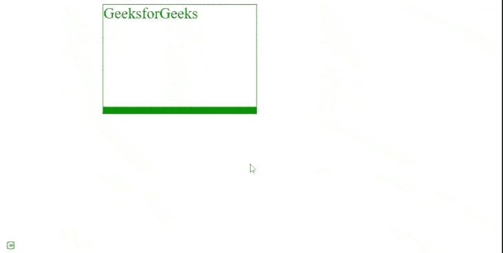

# 如何设置可使用 CSS 动画化的下边框宽度？

> 原文: [https://www.geeksforgeeks.org/how-to-set-the-width-of-the-bottom-border-animatable-using-css/](https://www.geeksforgeeks.org/how-to-set-the-width-of-the-bottom-border-animatable-using-css/)

在本文中，我们将学习使用 CSS 设置边框底部动画的宽度。

## 逼近

[`border-bottom-width`](https://www.geeksforgeeks.org/css-border-bottom-width-property/) 是底部边框的宽度，我们想要动画显示它的宽度。我们将使用 CSS 的 [`animation`](https://www.geeksforgeeks.org/css-animations/) 属性。它需要三个值。

*   第一个是动画的名称，它是一个我们想要绑定的 [`@keyframes`](https://www.geeksforgeeks.org/css-animation-and-keyframes-property/) 名称。

**语法:**

```css
@keyframes myFun {
  100% {
    border-bottom-color: red;
  }
}
```

*   第二是它活跃的时间。
*   最后一个是我们想要动画的次数。

**语法:**

```css
animation: animation_name animation_duration animation_count;
```

## 示例

### HTML

```html
<!DOCTYPE html>
<html>
  <head>
    <style>
      .gfg {
        width: 300px;
        height: 200px;
        border: solid 1px green;
        color: green;
        font-size: 30px;
        margin-left: 20%;
        animation: myFun 5s infinite;
      }
      @keyframes myFun {
        100% {
          border-bottom-width: 25px;
        }
      }
    </style>
  </head>
  <body>
    <div class="gfg">GeeksforGeeks</div>
  </body>
</html>
```

## 输出



动画