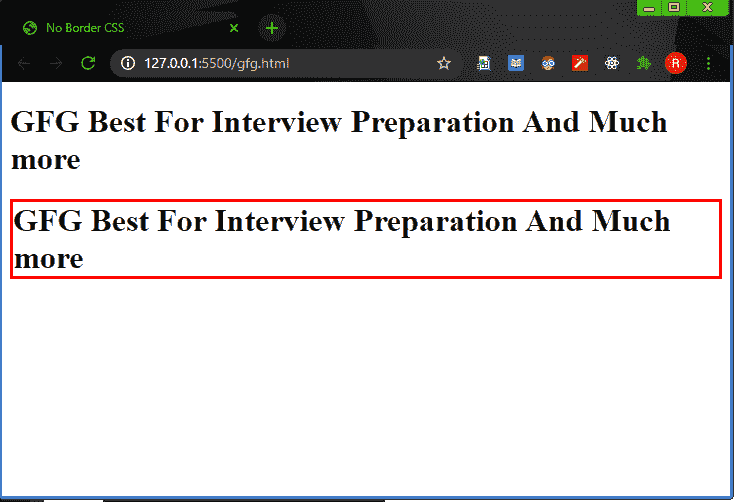
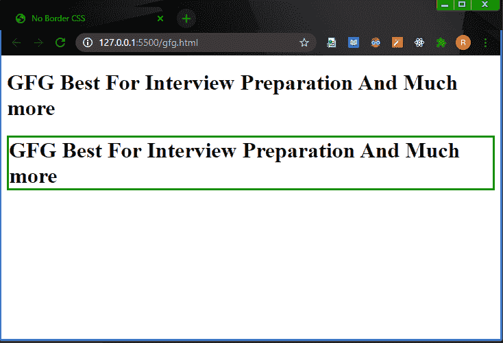

# 如何在 CSS 中指定无边框？

> 原文: [https://www.geeksforgeeks.org/how-to-specify-no-border-in-css/](https://www.geeksforgeeks.org/how-to-specify-no-border-in-css/)

我们可以使用 CSS `border: none`、`border-width: 0`、`border: 0` 属性来指定无边框。

## 方法 1

我们将为两个标题赋予 `border-color`、`border-style` 属性，用于显示有边框和无边框的文本。
对于无边框标题，我们将使用 `border-width: 0`，这将导致无边框。

### 示例

```html
<!DOCTYPE html>
<html>
<head>
   <title>No Border CSS</title>
</head>
<body>
 <h1 style="border-color : red ;
            border-style : solid ;
            border-width : 0">GFG Best For Interview Preparation And Much more</h1>
 <h1 style="border-color : red ;
            border-style : solid ;">GFG Best For Interview Preparation And Much more</h1>
</body>
</html>
```

### 输出



没有边界

## 方法 2

我们将为两个标题赋予 `border-color`、`border-style` 属性，用于显示有边框和无边框的文本。
对于无边框标题，我们将使用 `border: 0`，这将导致无边框。

### 示例

```html
<!DOCTYPE html>
<html>
<head>
  <title>No Border CSS</title>
</head>
<body>
 <h1 style="border-color : green ;
            border-style : solid ;
            border : 0">GFG Best For Interview Preparation And Much more</h1>
 <h1 style="border-color : green ;
            border-style : solid ;">GFG Best For Interview Preparation And Much more</h1>
</body>
</html>
```

### 输出



没有边界

## 方法 3

我们将为两个标题赋予 `border-color`、`border-style` 属性，用于显示有边框和无边框的文本。
对于无边框标题，我们将使用 `border: none`，这将导致无边框。

### 示例

```html
<!DOCTYPE html>
<html>
<head>
 <title>No Border CSS</title>
</head>
<body>
 <h1 style="border-color : green ;
            border-style : solid ;
            border : none">GFG Best For Interview Preparation And Much more</h1>
 <h1 style="border-color : green ;
            border-style : solid ;">GFG Best For Interview Preparation And Much more</h1>
</body>
</html>
```

### 输出


没有边界