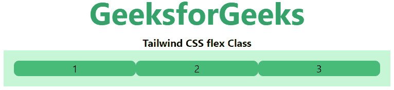

# 如何用 TailwindCSS 使用 CSS 变量？

> 原文: [https://www.geeksforgeeks.org/how-to-use-css-variables-with-tailwindcss/](https://www.geeksforgeeks.org/how-to-use-css-variables-with-tailwindcss/)

[Tailwind CSS](https://www.geeksforgeeks.org/css-tailwind-introduction/) 允许用户预定义类，而不是使用纯 CSS 属性。

我们需要[安装 Tailwind CSS](https://www.geeksforgeeks.org/css-tailwind-introduction/)。创建主 CSS 文件 `Global.css`，如下所示。

## Global.css

在下面的代码中，整个主体被包装成一个选择器。通过使用类 `.root` 或 id `#root` 来选择整个主体。

```html
@tailwind base;
@tailwind components;
@tailwind utilities;

.root,
#root,
#docs-root {
  --primary-color: green;
  --secondary-color: blue;
}
```

## tailwind.config.js

以下代码是带有新 CSS 变量的 `tailwind.config.js` 配置文件的内容。我们只想扩展配置来添加新的值。

```javascript
module.exports = {
  theme: {
    extend: {
      colors: {
        header: "var(--header)",
        primary: "var(--primary)",
        secondary: "var(--secondary)",
        main: "var(--main)",
        background: "var(--background)",
        accent: "var(--accent)",
        footer: "var(--footer)"
      },
    },
  },
};
```

## HTML 代码

完成上述步骤后，我们可以在下面的 HTML 代码中使用 CSS 变量。

```html
<!DOCTYPE html>
<head>

<link href=
         "https://unpkg.com/tailwindcss@^1.0/dist/tailwind.min.css"
        rel="stylesheet">
    <script src="tailwind.config.js">
    </script>
   <link href="Global.css" rel="stylesheet">
</head>

<body class="text-center">
<center>
    <h1 class="text-green-600 text-5xl font-bold">
        GeeksforGeeks
    </h1>
    <b>Tailwind CSS flex Class</b>
    <div class="flex bg-green-200 p-4 mx-16 ">
        <div class="flex-1 bg-green-500 rounded-lg">1</div>
        <div class="flex-1 bg-green-500 rounded-lg">2</div>
        <div class="flex-1 bg-green-500 rounded-lg">3</div>
    </div>
</center>
</body>

</html>
```

**输出:**

