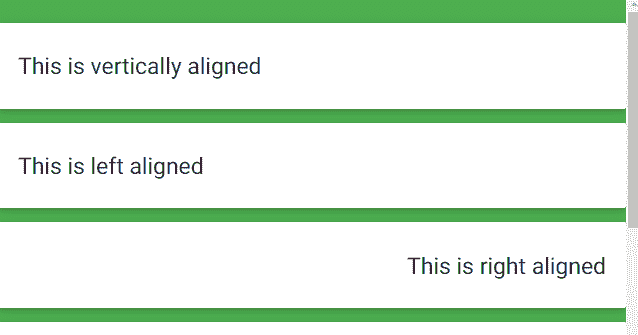

# Materialize CSS 助手

> 原文：[https://www.geeksforgeeks.org/materialize-css-helpers/](https://www.geeksforgeeks.org/materialize-css-helpers/)

Materialize CSS 中有几个助手用于设计需求，例如：

*   对齐
*   隐藏/显示内容
*   格式化

## 1. 对齐

可以使用以下类别水平或垂直对齐内容：

*   **垂直对齐：** 通过将类 `valign-wrapper` 添加到容纳您想要对齐的项目的容器中，可以轻松完成。

```html
<div class="valign-wrapper">
  <h5>This is vertically aligned</h5>
</div>
```

*   **水平对齐：** 这些类用于水平对齐内容：`left-align`、`right-align`、`center-align`。

```html
<div>
    <h5 class="left-align">This is left aligned</h5>
</div>
<div>
    <h5 class="right-align">This is right aligned</h5>
</div>
<div>
    <h5 class="center-align">This is center aligned</h5>
</div>
```

*   **快速浮动：** 还有其他用来对齐内容的类有 `left` 和 `right`。

```html
<div class="left">...</div>
<div class="right">...</div>
```

## 2. 隐藏/显示内容

为了在特定屏幕上隐藏/显示内容，Materialize 提供了易于使用的类。

| **Class** | **Screen range** |
| --- | --- |
| `hide` | Hide from all devices |
| `hide-on-small-only` | Hide only for mobile |
| `hide-on-med-only` | Hide only for tablet |
| `hide-on-large-only` | Hide only for desktop |
| `show-on-small` | Show only for mobile |
| `show-on-medium` | Show only for tablet |
| `show-on-large` | Show only for desktop |
| `show-on-medium-and-up` | Show for tablet and above |
| `show-on-medium-and-down` | Show for tablet and below |

```html
<div class="hide-on-small-only">
    This will be hidden from mobile screen
</div>
```

## 3. 格式化

这些类有助于格式化各种内容。

*   **截断：** 要截断省略号中的长文本行，`truncate` 类被添加到包含文本的标记中。

```html
<h4 class="truncate">
    This is an extremely long title that will be truncated
</h4>
```

*   **悬停：** `hoverable` 是用于为方块阴影添加动画的悬停类。

```html
<div class="card-panel hoverable">
    Hoverable Card Panel
</div>
```

**这里有一个使用以上所有类的例子：**

```html
<!DOCTYPE html>
<html>

<head>
    <!--Import Google Icon Font-->
    <link href="https://fonts.googleapis.com/icon?family=Material+Icons" rel="stylesheet">
    <!-- Compiled and minified CSS -->
    <link rel="stylesheet" href="https://cdnjs.cloudflare.com/ajax/libs/materialize/0.97.5/css/materialize.min.css">
    <!--Let browser know website is optimized for mobile-->
    <meta name="viewport" content="width=device-width, initial-scale=1.0" />
</head>

<body>
    <div class="class green">
        <br>
        <div class="card-panel">
            <div class="valign-wrapper">
                <h5>This is vertically aligned</h5>
            </div>
        </div>
        <div class="card-panel">
            <h5 class="left-align">This is left aligned</h5>
        </div>
        <div class="card-panel">
            <h5 class="right-align">This is right aligned</h5>
        </div>
        <div class="card-panel">
            <h5 class="center-align">This is center aligned</h5>
        </div>
        <div class="card-panel">
            <div class="left">...</div>
        </div>
        <div class="card-panel">
            <div class="right">...</div>
        </div>
        <div class="hide-on-small-only">Hidden for mobile only</div>
        <div class="hide-on-med-only">Hidden for Tablet Only</div>
        <div class="hide-on-large-only">Hidden for Desktop Only</div>
        <div class="card-panel">
            <h4 class="truncate">
                This is an extremely long text that will be truncated to show the changes.
            </h4>
        </div>
        <div class="card-panel hoverable center">
            this is hoverable
        </div>
        <br><br>
    </div>
    <!-- Compiled and minified JavaScript -->
    <script src="https://cdnjs.cloudflare.com/ajax/libs/materialize/0.97.5/js/materialize.min.js"></script>
</body>

</html>
```

**输出：**
