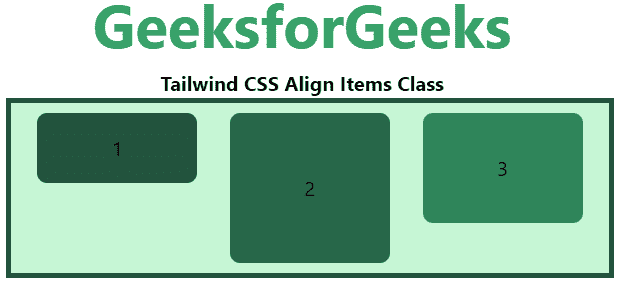
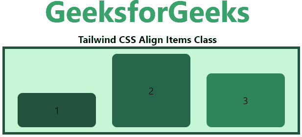
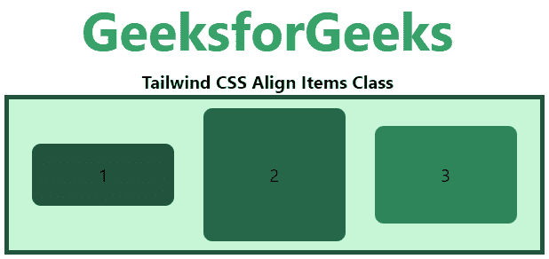
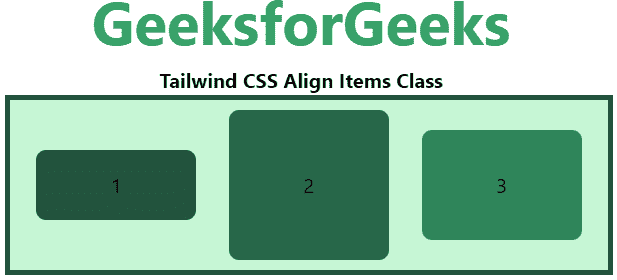
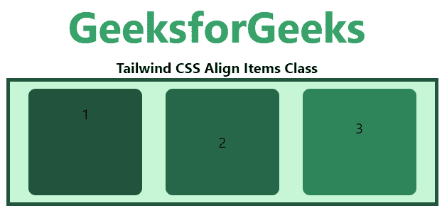

# Tailwind CSS Align Items

> 原文: [https://www.geeksforgeeks.org/tailwind-css-align-items/](https://www.geeksforgeeks.org/tailwind-css-align-items/)

这个类在 [Tailwind CSS](https://www.geeksforgeeks.org/css-tailwind-introduction/) 中接受很多值。它是 [CSS align-items 属性](https://www.geeksforgeeks.org/css-align-items-property/#:~:text=It%20is%20used%20to%20specify,center)的替代。此类用于设置柔性容器内部或给定窗口中项目的对齐方式。它将伸缩项目与轴对齐。`self-*` 类用于覆盖 `align-items` 类。

**align-items 类别:**

*   `items-start`
*   `items-end`
*   `items-center`
*   `items-baseline`
*   `items-stretch`

## items-start
物品将被定位到容器的开始处。

### 语法
```html
<element class="items-start">...</element>
```

### 示例
#### HTML
```html
<!DOCTYPE html> 
<head> 
    <link href=
"https://unpkg.com/tailwindcss@^1.0/dist/tailwind.min.css" 
          rel="stylesheet"> 
</head> 

<body class="text-center"> 
    <h1 class="text-green-600 text-5xl font-bold">
        GeeksforGeeks
    </h1> 
    <b>Tailwind CSS Align Items Class</b> 
    <div id="main" class="p-2 justify-around ml-32 h-26 w-2/3 flex
                          items-start
                          bg-green-200 border-solid border-4 
                          border-green-900"> 
        <div class="bg-green-900 rounded-lg py-4 w-32">1</div> 
        <div class="bg-green-800 rounded-lg py-12 w-32">2</div> 
        <div class="bg-green-700 rounded-lg py-8 w-32">3</div> 
    </div> 
</body> 

</html>
```

### 输出


## items-end
物品将被放置到容器的末端。

### 语法
```html
<element class="items-end">...</element>
```

### 示例
#### HTML
```html
<!DOCTYPE html> 
<head> 
    <link href=
"https://unpkg.com/tailwindcss@^1.0/dist/tailwind.min.css" 
          rel="stylesheet"> 
</head> 

<body class="text-center"> 
    <h1 class="text-green-600 text-5xl font-bold">
        GeeksforGeeks
    </h1> 
    <b>Tailwind CSS Align Items Class</b> 
    <div id="main" class="p-2 justify-around ml-32 h-26 w-2/3 flex
                          items-end
                          bg-green-200 border-solid border-4 
                          border-green-900"> 
        <div class="bg-green-900 rounded-lg py-4 w-32">1</div> 
        <div class="bg-green-800 rounded-lg py-12 w-32">2</div> 
        <div class="bg-green-700 rounded-lg py-8 w-32">3</div> 
    </div> 
</body> 

</html>
```

### 输出


## items-center
物品的位置应垂直于容器的中心。

### 语法
```html
<element class="items-center">...</element>
```

### 示例
#### HTML
```html
<!DOCTYPE html> 
<head> 
    <link href=
"https://unpkg.com/tailwindcss@^1.0/dist/tailwind.min.css" 
          rel="stylesheet"> 
</head> 

<body class="text-center"> 
    <h1 class="text-green-600 text-5xl font-bold">
        GeeksforGeeks
    </h1> 
    <b>Tailwind CSS Align Items Class</b> 
    <div id="main" class="p-2 justify-around ml-32 h-26 w-2/3 flex
                          items-center
                          bg-green-200 border-solid border-4 
                          border-green-900"> 
        <div class="bg-green-900 rounded-lg py-4 w-32">1</div> 
        <div class="bg-green-800 rounded-lg py-12 w-32">2</div> 
        <div class="bg-green-700 rounded-lg py-8 w-32">3</div> 
    </div> 
</body> 

</html>
```

### 输出


## items-baseline
物品将被定位到容器的基线。

### 语法
```html
<element class="items-baseline">...</element>
```

### 示例
#### HTML
```html
<!DOCTYPE html> 
<head> 
    <link href=
"https://unpkg.com/tailwindcss@^1.0/dist/tailwind.min.css" 
          rel="stylesheet"> 
</head> 

<body class="text-center"> 
    <h1 class="text-green-600 text-5xl font-bold">
        GeeksforGeeks
    </h1> 
    <b>Tailwind CSS Align Items Class</b> 
    <div id="main" class="p-2 justify-around ml-32 h-26 w-2/3 flex
                          items-baseline
                          bg-green-200 border-solid border-4 
                          border-green-900"> 
        <div class="bg-green-900 rounded-lg py-4 w-32">1</div> 
        <div class="bg-green-800 rounded-lg py-12 w-32">2</div> 
        <div class="bg-green-700 rounded-lg py-8 w-32">3</div> 
    </div> 
</body> 

</html>
```

### 输出


## items-stretch
项目被拉伸以适合容器，这是默认值。

### 语法
```html
<element class="items-stretch">...</element>
```

### 示例
#### HTML
```html
<!DOCTYPE html> 
<head> 
    <link href=
"https://unpkg.com/tailwindcss@^1.0/dist/tailwind.min.css" 
          rel="stylesheet"> 
</head> 

<body class="text-center"> 
    <h1 class="text-green-600 text-5xl font-bold">
        GeeksforGeeks
    </h1> 
    <b>Tailwind CSS Align Items Class</b> 
    <div id="main" class="p-2 justify-around ml-32 h-26 w-2/3 flex
                          items-stretch
                          bg-green-200 border-solid border-4 
                          border-green-900"> 
        <div class="bg-green-900 rounded-lg py-4 w-32">1</div> 
        <div class="bg-green-800 rounded-lg py-12 w-32">2</div> 
        <div class="bg-green-700 rounded-lg py-8 w-32">3</div> 
    </div> 
</body> 

</html>
```

### 输出
