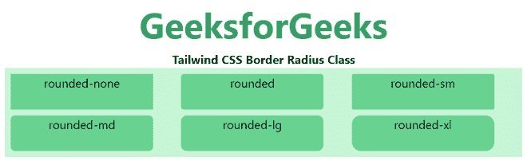
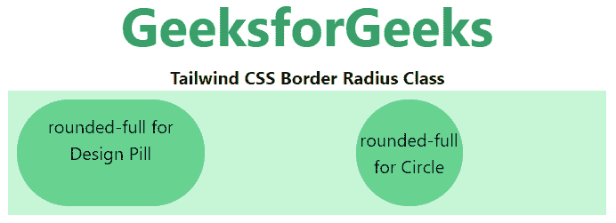
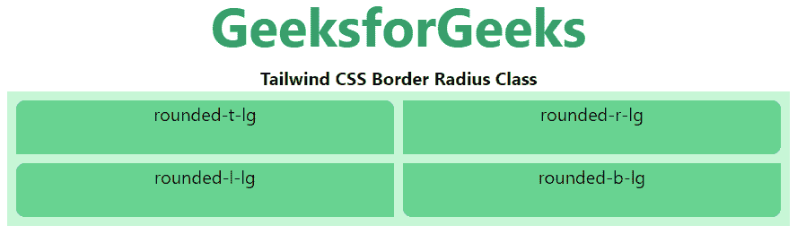
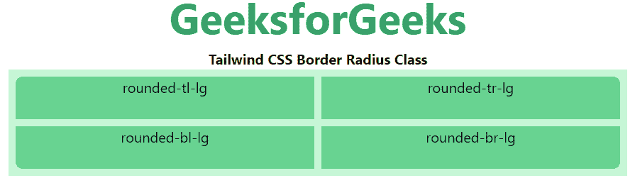

# Tailwind CSS 边框半径

> 原文：[https://www.geeksforgeeks.org/tailwind-css-border-radius/](https://www.geeksforgeeks.org/tailwind-css-border-radius/)

这个类在 Tailwind CSS 中接受多个值。所有的属性都包含在类的形式中。它是 [CSS `border-radius` 属性的替代](https://www.geeksforgeeks.org/css-border-radius-property/)。该类用于设置边框半径。

**边界半径等级：**

*   `rounded-none`
*   `rounded-sm`
*   `rounded`
*   `rounded-md`
*   `rounded-lg`
*   `rounded-xl`
*   `rounded-2xl`
*   `rounded-3xl`
*   `rounded-full`
*   `rounded-t-none`
*   `rounded-r-none`
*   `rounded-b-none`
*   `rounded-l-none`
*   `rounded-t-sm`
*   `rounded-r-sm`
*   `rounded-b-sm`
*   `rounded-l-sm`
*   `rounded-t`
*   `rounded-r`
*   `rounded-b`
*   `rounded-l`
*   `rounded-t-md`
*   `rounded-r-md`
*   `rounded-b-md`
*   `rounded-l-md`
*   `rounded-t-lg`
*   `rounded-r-lg`
*   `rounded-b-lg`
*   `rounded-l-lg`
*   `rounded-t-xl`
*   `rounded-r-xl`
*   `rounded-b-xl`
*   `rounded-l-xl`
*   `rounded-t-2xl`
*   `rounded-r-2xl`
*   `rounded-b-2xl`
*   `rounded-l-2xl`
*   `rounded-t-3xl`
*   `rounded-r-3xl`
*   `rounded-b-3xl`
*   `rounded-l-3xl`
*   `rounded-t-full`
*   `rounded-r-full`
*   `rounded-b-full`
*   `rounded-l-full`
*   `rounded-tl-none`
*   `rounded-tr-none`
*   `rounded-br-none`
*   `rounded-bl-none`
*   `rounded-tl-sm`
*   `rounded-tr-sm`
*   `rounded-br-sm`
*   `rounded-bl-sm`
*   `rounded-tl`
*   `rounded-tr`
*   `rounded-br`
*   `rounded-bl`
*   `rounded-tl-md`
*   `rounded-tr-md`
*   `rounded-br-md`
*   `rounded-bl-md`
*   `rounded-tl-lg`
*   `rounded-tr-lg`
*   `rounded-br-lg`
*   `rounded-bl-lg`
*   `rounded-tl-xl`
*   `rounded-tr-xl`
*   `rounded-br-xl`
*   `rounded-bl-xl`
*   `rounded-tl-2xl`
*   `rounded-tr-2xl`
*   `rounded-br-2xl`
*   `rounded-bl-2xl`
*   `rounded-tl-3xl`
*   `rounded-tr-3xl`
*   `rounded-br-3xl`
*   `rounded-bl-3xl`
*   `rounded-tl-full`
*   `rounded-tr-full`
*   `rounded-br-full`
*   `rounded-bl-full`

## 圆角

在本节中，涵盖了用于创建圆角的类，如 `rounded-sm`、`rounded-md`、`rounded-lg` 等，但不包括完全圆形或药丸形状。

**语法：**

```html
<element class="rounded-{Border-Radius}">...</element>
```

**示例：**

```html
<!DOCTYPE html>
<html>
<head>
    <link href="https://unpkg.com/tailwindcss@^1.0/dist/tailwind.min.css" rel="stylesheet">
</head>
<body class="text-center">
    <h1 class="text-green-600 text-5xl font-bold">GeeksforGeeks</h1>
    <b>Tailwind CSS Border Radius Class</b>
    <div class="mx-4 grid grid-cols-3 gap-2 bg-green-200 p-2">
        <!-- First sub div is not for rounding -->
        <div class="rounded-none bg-green-400 w-48 h-12">rounded-none</div>
        <div class="rounded bg-green-400 w-48 h-12">rounded</div>
        <div class="rounded-sm bg-green-400 w-48 h-12">rounded-sm</div>
        <div class="rounded-md bg-green-400 w-48 h-12">rounded-md</div>
        <div class="rounded-lg bg-green-400 w-48 h-12">rounded-lg</div>
        <div class="rounded-xl bg-green-400 w-48 h-12">rounded-xl</div>
    </div>
</body>
</html>
```

**输出：**



## 药丸和圆圈

在本节中，涵盖了已用于创建完整圆圈和药丸（如 `rounded-full` 类）的类。

**语法：**

```html
<element class="rounded-full">...</element>
```

**示例：**

```html
<!DOCTYPE html>
<html>
<head>
    <link href="https://unpkg.com/tailwindcss@^1.0/dist/tailwind.min.css" rel="stylesheet">
</head>
<body class="text-center">
    <h1 class="text-green-600 text-5xl font-bold">GeeksforGeeks</h1>
    <b>Tailwind CSS Border Radius Class</b>
    <div class="mx-24 grid grid-cols-3 gap-2 bg-green-200 p-2">
        <div class="rounded-full bg-green-400 py-3 px-6">rounded-full for Design Pill</div>
        <div class="rounded-full mx-32 bg-green-400 h-24 w-24 flex items-center justify-center">rounded-full for Circle</div>
    </div>
</body>
</html>
```

**输出：**



## 分别倒圆角边

在本节中，涵盖了所有用于创建倒圆角边的类，如 `rounded-t-lg`、`rounded-r-lg`、`rounded-b-lg` 等。

**语法：**

```html
<element class="rounded-{t|r|b|l}{-size?}">...</element>
```

**示例：**

```html
<!DOCTYPE html>
<html>
<head>
    <link href="https://unpkg.com/tailwindcss@^1.0/dist/tailwind.min.css" rel="stylesheet">
</head>
<body class="text-center">
    <h1 class="text-green-600 text-5xl font-bold">GeeksforGeeks</h1>
    <b>Tailwind CSS Border Radius Class</b>
    <div class="mx-4 grid grid-cols-2 gap-2 bg-green-200 p-2">
        <!-- First sub div is not for rounding -->
        <div class="rounded-t-lg bg-green-400 w-full h-12">rounded-t-lg</div>
        <div class="rounded-r-lg bg-green-400 w-full h-12">rounded-r-lg</div>
        <div class="rounded-l-lg bg-green-400 w-full h-12">rounded-l-lg</div>
        <div class="rounded-b-lg bg-green-400 w-full h-12">rounded-b-lg</div>
    </div>
</body>
</html>
```

**输出：**



## 分别圆角

在本节中，涵盖了所有用于创建圆角的类，如 `rounded-tl-lg`、`rounded-tr-lg`、`rounded-br-lg` 等。

**语法：**

```html
<element class="rounded-{tl|tr|br|bl}{-size?}">...</element>
```

**示例：**

```html
<!DOCTYPE html>
<html>
<head>
    <link href="https://unpkg.com/tailwindcss@^1.0/dist/tailwind.min.css" rel="stylesheet">
</head>
<body class="text-center">
    <h1 class="text-green-600 text-5xl font-bold">GeeksforGeeks</h1>
    <b>Tailwind CSS Border Radius Class</b>
    <div class="mx-4 grid grid-cols-2 gap-2 bg-green-200 p-2">
        <!-- First sub div is not for rounding -->
        <div class="rounded-tl-lg bg-green-400 w-full h-12">rounded-tl-lg</div>
        <div class="rounded-tr-lg bg-green-400 w-full h-12">rounded-tr-lg</div>
        <div class="rounded-bl-lg bg-green-400 w-full h-12">rounded-bl-lg</div>
        <div class="rounded-br-lg bg-green-400 w-full h-12">rounded-br-lg</div>
    </div>
</body>
</html>
```

**输出：**

