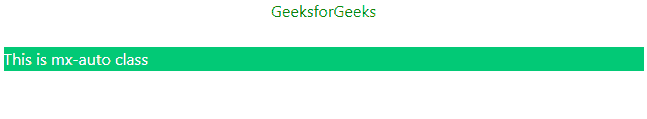
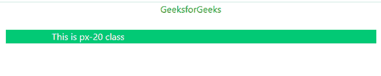

# Tailwind CSS 容器

> 原文: [https://www.geeksforgeeks.org/tailwind-css-container/](https://www.geeksforgeeks.org/tailwind-css-container/)

在 [Tailwind CSS](https://www.geeksforgeeks.org/css-tailwind-introduction/) 中，一个容器用来固定一个元素的*最大宽度*来匹配断点的*最小宽度*。当内容必须以响应每个断点的方式显示时，它非常方便。

Tailwind CSS 中的断点如下。

| **Breakpoint** | **最小宽度** |
| :--- | :--- |
| `sm` | 640px |
| `md` | 768px |
| `lg` | 1024px |
| `xl` | 1280px |

Tailwind CSS 不会自动居中，也不包含任何预定义的填充。下面是一些使容器类脱颖而出的实用程序类。

## `mx-auto`

为了使容器居中，我们使用 `mx-auto` 实用程序类。它会自动调整容器的边距，使容器看起来居中。

**语法:**

```html
<element class="mx-auto">...</element>
```

**示例:**

```html
<!DOCTYPE html>
<html>
<head>
    <link href="https://unpkg.com/tailwindcss@^1.0/dist/tailwind.min.css" rel="stylesheet">
    <style>
        .container {
            background-color: rgb(2, 201, 118);
            color: white;
        }
        h2 {
            text-align: center;
        }
    </style>
</head>
<body>
    <h2 style="color:green">GeeksforGeeks</h2><br />
    <div class="container mx-auto">
        This is mx-auto class
    </div>
</body>
</html>
```

**输出:**



`mx-auto` 类

## `px-{size}`

要添加填充容器，我们使用 `px-{size}` 实用程序类。它向容器中添加了与所述大小相等的水平填充。

**语法:**

```html
<element class="px-20">...</element>
```

**示例:**

```html
<!DOCTYPE html>
<html>
<head>
    <link href="https://unpkg.com/tailwindcss@^1.0/dist/tailwind.min.css" rel="stylesheet">
    <style>
        .container {
            background-color: rgb(2, 201, 118);
            color: white;
        }
        h2 {
            text-align: center;
        }
    </style>
</head>
<body>
    <h2 style="color:green">GeeksforGeeks</h2><br />
    <div class="container mx-auto px-20">
        This is px-20 class
    </div>
</body>
</html>
```

**输出:**



`px-{size}` 类