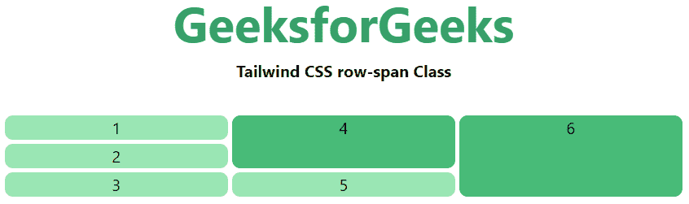
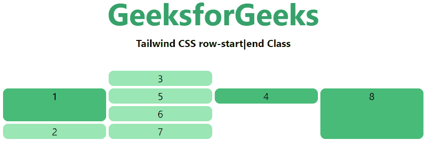

# 顺风 CSS 网格行开始/结束

> 原文: [https://www.geeksforgeeks.org/tailwind-css-grid-row-start-end/](https://www.geeksforgeeks.org/tailwind-css-grid-row-start-end/)

这个类在顺风 CSS 中接受多个值。所有的属性都包含在类的形式中。是 CSS 中 [CSS 网格行属性](https://www.geeksforgeeks.org/css-grid-row-property/)的替代。它用于描述允许设计网格结构和使用 Tailwind CSS 控制网格项目放置的属性数量。它可以改变网格项目的布局，而不考虑它们的源顺序，这允许移动网格项目以适应这些变化的上下文，而不必修改底层标记。但是为了前端的快速发展。行数由给这个类的值的数量来设置。

## 网格行开始/结束

*   `row-auto`
*   `row-span-1`
*   `row-span-2`
*   `row-span-3`
*   `row-span-4`
*   `row-span-5`
*   `row-span-6`
*   `row-span-7`
*   `row-span-8`
*   `row-span-9`
*   `row-span-10`
*   `row-span-11`
*   `row-span-12`
*   `row-span-full`
*   `row-start-1`
*   `row-start-2`
*   `row-start-3`
*   `row-start-4`
*   `row-start-5`
*   `row-start-6`
*   `row-start-7`
*   `row-start-8`
*   `row-start-9`
*   `row-start-10`
*   `row-start-11`
*   `row-start-12`
*   `row-start-13`
*   `row-start-auto`
*   `row-end-1`
*   `row-end-2`
*   `row-end-3`
*   `row-end-4`
*   `row-end-5`
*   `row-end-6`
*   `row-end-7`
*   `row-end-8`
*   `row-end-9`
*   `row-end-10`
*   `row-end-11`
*   `row-end-12`
*   `row-end-13`
*   `row-end-auto`

## 跨度行(`row-span`)

这个类会覆盖跨度区域，提到数字后这个类会持有一个跨度的面积，我们都知道有 12 个网格行或者你可以说 12 个网格跨度。

**语法:**

```html
<element class="row-span-number"> Contents... </element>
```

**参数:** 这个类接受一个参数，如上所述，如下所述:

**数字:** 它代表一个网格行的跨度数。

**示例:**

## 超文本标记语言

```html
<!DOCTYPE html>

<head> 
    <title>Tailwind row-span Class</title>

<link href=
"https://unpkg.com/tailwindcss@^1.0/dist/tailwind.min.css" 
          rel="stylesheet"> 
</head>

<body class="text-center"> 
    <h1 class="text-green-600 text-5xl font-bold">
        GeeksforGeeks
    </h1>

<b>Tailwind CSS row-span Class</b>

<div id="main" class="m-8 grid grid-row-3 grid-flow-col gap-1"> 
        <div class="bg-green-300 rounded-lg">1</div> 
        <div class="bg-green-300 rounded-lg">2</div> 
        <div class="bg-green-300 rounded-lg">3</div> 
        <div class="bg-green-500 row-span-2 rounded-lg">4</div> 
        <div class="bg-green-300 rounded-lg">5</div> 
        <div class="bg-green-500 row-span-3 rounded-lg">6</div> 
    </div> 
</body>

</html>
```

**输出:**



## 开始和结束线(`row-start|end`)

这个类用于使一个元素在第 n 个网格线开始或结束。这些也可以与行跨度数实用程序结合使用，以跨越特定数量的列。

**注意:** 我们可以将这个类和上述的类(`row-span`)合并，下面的例子会给你一个如何使用的思路。

**语法:**

```html
<element class="row-start|end-number">..</element>
```

**参数:** 这个类接受一个参数，如上所述，如下所述:

**编号:** 此参数定义网格行或正常行的开始或结束位置。

**示例:**

## 超文本标记语言

```html
<!DOCTYPE html>

<head> 
    <title>Tailwind row-start|end Class</title>

<link href=
"https://unpkg.com/tailwindcss@^1.0/dist/tailwind.min.css" 
          rel="stylesheet"> 
</head>

<body class="text-center"> 
    <h1 class="text-green-600 text-5xl font-bold">
        GeeksforGeeks
    </h1>

<b>Tailwind CSS row-start|end Class</b>

<div id="main" class="m-8 grid grid-row-4 
                              grid-flow-col gap-1 "> 
        <div class="bg-green-500 row-start-2 row-span-2 
                    rounded-lg">1</div> 
        <div class="bg-green-300 rounded-lg">2</div> 
        <div class="bg-green-300 rounded-lg">3</div> 
        <div class="bg-green-500 row-start-2 col-end-4 
                    rounded-lg">4</div> 
        <div class="bg-green-300 rounded-lg">5</div> 
        <div class="bg-green-300 rounded-lg">6</div> 
        <div class="bg-green-300 rounded-lg">7</div> 
        <div class="bg-green-500 row-start-2 row-span-3 
                    rounded-lg">8</div>
    </div> 
</body>

</html>
```

**输出:**

