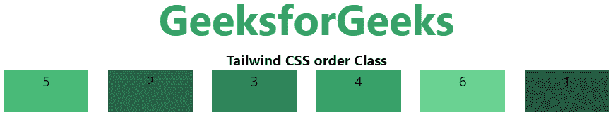

# Tailwind CSS order 类

> 原文：[https://www.geeksforgeeks.org/tailwind-css-order/](https://www.geeksforgeeks.org/tailwind-css-order/)

顺序是 Tailwind CSS 最好的特性之一，通过使用这个类，我们可以根据自己的需求对 flex 和 grid 项进行排序。有很多 `order` 类。该类用于以不同于 DOM 中显示的顺序呈现 flex 和 grid 项。

## 可用的 order 类

*   `order-1`
*   `order-2`
*   `order-3`
*   `order-4`
*   `order-5`
*   `order-6`
*   `order-7`
*   `order-8`
*   `order-9`
*   `order-10`
*   `order-11`
*   `order-12`
*   `order-first`
*   `order-last`
*   `order-none`

## 语法

```html
<element class="order- number | string">
```

## 参数

这个类接受两种类型的参数，但是一次一个，只能跟随着订单号或者你要提到的位置。

*   **数字**：跟随订单索引的整数。
*   **字符串**：在词序索引位置，只接受 `first` 或 `last`。

## 示例

在本例中，我们在第一个弹性项上设置了 `order-last`，在第五个弹性项上设置了 `order-first`，现在可以看到订单列表与正常不同。

### HTML 代码

```html
<!DOCTYPE html>
<html>

<head>
    <title>Tailwind order Class</title>

<link href=
"https://unpkg.com/tailwindcss@^1.0/dist/tailwind.min.css"
          rel="stylesheet">
</head>

<body class="text-center">
    <h1 class="text-green-600 text-5xl font-bold">
        GeeksforGeeks
    </h1>

<b>Tailwind CSS order Class</b>

<div id="main" class="flex flex-row justify-evenly">
        <div class="bg-green-900 order-last w-24 h-12">1</div>
        <div class="bg-green-800 w-24 h-12">2</div>
        <div class="bg-green-700 w-24 h-12">3</div>
        <div class="bg-green-600 w-24 h-12">4</div>
        <div class="bg-green-500 order-first w-24 h-12">5</div>
        <div class="bg-green-400 w-24 h-12">6</div>
    </div>
</body>

</html>
```

## 输出

