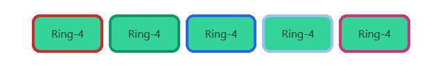

# 顺风 CSS 戒指颜色

> 原文：[https://www.geeksforgeeks.org/tailwind-css-ring-color/](https://www.geeksforgeeks.org/tailwind-css-ring-color/)

这个类在[顺风 CSS](https://www.geeksforgeeks.org/css-tailwind-introduction/)中接受大量的值，其中所有的属性都包含在类形式中。通过使用这个类，我们可以给任何戒指上色。在 CSS 中，我们通过使用[CSS Color 属性](https://www.geeksforgeeks.org/css-color-property/)来实现。

## 戒指颜色等级

*   `ring-transparent`：环的颜色会是透明的。
*   `ring-current`：环颜色将取决于父元素颜色。
*   `ring-black`：戒指颜色将为黑色。
*   `ring-white`：环色将为白色。
*   `ring-gray-50`：戒指颜色将为灰色。
*   `ring-red-50`：戒色会是红色。
*   `ring-blue-50`：戒色会是蓝色。
*   `ring-indigo-50`：环的颜色会是靛蓝。
*   `ring-purple-50`：戒指颜色会是紫色。
*   `ring-green-50`：戒指颜色会是绿色。
*   `ring-yellow-50`：环色将为黄色。
*   `ring-pink-50`：戒指颜色会是粉色。

**注意：**颜色的值可以根据你的需要在 50-900 之间变化，跨度应为 100。

## 语法

```html
<button class="ring-{color}">...</button>
```

## 示例

```html
<!DOCTYPE html>
<html>
<head>
    <link
    href="https://unpkg.com/tailwindcss@^1.0/dist/tailwind.min.css"
    rel="stylesheet">
</head>

<body class="text-center">
    <div class="mx-16 grid grid-cols-5 gap-4 p-2">
        <button class="ring-4 ring-red-600 bg-green-400
                       w-full h-12 rounded-lg">
            Ring-4
        </button>
        <button class="ring-4 ring-green-600 bg-green-400
                       w-full h-12 rounded-lg">
            Ring-4
        </button>
        <button class="ring-4 ring-blue-600 bg-green-400
                       w-full h-12 rounded-lg">
            Ring-4
        </button>
        <button class="ring-4 ring-yellow-600 bg-green-400
                       w-full h-12 rounded-lg">
            Ring-4
        </button>
        <button class="ring-4 ring-pink-600 bg-green-400
                       w-full h-12 rounded-lg">
            Ring-4
        </button>
    </div>
</body>
</html>
```

**注意：**目前浏览器不支持 Tailwind CSS Ring Color，所以对于输出，我分享一下输出的链接（tailswind CSS 游乐场）。

## 输出



顺风戒指颜色