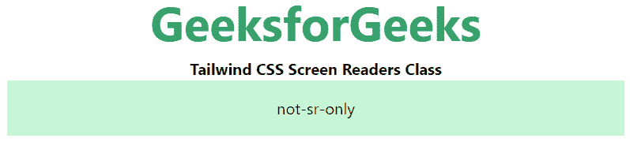

# Tailwind CSS 屏幕閱讀器

> 原文：[https://www.geeksforgeeks.org/tailwind-css-screen-readers/](https://www.geeksforgeeks.org/tailwind-css-screen-readers/)

這個類別在 [Tailwind CSS](https://www.geeksforgeeks.org/css-tailwind-introduction/) 中接受很多值，其中所有的屬性都以類的形式被覆蓋。該類別用於提高螢幕閱讀器的可訪問性。

## 螢幕閱讀器類別

*   `sr-only`：這個類別用於隱藏一個元素，而不會對螢幕閱讀器隱藏它。
*   `not-sr-only`：這個類別用來撤銷 `sr-only` 類別的效果。

## 語法

```html
<svg class="sr-only|not-sr-only">...</svg>
```

## 範例

### HTML

```html
<!DOCTYPE html> 
<html>
<head>     
    <link href= 
    "https://unpkg.com/tailwindcss@^1.0/dist/tailwind.min.css"
    rel="stylesheet"> 
</head>

<body class="text-center"> 
<center> 
    <h1 class="text-green-600 text-5xl font-bold"> 
        GeeksforGeeks 
    </h1> 
    <b>Tailwind CSS Screen Readers Class</b> 
    <div class="bg-green-200 p-4 mx-16 space-y-4"> 
          <span class="sr-only">sr-only</span>
          <span class="not-sr-only">not-sr-only</span>
    </div> 
</center> 
</body>

</html>
```

### 輸出

