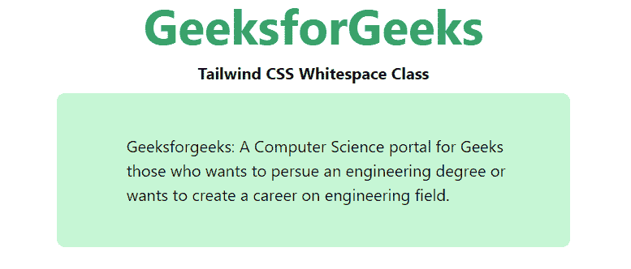
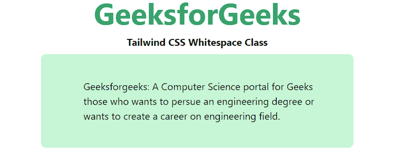

# Tailwind CSS 空白类

> 原文: [https://www.geeksforgeeks.org/tailwind-css-whitespace/](https://www.geeksforgeeks.org/tailwind-css-whitespace/)

该类在 [Tailwind CSS](https://www.geeksforgeeks.org/css-tailwind-introduction/) 中接受多个值。所有的属性都包含在类的形式中。它是 [CSS 空白属性](https://www.geeksforgeeks.org/css-white-space-property/)的替代品。此类用于控制文本换行和白间距。此属性中有几种类型的值可供使用。

**空白类:**

*   `whitespace-normal`
*   `whitespace-nowrap`
*   `whitespace-pre`
*   `whitespace-pre-line`
*   `whitespace-pre-wrap`

## `whitespace-normal`

这是这个类的默认值。当 Tailwind 的 `whitespace` 类别设置为 `normal` 时，两个或更多空白的每个序列将作为单个空白出现。元素中的内容将在任何需要的地方换行。

**语法:**

```html
<element class="whitespace-normal">...</element>
```

**示例:**

```html
<!DOCTYPE html>
<head>
    <link href=
"https://unpkg.com/tailwindcss@^1.0/dist/tailwind.min.css"
          rel="stylesheet">
</head>

<body class="text-center mx-4 space-y-2">
    <h1 class="text-green-600 text-5xl font-bold">
        GeeksforGeeks
    </h1>
    <b>Tailwind CSS Whitespace Class</b>
    <div class="mx-24 bg-green-200 rounded-lg">
        <p class="p-4 whitespace-normal text-justify">
            Geeksforgeeks: A Computer Science portal for Geeks
            those who wants to pursue an engineering degree or
            wants to create a career on engineering field.
        </p>

    </div>
</body>

</html>
```

**输出:**


`whitespace-normal`

## `whitespace-nowrap`

当 Tailwind 的 `whitespace` 类别设置为 `nowrap` 时，两个或更多空白的每个序列将作为单个空白出现。除非明确指定，否则元素中的内容不会换行。

**语法:**

```html
<element class="whitespace-nowrap">...</element>
```

**示例:**

```html
<!DOCTYPE html>
<head>
    <link href=
"https://unpkg.com/tailwindcss@^1.0/dist/tailwind.min.css"
          rel="stylesheet">
</head>

<body class="text-center mx-4 space-y-2">
    <h1 class="text-green-600 text-5xl font-bold">
        GeeksforGeeks
    </h1>
    <b>Tailwind CSS Whitespace Class</b>
    <div class="mx-24 bg-green-200 rounded-lg">
        <p class="p-4 whitespace-nowrap text-justify">
            Geeksforgeeks: A Computer Science portal for Geeks
            those who wants to pursue an engineering degree or
            wants to create a career on engineering field.
        </p>

    </div>
</body>

</html>
```

**输出:**


`whitespace-nowrap`

## `whitespace-pre`

该值使空白具有与 HTML 中的 [`<pre>`](https://www.geeksforgeeks.org/html-pre-tag/) 标签相同的效果。元素中的内容只有在使用换行符指定时才会换行。

**语法:**

```html
<element class="whitespace-pre">...</element>
```

**示例:**

```html
<!DOCTYPE html>
<head>
    <link href=
"https://unpkg.com/tailwindcss@^1.0/dist/tailwind.min.css"
          rel="stylesheet">
</head>

<body class="text-center mx-4 space-y-2">
    <h1 class="text-green-600 text-5xl font-bold">
        GeeksforGeeks
    </h1>
    <b>Tailwind CSS Whitespace Class</b>
    <div class="mx-24 bg-green-200 rounded-lg">
        <p class="p-4 whitespace-pre text-justify">
            Geeksforgeeks: A Computer Science portal for Geeks
            those who wants to pursue an engineering degree or
            wants to create a career on engineering field.
        </p>

    </div>
</body>

</html>
```

**输出:**



`whitespace-pre`

## `whitespace-pre-line`

当 Tailwind 的 `whitespace` 类设置为 `pre-line` 值时，两个或更多空白的每个序列将作为单个空白出现。当需要和明确指定时，元素中的内容将被包装。

**语法:**

```html
<element class="whitespace-pre-line">...</element>
```

**示例:**

```html
<!DOCTYPE html>
<head>
    <link href=
"https://unpkg.com/tailwindcss@^1.0/dist/tailwind.min.css"
          rel="stylesheet">
</head>

<body class="text-center mx-4 space-y-2">
    <h1 class="text-green-600 text-5xl font-bold">
        GeeksforGeeks
    </h1>
    <b>Tailwind CSS Whitespace Class</b>
    <div class="mx-24 bg-green-200 rounded-lg">
        <p class="p-4 whitespace-pre-line text-justify">
            Geeksforgeeks: A Computer Science portal for Geeks
            those who wants to pursue an engineering degree or
            wants to create a career on engineering field.
        </p>

    </div>
</body>

</html>
```

**输出:**


`whitespace-pre-line`

## `whitespace-pre-wrap`

当 Tailwind 的 `whitespace` 类被设置为 `pre-wrap` 值时，每个空白序列将按原样出现。当需要和明确指定时，元素中的内容将被包装。

**语法:**

```html
<element class="whitespace-pre-wrap">...</element>
```

**示例:**

```html
<!DOCTYPE html>
<head>
    <link href=
"https://unpkg.com/tailwindcss@^1.0/dist/tailwind.min.css"
          rel="stylesheet">
</head>

<body class="text-center mx-4 space-y-2">
    <h1 class="text-green-600 text-5xl font-bold">
        GeeksforGeeks
    </h1>
    <b>Tailwind CSS Whitespace Class</b>
    <div class="mx-24 bg-green-200 rounded-lg">
        <p class="p-4 whitespace-pre-wrap text-justify">
            Geeksforgeeks: A Computer Science portal for Geeks
            those who wants to pursue an engineering degree or
            wants to create a career on engineering field.
        </p>

    </div>
</body>

</html>
```

**输出:**



`whitespace-pre-wrap`