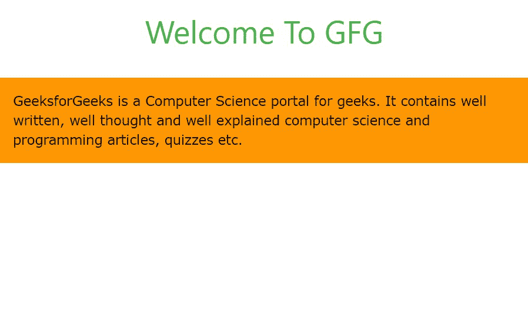
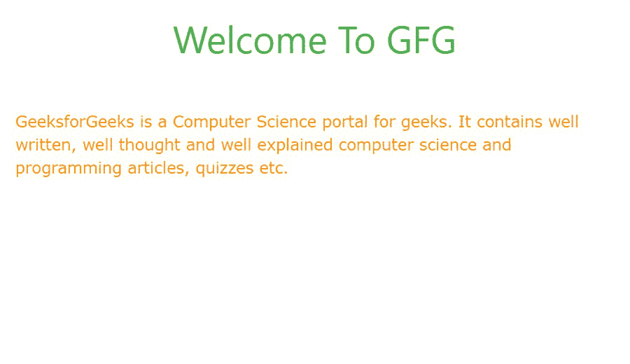
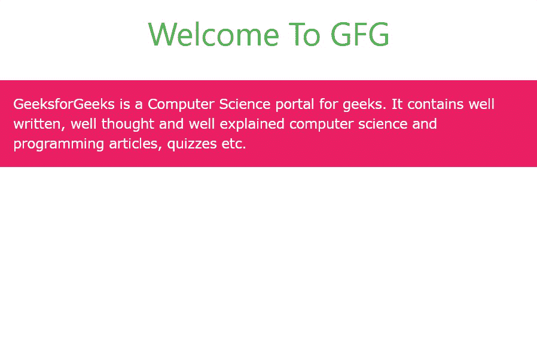
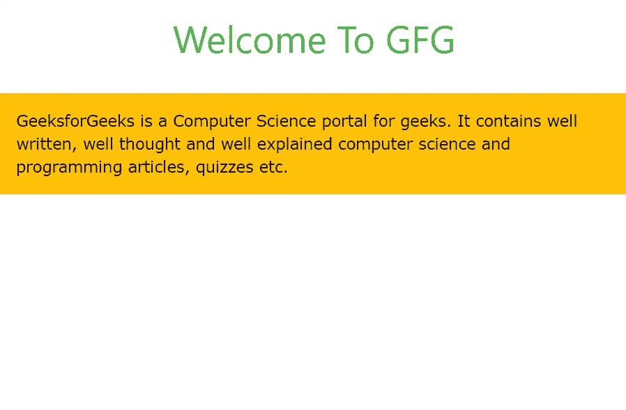
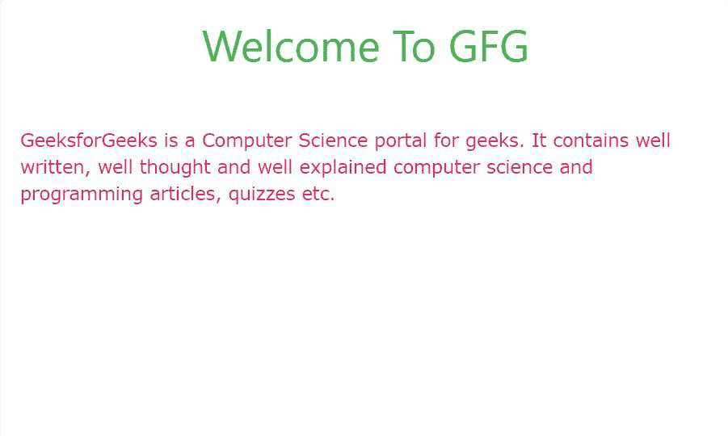
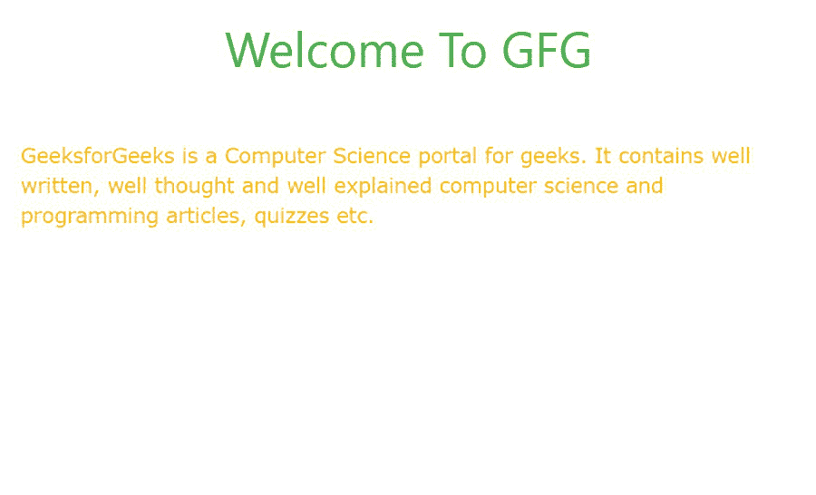

# W3.CSS 颜色

> 原文: [https://www.geeksforgeeks.org/w3-css-colors/](https://www.geeksforgeeks.org/w3-css-colors/)

W3.CSS 为我们提供了设置字体和容器颜色的类。不仅如此，还有一些类可以在悬停分割或部分时更改或设置字体或容器的颜色。所有的着色元素可以大致分为以下几个部分:

*   背景颜色
*   文本颜色
*   悬停背景颜色
*   悬停文本颜色

## 背景色

背景色类如下:

| Sr no. | 背景色名称 | 背景色类 |
| --- | --- | --- |
| 1. | 红色 | `w3-red` |
| 2. | 粉色 | `w3-pink` |
| 3. | 紫色 | `w3-purple` |
| 4. | 深紫色 | `w3-deep-purple` |
| 5. | 蓝色 | `w3-blue` |
| 6. | 淡蓝色 | `w3-light-blue` |
| 7. | Aqua | `w3-aqua` |
| 8. | 绿色 | `w3-green` |
| 9. | 浅绿色 | `w3-light-green` |
| 10. | 石灰 | `w3-lime` |
| 11. | 沙 | `w3-sand` |
| 12. | 卡其色 | `w3-khaki` |
| 13. | 深灰色 | `w3-dark-grey` |
| 14. | 淡黄色 | `w3-pale-yellow` |
| 15. | 黄色 | `w3-yellow` |
| 16. | 琥珀 | `w3-amber` |
| 17. | 橙色 | `w3-orange` |
| 18. | 深橙色 | `w3-deep-orange` |
| 19. | 棕色 | `w3-brown` |
| 20. | 灰色 | `w3-grey` |
| 21. | 浅灰色 | `w3-light-grey` |
| 22. | 深灰色 | `w3-dark-grey` |
| 23. | 蓝灰色 | `w3-blue-grey` |
| 24. | 淡红色 | `w3-pale-red` |
| 25. | 淡绿色 | `w3-pale-green` |
| 26. | 淡黄色 | `w3-pale-yellow` |
| 27. | 淡蓝色 | `w3-pale-blue` |
| 28. | 缇尔 | `w3-teal` |
| 29. | 黑色 | `w3-black` |
| 30. | 白色 | `w3-white` |

**示例:** 在分割上添加背景色。

### HTML

```html
<!DOCTYPE html>
<html>

<head>

    <!-- Adding W3.CSS file through external link -->
    <link rel="stylesheet" href=
        "https://www.w3schools.com/w3css/4/w3.css">

</head>

<body>
    <!-- w3-container is used to add 16px 
        padding to any HTML element.  -->
    <!-- w3-center is used to set the content 
        of the element to the center. -->
    <div class="w3-container w3-center">

        <!-- w3-text-green sets the text 
            color to green. -->
        <!-- w3-xxlarge sets font size to 32px -->
        <h2 class="w3-text-green w3-xxlarge">
            Welcome To GFG
        </h2>
    </div>

    <!-- w3-orange sets the background
          color orange -->
    <!-- w3-panel is used to 16px padding 
        from all the direction -->
    <div class="w3-panel w3-orange">

        <p>
            GeeksforGeeks is a Computer Science 
            portal for geeks. It contains well 
            written, well thought and well 
            explained computer science and 
            programming articles, quizzes etc.
        </p>
    </div>
</body>

</html>
```

**输出:**



## 文字颜色

文字颜色类别如下:

| Sr no. | 文字颜色名称 | 文字颜色类 |
| --- | --- | --- |
| 1. | 琥珀 | `w3-text-amber` |
| 2. | Aqua | `w3-text-aqua` |
| 3. | 蓝色 | `w3-text-blue` |
| 4. | 淡蓝色 | `w3-text-light-blue` |
| 5. | 棕色 | `w3-text-brown` |
| 6. | 青色 | `w3-text-cyan` |
| 7. | 蓝灰色 | `w3-text-blue-grey` |
| 8. | 绿色 | `w3-text-green` |
| 9. | 浅绿色 | `w3-text-light-green` |
| 10. | 靛蓝 | `w3-text-indigo` |
| 11. | 卡其色 | `w3-text-khaki` |
| 12. | 石灰 | `w3-text-lime` |
| 13. | 橙色 | `w3-text-orange` |
| 14. | 深橙色 | `w3-text-deep-orange` |
| 15. | 粉色 | `w3-text-pink` |
| 16. | 紫色 | `w3-text-purple` |
| 17. | 深紫色 | `w3-text-deep-purple` |
| 18. | 红色 | `w3-text-red` |
| 19. | 沙 | `w3-text-sand` |
| 20. | 缇尔 | `w3-text-teal` |
| 21. | 黄色 | `w3-text-yellow` |
| 22. | 白色 | `w3-text-white` |
| 23. | 黑色 | `w3-text-black` |
| 24. | 灰色 | `w3-text-grey` |
| 25. | 浅灰色 | `w3-text-light-grey` |
| 26. | 深灰色 | `w3-text-dark-grey` |
| 27. | 淡红色 | `w3-text-pale-red` |
| 28. | 淡绿色 | `w3-text-pale-green` |
| 29. | 淡黄色 | `w3-text-pale-yellow` |
| 30. | 淡蓝色 | `w3-text-pale-blue` |

**示例:** 给分割添加字体颜色。

### HTML

```html
<!DOCTYPE html>
<html>

<head>

    <!-- Adding W3.CSS file through external link -->
    <link rel="stylesheet" href=
        "https://www.w3schools.com/w3css/4/w3.css">

</head>

<body>
    <!-- w3-container is used to add 16px 
        padding to any HTML element.  -->
    <!-- w3-center is used to set the content 
        of the element to the center. -->
    <div class="w3-container w3-center">

        <!-- w3-text-green sets the text 
            color to green. -->
        <!-- w3-xxlarge sets font size to 32px -->
        <h2 class="w3-text-green w3-xxlarge">
            Welcome To GFG
        </h2>
    </div>

    <!-- w3-text-orange sets the font 
        color to orange -->
    <!-- w3-panel is used to 16px padding 
        from all the direction -->
    <div class="w3-panel w3-text-orange">
        <p>
            GeeksforGeeks is a Computer Science 
            portal for geeks. It contains well 
            written, well thought and well 
            explained computer science and 
            programming articles, quizzes etc.
        </p>
    </div>
</body>

</html>
```

**输出:**



## 悬停背景色

可悬停的背景色类别如下:

| Sr no. | 背景色名称 | 背景色类 |
| --- | --- | --- |
| 1. | 琥珀色 | `w3-hover-amber` |
| 2. | Aqua | `w3-hover-aqua` |
| 3. | 蓝色 | `w3-hover-blue` |
| 4. | 浅蓝色 | `w3-hover-light-blue` |
| 5. | 棕色 | `w3-hover-brown` |
| 6. | 青色 | `w3-hover-cyan` |
| 7. | 蓝灰色 | `w3-hover-blue-grey` |
| 8. | 绿色 | `w3-hover-green` |
| 9. | 浅绿色 | `w3-hover-light-green` |
| 10. | 靛蓝 | `w3-hover-indigo` |
| 11. | 卡其色 | `w3-hover-khaki` |
| 12. | 石灰 | `w3-hover-lime` |
| 13. | 橙色 | `w3-hover-orange` |
| 14. | 深橙色 | `w3-hover-deep-orange` |
| 15. | 粉色 | `w3-hover-pink` |
| 16. | 紫色 | `w3-hover-purple` |
| 17. | 深紫色 | `w3-hover-deep-purple` |
| 18. | 红色 | `w3-hover-red` |
| 19. | 沙 | `w3-hover-sand` |
| 20. | 缇尔 | `w3-hover-teal` |
| 21. | 黄色 | `w3-hover-yellow` |
| 22. | 白色 | `w3-hover-white` |
| 23. | 黑色 | `w3-hover-black` |
| 24. | 灰色 | `w3-hover-grey` |
| 25. | 浅灰色 | `w3-hover-light-grey` |
| 26. | 深灰色 | `w3-hover-dark-grey` |
| 27. | 淡红色 | `w3-hover-pale-red` |
| 28. | 淡绿色 | `w3-hover-pale-green` |
| 29. | 淡黄色 | `w3-hover-pale-yellow` |
| 30. | 淡蓝色 | `w3-hover-pale-blue` |

**示例:** 在分区上添加可悬停的背景色。

## 超文本标记语言

```html
<!DOCTYPE html>
<html>

<head>
    <!-- Adding W3.CSS file through external link -->
    <link rel="stylesheet" href="https://www.w3schools.com/w3css/4/w3.css">
</head>

<body>
    <!-- w3-container is used to add 16px padding to any HTML element. -->
    <!-- w3-center is used to set the content of the element to the center. -->
    <div class="w3-container w3-center">
        <!-- w3-text-green sets the text color to green. -->
        <!-- w3-xxlarge sets font size to 32px -->
        <h2 class="w3-text-green w3-xxlarge">
            Welcome To GFG
        </h2>
    </div>

    <!-- w3-hover-amber sets the background color to amber on hover over the division -->
    <!-- w3-panel is used to 16px padding from all the direction -->
    <div class="w3-panel w3-text-white w3-pink w3-hover-amber">
        <p>
            GeeksforGeeks is a Computer Science portal for geeks. It contains well written, well thought and well explained computer science and programming articles, quizzes etc.
        </p>
    </div>
</body>

</html>
```

**输出:**

*   **悬停前:**



*   **悬停时:**



**悬停文字颜色:** 可悬停文字颜色类别如下：

| Sr 编号 | 文字颜色名称 | 文字颜色类别 |
| :--- | :--- | :--- |
| 1。 | 琥珀色 | `w3-hover-text-amber` |
| 2。 | Aqua | `w3-hover-text-aqua` |
| 3。 | 蓝色 | `w3-hover-text-blue` |
| 4。 | 浅蓝色 | `w3-hover-text-light-blue` |
| 5。 | 棕色 | `w3-hover-text-brown` |
| 6。 | 青色 | `w3-hover-text-cyan` |
| 7。 | 蓝灰色 | `w3-hover-text-blue-grey` |
| 8。 | 绿色 | `w3-hover-text-green` |
| 9。 | 浅绿色 | `w3-hover-text-light-green` |
| 10。 | 靛蓝 | `w3-hover-text-indigo` |
| 11。 | 卡其色 | `w3-hover-text-khaki` |
| 12。 | 石灰 | `w3-hover-text-lime` |
| 13。 | 橙色 | `w3-hover-text-orange` |
| 14。 | 深橙色 | `w3-hover-text-deep-orange` |
| 15。 | 粉色 | `w3-hover-text-pink` |
| 16。 | 紫色 | `w3-hover-text-purple` |
| 17。 | 深紫色 | `w3-hover-text-deep-purple` |
| 18。 | 红色 | `w3-hover-text-red` |
| 19。 | 沙 | `w3-hover-text-sand` |
| 20。 | 缇尔 | `w3-hover-text-teal` |
| 21。 | 黄色 | `w3-hover-text-yellow` |
| 22。 | 白色 | `w3-hover-text-white` |
| 23。 | 黑色 | `w3-hover-text-black` |
| 24。 | 灰色 | `w3-hover-text-grey` |
| 25。 | 浅灰色 | `w3-hover-text-light-grey` |
| 26。 | 深灰色 | `w3-hover-text-dark-grey` |

**示例:** 在分区上添加可悬停的文本颜色。

### 示例代码

```html
<!DOCTYPE html>
<html>

<head>
    <!-- Adding W3.CSS file through external link -->
    <link rel="stylesheet" href="https://www.w3schools.com/w3css/4/w3.css">
</head>

<body>
    <!-- w3-container is used to add 16px padding to any HTML element. -->
    <!-- w3-center is used to set the content of the element to the center. -->
    <div class="w3-container w3-center">
        <!-- w3-text-green sets the text color to green. -->
        <!-- w3-xxlarge sets font size to 32px -->
        <h2 class="w3-text-green w3-xxlarge">
            Welcome To GFG
        </h2>
    </div>

    <!-- w3-hover-text-amber sets the font color to amber on hover over the division -->
    <!-- w3-panel is used to 16px padding from all the direction -->
    <div class="w3-panel w3-text-pink w3-hover-text-amber">
        <p>
            GeeksforGeeks is a Computer Science portal for geeks. It contains well written, well thought and well explained computer science and programming articles, quizzes etc.
        </p>
    </div>
</body>

</html>
```

**输出:**

*   **悬停前:**



*   **悬停时:**

