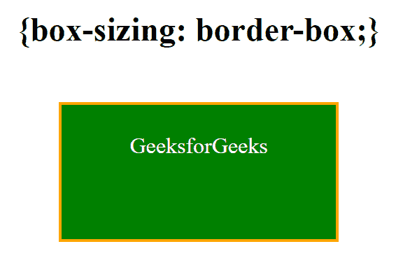
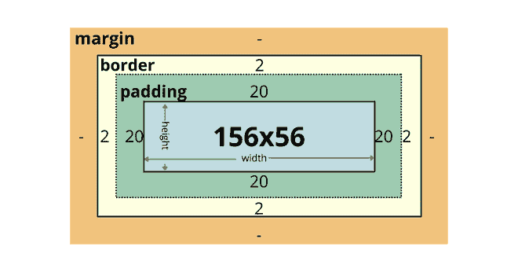

# CSS 中的 box-sizing 属性有什么用？

> 原文: [https://www.geeksforgeeks.org/what-is-the-use-of-box-sizing-property-in-css/](https://www.geeksforgeeks.org/what-is-the-use-of-box-sizing-property-in-css/)

`box-sizing` 属性定义了元素的宽度和高度如何对用户可见，即是否包括边框和填充。

## 语法

```html
box-sizing: content-box|border-box;
```

## 属性值

*   `content-box` (默认值)
*   `border-box`: 它告诉浏览器，为元素的宽度和高度指定的值将包括内容、填充和边框。这通常会使元素的大小调整变得更加容易。`border-box` 是浏览器用于 `<table>`、`<select>` 和 `<button>` 元素的默认样式。例如–如果您将元素的 `width` 设置为 200，`height` 设置为 100 像素，则 200 和 100 像素将包括您添加的任何边框或填充，并且内容框将收缩以吸收额外的宽度和高度。

## border-box 语法

```html
box-sizing: border-box;
```

元素的尺寸计算如下:

```html
width = border + padding + width of the content  
height = border + padding + height of the content
```

## 示例

### HTML

```html
<!DOCTYPE html>
<html>

<head>
    <title>box-sizing Property</title>

<style>
        div {
            width: 200px;
            height: 100px;
            padding: 20px;
            border: 2px solid orange;
            background: green;
            color: white;
            display: inline-block
        }

.box {
            box-sizing: border-box;
        }
    </style>
</head>

<body style="text-align:center;">
    <h2>{box-sizing: border-box;}</h2>
    <br>
    <div class="box">GeeksforGeeks</div>
</body>

</html>
```

## 输出



下图说明了上述示例的 `{box-sizing: border-box;}`。



## 浏览器支持

浏览器完全支持 `box-sizing` 属性，如下所示–

*   Google Chrome 10.0 4.0 -webkit-
*   Internet Explorer 8.0
*   Firefox 29.0 2.0 -moz-
*   Opera 9.5
*   Apple Safari 5.1 3.2 -webkit-