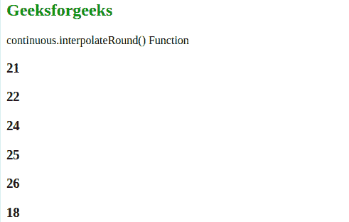

# D3.js continuous.interpolate()函数

> 原文: [https://www.geeksforgeeks.org/d3-js-continuous-interpolate-function/](https://www.geeksforgeeks.org/d3-js-continuous-interpolate-function/)

`continuous.interpolate()`功能用于设置范围插值器工厂，该工厂用于为彼此相邻的范围中的每对值创建插值器。

## 语法

```
continuous.interpolate(interpolate)
```

## 参数

该函数接受一个参数，如上所述，如下所述。

*   `interpolate`: 该参数接受插值器。

## 返回值

这个函数不返回任何东西。

下面的程序说明了 D3.js 中的 `continuous.interpolate()` 函数:

## 示例

### HTML

```html
<!DOCTYPE html>
<html lang="en">

<head>
    <meta charset="UTF-8" />
    <meta name="viewport" content=
        "width=device-width, initial-scale=1.0"/>
    <script src="https://d3js.org/d3.v4.min.js">
    </script>
    <script src="https://d3js.org/d3-color.v1.min.js">
    </script>
    <script src=
    "https://d3js.org/d3-interpolate.v1.min.js">
    </script>
    <script src=
    "https://d3js.org/d3-scale-chromatic.v1.min.js">
    </script>
</head>

<body>
    <h2 style="color: green;">Geeksforgeeks</h2>

<p>continuous.interpolateRound() Function </p>

<script>
        var continuous = d3.scaleLinear()
            // Domain ranges -10, 0, 10
            .domain([-10, 0, 10])
            // Range for the domain
            .range([10, 20, 30, 40, 50, 60, 70, 80, 90])
            // Using interpolateRound
            .interpolate(d3.interpolateRound);

document.write("<div>");
        document.write("<h3>" + continuous(1) + "</h3>");
        document.write("<h3>" + continuous(2) + "</h3>");
        document.write("<h3>" + continuous(3.5) + "</h3>");
        document.write("<h3>" + continuous(4.5) + "</h3>");
        document.write("<h3>" + continuous(5.5) + "</h3>");
        document.write("<h3>" 
            + continuous(-2.5) + "</h3></div>");
    </script>
</body>

</html>
```

## 输出

