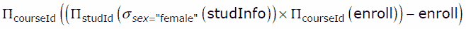
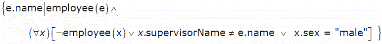
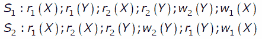

# 数据库管理系统|第 11 集

> 原文: [https://www.geeksforgeeks.org/database-management-systems-set-11/](https://www.geeksforgeeks.org/database-management-systems-set-11/)

GATE CS 2007 考试提出了以下问题。

## 1) 关于学生集合的信息由关系`studinfo(studId，姓名，性别)`给出。`注册(studId，courseId)`关系给出了哪个学生注册(或选修)了该课程。假设每门课程至少有一名男生和一名女生选修。下面的关系代数表达式代表什么？

[](https://media.geeksforgeeks.org/wp-content/cdn-uploads/GATE2009DBMS12.gif)

(A) 所有女生都参加的课程。
(B) 招收适当数量女生的课程。
(C) 只招收男生的课程。
(D) 以上都不是

**回答 (B)**

问题中给出的表达式按顺序执行以下步骤。
a) 选择所有女生中的`studinfo`，选择所有课程中的所有`course`。
b) 然后查询进行上面的[笛卡尔乘积](http://en.wikipedia.org/wiki/Cartesian_product)从不同的表中选择两列。
c) 最后从上述步骤(b)的结果中减去`enroll`表。这将删除存在于`enroll`表中的所有(`studId`, `courseId`)对。如果所有的女生都注册了一门课程，那么这门课程将不会出现在减去的结果中。

所以完整的表达式返回了招收了适当一部分女生的课程。

```text
studinfo table
studid   name    sex
1        a      Male
2        c      Female 
3        d      Female

enroll table
studid  courseid
1         1
2         1
3         1
2         2 
3         3
3         2

Result of step b
studid     courseid
2             1
2             2
2             3
3             1
3             2
3             3

Result of step c
studid    courseid
2           3
```

## 2) 考虑以姓名为关键的关系`员工(姓名、性别、主管姓名)`。`主管姓名`给出所考虑员工的主管姓名。下面的元组关系演算查询会产生什么？

[](https://media.geeksforgeeks.org/wp-content/cdn-uploads/GATE2009DBMS22.gif)

(A) 有男主管的员工姓名。
(B) 没有直接男性下属的员工姓名。
(C) 无直接女性下属的员工姓名。
(D) 有女主管的员工姓名。

**答案 (C)**

查询选择所有直接下属为“男性”的员工。换句话说，它选择没有直接女性下属的员工姓名。

## 3) 考虑表`员工(empId、姓名、部门、薪资)`和下面的两个查询 `Q1`、`Q2`。假设第 5 部门有多名员工，我们想找到工资比第 5 部门任何人都高的员工，对于任意的员工表，以下哪一种说法是正确的？

```sql
Q1 : Select e.empId
     From employee e
     Where not exists
        (Select * From employee s where s.department = “5” and 
                                        s.salary >=e.salary)
Q2 : Select e.empId
     From employee e
     Where e.salary > Any
    (Select distinct salary From employee s Where s.department = “5”)
```

(A) `Q1` 是正确的查询
(B) `Q2` 是正确的查询
(C) `Q1` 和 `Q2` 给出了相同的答案。
(D) `Q1` 和 `Q2` 都不是正确的查询

**回答 (B)**

让`员工(empId、姓名、部门、工资)`有如下实例。

```text
empId 名称 部门 工资
E1    A    1    10000
E2    B    5    5000
E3    C    5    7000
E4    D    2    2000
E5    E    3    8000
```

现在实际结果应该包含 `empId` : `E1`、`E3` 和 `E5`(因为他们的工资比部门中的任何员工都高‘5’)。

现在 `Q1`:

注意: `EXISTS`(空集)给出假，`NOT EXISTS`(空集)给出真。

```sql
Select e.empId
From employee e
Where not exists
    (Select * From employee s where s.department = “5” and 
                                    s.salary >= e.salary)
```

`Q1` 将只得到 `empId` `E1`。

而 `Q2`:

```sql
Select e.empId
From employee e
Where e.salary > Any
    (Select distinct salary From employee s Where s.department = “5”)
```

`Q2` 将产生 `empId` `E1`、`E3` 和 `E5`。

因此 `Q2` 是正确的查询。

## 4) 下列哪一项陈述为假？

(A) 任何有两个属性的关系都在 `BCNF`
(B) 每个键只有一个属性的关系都在 `2NF`
(C) 一个质数属性可以过渡依赖于 `3NF` 关系中的一个键。
(D) 一个主属性可以过渡地依赖于 `BCNF` 关系中的一个键。

**答案 (D)**

## 5) 考虑以下涉及两个交易的时间表。以下哪个陈述是正确的？

[](https://media.geeksforgeeks.org/wp-content/cdn-uploads/GATE2009DBMS3.gif)

(A) `S1` 和 `S2` 都是冲突可串行化的。
(B) `S1` 是冲突可串行化的，`S2` 不是冲突可串行化的。
(C) `S1` 不冲突可串行化，`S2` 冲突可串行化。
(D) `S1` 和 `S2` 都不是冲突可串行化的。

**答案 (C)**

`S1` 不是冲突可串行化的，但 `S2` 是冲突可串行化的。

```text
Schedule S1
   T1            T2
r1(X)
r1(Y)
                r2(X)
                r2(Y)
                w2(Y)
w1(X)
The schedule is neither conflict equivalent to T1T2, nor T2T1.

Schedule S2
   T1            T2
r1(X)
                r2(X)
                r2(Y)
                w2(Y)
r1(Y)
w1(X)
The schedule is conflict equivalent to T2T1.
```

如果您发现任何答案/解释不正确，或者您想分享更多关于上述主题的信息，请写评论。