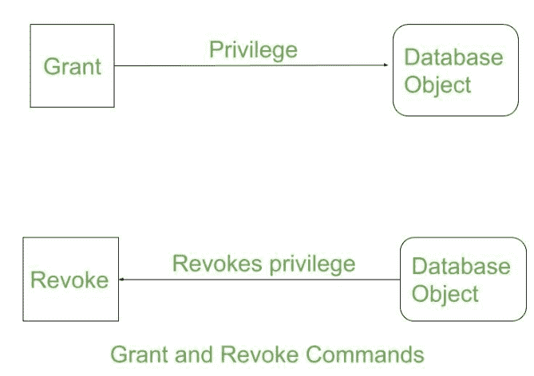

# 授予和撤销的区别

> 原文：[https://www.geeksforgeeks.org/difference-between-grant-and-revoke/](https://www.geeksforgeeks.org/difference-between-grant-and-revoke/)

数据控制语言（`DCL`）通过一些特定的查询帮助用户检索和修改存储在数据库中的数据。授予和撤销属于数据控制语言的这些命令类型。`DCL` 是 [`SQL` 命令](https://www.geeksforgeeks.org/sql-ddl-dql-dml-dcl-tcl-commands/)的组成部分。

## 1. 授予

`SQL` `GRANT` 命令专门用于为用户提供[数据库对象](https://www.geeksforgeeks.org/database-objects-in-dbms/)的权限。该命令还允许用户向其他用户授予权限。

**语法：**

```sql
grant privilege_name on object_name
to {user_name | public | role_name}
```

这里 `privilege_name` 是必须授予的权限，`object_name` 是数据库对象的名称，`user_name` 是应该提供访问权限的用户，`public` 用于允许所有用户访问。

## 2. 撤销

`REVOKE` 命令撤销用户对数据库对象的权限（如果有）。它执行与 `GRANT` 命令相反的操作。当特定用户 `U` 的权限被撤销时，用户 `U` 授予所有其他用户的权限也将被撤销。

**语法：**

```sql
revoke privilege_name on object_name
from {user_name | public | role_name}
```

**示例：**

```sql
grant insert,
select on accounts to Ram
```

通过上面的命令，用户 `Ram` 已经授予了对 `accounts` 数据库对象的权限，就像他可以查询或插入 `accounts` 一样。

```sql
revoke insert,
select on accounts from Ram
```

通过上面的命令，用户 `Ram` 对 `accounts` 数据库对象的查询或插入等权限已被删除。



要了解确切的语法以及它们是如何使用的，请单击[此处](https://www.geeksforgeeks.org/difference-between-grant-and-revoke/)。

## 授予和撤销命令的区别

| S.NO | 授予 | 取消 |
| --- | --- | --- |
| 1 | 此 `DCL` 命令授予用户对数据库对象的权限。 | 此 `DCL` 命令删除授予用户对数据库对象的权限（如果有）。 |
| 2 | 它向用户分配访问权限。 | 它取消用户的用户访问权限。 |
| 3 | 对于每个用户，您需要指定权限。 | 如果删除了一个用户的访问权限；该用户向其他用户提供的所有特定权限都将被删除。 |
| 4 | 当访问分散时，授予权限将很容易。 | 如果分散访问，移除授予的权限是困难的。 |