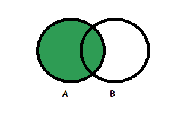
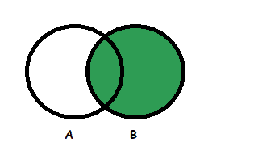
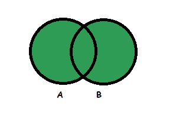

# 左、右和全外连接之间的差异

> 原文：[https://www.geeksforgeeks.org/difference-between-left-right-and-full-outer-join/](https://www.geeksforgeeks.org/difference-between-left-right-and-full-outer-join/)

数据库管理系统（DBMS）允许使用连接从多个表中检索数据。

[联接](https://www.geeksforgeeks.org/sql-join-set-1-inner-left-right-and-full-joins/)主要是两个或多个关系（或表）的笛卡尔乘积。

SQL 连接大致分为[内部连接和](https://www.geeksforgeeks.org/inner-join-vs-outer-join/)外部连接。内部联接从满足联接条件的表中选择行。但是使用内部连接会丢失两个表中不满足条件的行。外部连接可用于防止表中的数据丢失。

## 外连接的类型

外连接又分为 3 种：左外连接、右外连接和全外连接。这些解释如下。

### 1. Left Outer Join

`Left Outer Join` returns all the rows from the table on the left and columns of the table on the right is null padded. `Left Outer Join` retrieves all the rows from both the tables that satisfy the join condition along with the unmatched rows of the left table.

**语法：**

```sql
SELECT [column1, column2, ....]
FROM   table1
LEFT OUTER JOIN table2 ON 
    table1.matching_column = table2.matching_column
WHERE [condition];
```

或者

```sql
SELECT [column1, column2, ....]
FROM   table1
LEFT OUTER JOIN table2 
    ON table1.matching_column = table2.matching_column
WHERE [condition];
```

**图解表示：**



### 2. Right Outer Join

`Right Outer Join` returns all the rows from the table on the right and columns of the table on the left is null padded. `Right Outer Join` retrieves all the rows from both the tables that satisfy the join condition along with the unmatched rows of the right table.

**语法：**

```sql
SELECT [column1, column2, ....]
FROM   table1
RIGHT OUTER JOIN table2 ON 
    table1.matching_column = table2.matching_column
WHERE [condition];
```

或者，

```sql
SELECT [column1, column2, ....]
FROM   table1
RIGHT OUTER JOIN table2 
    ON table1.matching_column(+) = table2.matching_column
WHERE [condition];
```

**图解表示：**



### 3. Full Outer Join

`Full Outer Join` returns all the rows from both the table. When no matching rows exist for the row in the left table, the columns of the right table are null padded. Similarly, when no matching rows exist for the row in the right table, the columns of the left table are null padded. `Full outer join` is the union of `left outer join` and `right outer join`.

**语法：**

```sql
SELECT [column1, column2, ....]
FROM   table1
FULL OUTER JOIN table2 
    ON table1.matching_column = table2.matching_column
WHERE [condition];
```

**图解表示：**



## 例

考虑以下员工表，

| EMPID | ENAME | EMPDEPT | SALARY |
| :--- | :--- | :--- | :--- |
| 101 | Amanda | Development | 50000 |
| 102 | Luna | HR | 40000 |
| 103 | Bruce | Design | 30000 |
| 104 | Steve | Testing | 35000 |
| 105 | Roger | Analyst | 10000 |

部门表：

| DEPTID | DEPTNAME | LOCATION |
| :--- | :--- | :--- |
| 10 | Development | New York |
| 11 | Design | New York |
| 12 | Testing | Washington |
| 13 | Helpdesk | Los Angeles |

现在，

### 1. 左外连接查询

```sql
Select empid, ename, deptid, deptname 
from employee 
left outer join department 
on employee.empdept = department.deptname;
```

输出：

| EMPID | ENAME | DEPTID | DEPTNAME |
| :--- | :--- | :--- | :--- |
| 101 | Amanda | 10 | Development |
| 103 | Bruce | 11 | Design |
| 104 | Steve | 12 | Testing |
| 102 | Luna | NULL | NULL |
| 105 | Roger | NULL | NULL |

### 2. 右外连接查询

```sql
Select empid, ename, deptid, deptname 
from employee right outer join department 
on employee.empdept = department.deptname;
```

| EMPID | ENAME | DEPTID | DEPTNAME |
| :--- | :--- | :--- | :--- |
| 101 | Amanda | 10 | Development |
| 103 | Bruce | 11 | Design |
| 104 | Steve | 12 | Testing |
| NULL | NULL | 13 | Helpdesk |

### 3. 完全外部连接查询

```sql
Select empid, ename, deptid, deptname 
from employee full outer join department 
on employee.empdept = department.deptname;
```

| EMPID | ENAME | DEPTID | DEPTNAME |
| :--- | :--- | :--- | :--- |
| 101 | Amanda | 10 | Development |
| 103 | Bruce | 11 | Design |
| 104 | Steve | 12 | Testing |
| 102 | Luna | NULL | NULL |
| 105 | Roger | NULL | NULL |
| NULL | NULL | 13 | Helpdesk |

## 左外连接、右外连接、全外连接之间的差异

| 左外连接 | 右外连接 | 完全外部连接 |
| :--- | :--- | :--- |
| 从左边的表中获取所有行 | 从右边的表中获取所有行 | 从两个表中获取所有行 |
| 内部联接 + 左表中所有不匹配的行 | 内部联接 + 右表中所有不匹配的行 | 内部联接 + 左表中所有不匹配的行 + 右表中所有不匹配的行 |
| 右表中不匹配的数据丢失 | 左表不匹配的数据丢失 | 没有数据丢失 |
| `SELECT [column1, column2, ....] FROM table1 LEFT OUTER JOIN table2 ON table1.matching_column = table2.matching_column` | `SELECT [column1, column2, ....] FROM table1 RIGHT OUTER JOIN table2 ON table1.matching_column = table2.matching_column` | `SELECT [column1, column2, ....] FROM table1 FULL OUTER JOIN table2 ON table1.matching_column = table2.matching_column` |