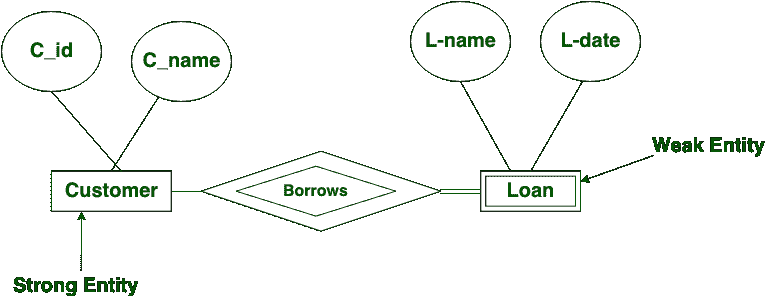

# 强弱实体的区别

> 原文: [https://www.geeksforgeeks.org/difference-between-strong-and-weak-entity/](https://www.geeksforgeeks.org/difference-between-strong-and-weak-entity/)

先决条件 – [`ER` 模型](https://www.geeksforgeeks.org/database-management-system-er-model/)

## `强实体`:
`强实体`不依赖于模式中的任何其他实体。`强实体`总是有一个`主键`。`强实体`由单个`矩形`表示。两个`强实体`之间的关系用一颗`钻石`来表示。
各种`强实体`组合在一起，就形成了一个`强实体集`。

## `弱实体`:
[`弱实体`](https://practice.geeksforgeeks.org/problems/explain-weak-entity-types)依赖`强实体`来保证其存在。与`强实体`不同，`弱实体`没有任何`主键`。相反，它有一个`部分鉴别键`。`弱实体`由`双矩形`表示。
一`强`一`弱实体`之间的关系用`双菱形`表示。这种关系也被称为`识别关系`。

## `强弱实体区别`:

| S.NO | `强实体` | `弱实体` |
| :--- | :--- | :--- |
| 1. | `强实体`总是有一个`主键`。 | 而`弱实体`具有`部分鉴别器密钥`。 |
| 2. | `强实体`不依赖于任何其他实体。 | `弱实体`依赖`强实体`。 |
| 3. | `强实体`由单个`矩形`表示。 | `弱实体`用`双矩形`表示。 |
| 4. | 两个`强实体`的关系用一颗`钻石`来表示。 | 而一个`强实体`和一个`弱实体`之间的关系则用`双菱形`来表示。 |
| 5. | `强实体`要么完全参与，要么不参与。 | 而`弱实体`总是有完全的参与。 |