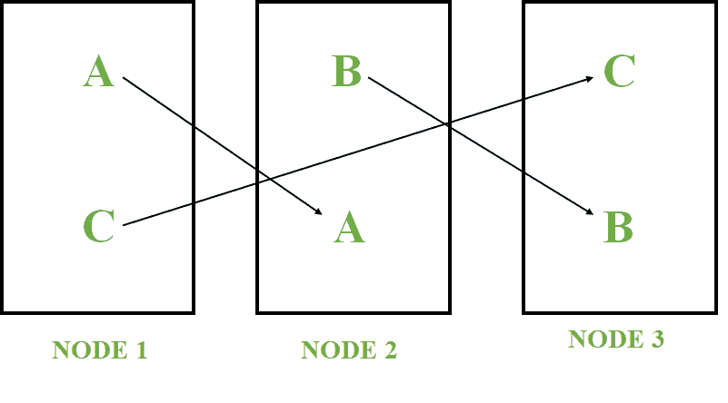

# 惠普 Vertica 的特点

> 原文：[https://www.geeksforgeeks.org/features-of-hp-vertica/](https://www.geeksforgeeks.org/features-of-hp-vertica/)

以下是`惠普 Vertica`的特性，以及为什么您应该将它与传统的数据库管理系统分开使用。`惠普 Vertica`是一款数据库产品，用于处理海量数据或大数据。它是为分析目的而构建的关系数据库管理系统。

## 惠普 Vertica 的特点

如下：

### 1. 列方向
在 `HP vertica` 中，数据以列的形式存储，而不是以行的形式存储。数据列存储的主要原因是为了最大限度地减少读写操作，也为了更快地检索查询输出。

### 2. 高级压缩
编码和压缩技术用于优化查询性能和节省存储空间。编码是将数据转换成标准格式的过程。编码数据可由 `Vertica` 直接处理。

压缩是将数据转换成压缩格式的过程。`Vertica` 无法直接处理压缩数据。数据必须先解压缩。最常用的编码和压缩方法是游程编码(`RLE`)、`Deltaval` 编码和 `LZO`（基于莱姆佩尔-齐夫-奥伯胡默）压缩。

### 3. 高可用性
`Vertica` 是为高可用性而设计的。高可用性是指即使某个节点发生故障，数据库也能继续运行的能力。如果一个节点失败，其数据副本会在其他存活的节点上可用，如下所示。

`Vertica` 通过查询其他节点自动恢复丢失的数据。

### 4. 大规模并行处理
`Vertica` 是一种无共享架构，它允许集群中的每个节点在运行查询时处理其所属的那部分数据库。

公共网络用于与外界通信。专用网络用于节点间通信（查询计划、查询结果、数据加载）。

我们可以连续实时地将数据加载到任何节点。通过让查询执行的一个节点作为发起者，其他节点作为执行者，请求将被平均分配和管理。

### 5. 应用集成
`惠普垂直`整合来自不同地点或不同数据源的数据，这就是所谓的应用集成。`ETL`（提取、转换和加载）工具用于从不同的数据库中提取数据，并将它们转换为标准形式，然后将其放入另一个数据库存储库中。

### 6. 自动数据库设计
为了高效地自动设计数据库，`HP vertica` 使用一个称为数据库设计器的工具。当数据从行存储数据源加载到 `vertica` 时，`vertica` 会将数据转换为基于列的投影。

投影不是在创建表时形成的，而是在最初将数据加载到数据库表时形成的。