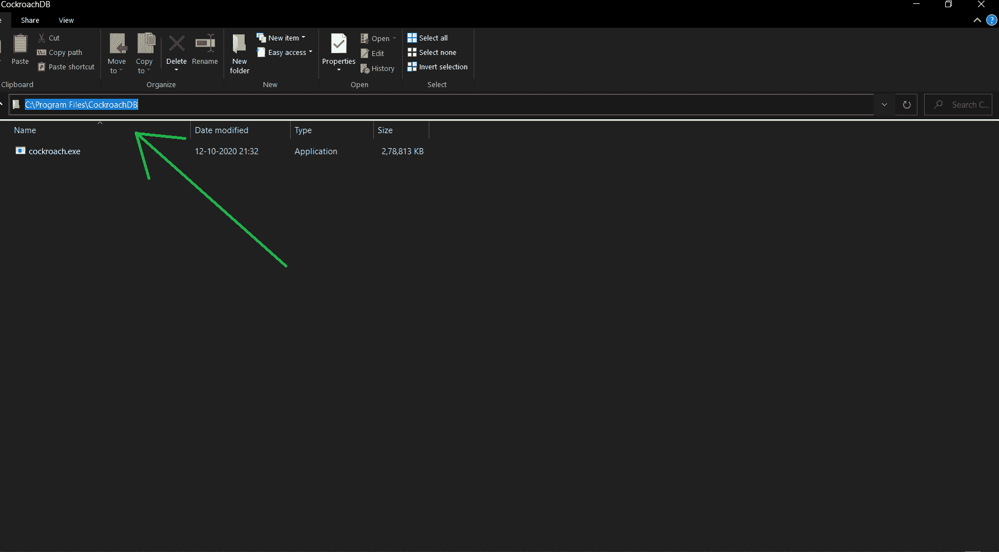
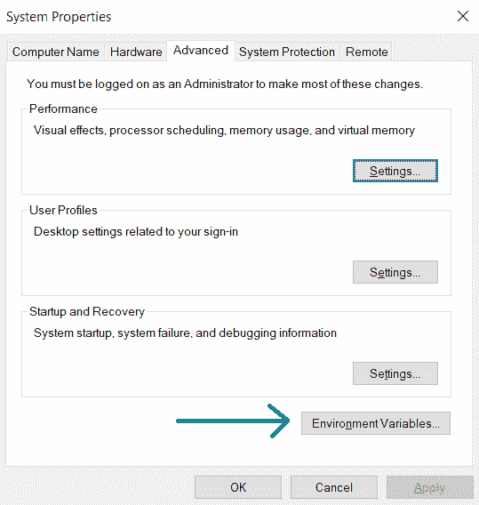
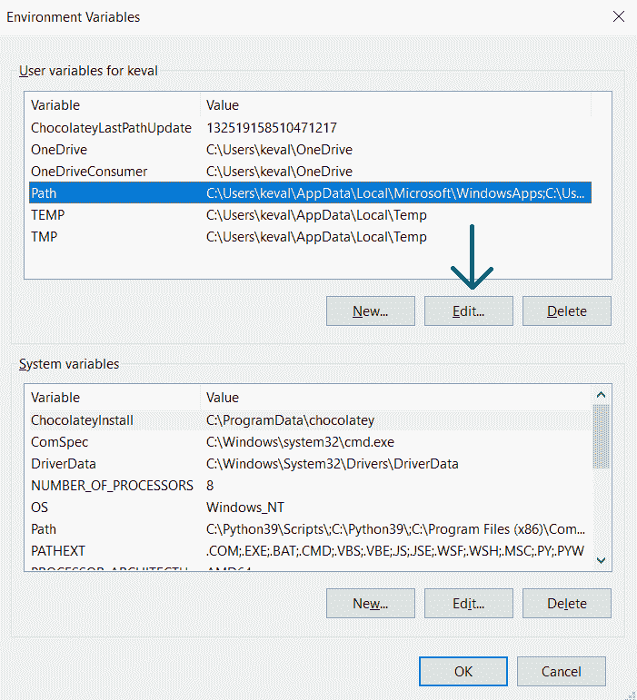
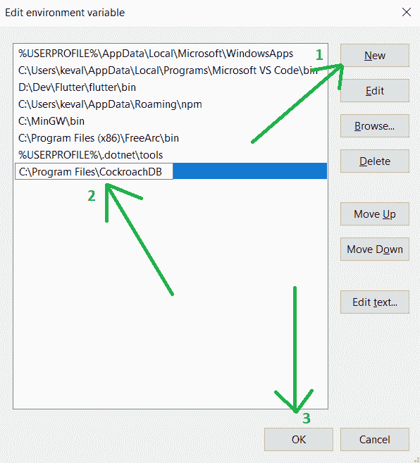
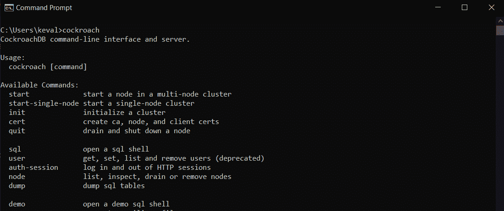

# 如何为 Windows 安装 CockroachDB

> 原文: [https://www.geeksforgeeks.org/how-to-install-cockroachdb-for-windows/](https://www.geeksforgeeks.org/how-to-install-cockroachdb-for-windows/)

## 先决条件

Windows 8 或更高版本。

## CockroachDB 简介

[CockroachDB](https://www.cockroachlabs.com/) 是一个分布式 SQL 数据库，具有以下特点：

*   建立在事务性和强一致性的键值存储上。
*   支持水平扩展。
*   能够在磁盘、机器、机架甚至数据中心故障中幸存下来，并将延迟中断降至最低。
*   无需人工干预。
*   支持强一致的 ACID 事务。
*   为结构化、操作和查询数据提供了一个熟悉的 SQL 应用编程接口。

## 安装步骤

安装 CockroachDB 包括以下 3 个步骤：

1.  下载
2.  将其添加到环境变量路径
3.  运行它

### 第一步：下载

从[这里](https://binaries.cockroachdb.com/cockroach-v20.2.3.windows-6.2-amd64.zip)下载，并在某个地方解压可执行文件。人们通常把它放在操作系统驱动器的`程序文件文件夹`中，但它可以在任何地方。一旦解压完成，我们将复制如下所示的路径。

### 第二步：将其添加到环境变量路径

我们需要将它添加到环境变量路径中，以便可以从系统上的任何目录访问它。为此，按下窗口按钮并搜索`“编辑系统环境变量”`，然后按回车键。这将打开一个新窗口，您应该点击`环境变量`按钮，如下所示。

这将打开另一个窗口，我们将选择`路径`并单击编辑。你可以看到给定的截图供你参考。

在下一个窗口中，单击`新建`按钮将添加一个新的文本字段，我们将在其中粘贴`CockroachDB.exe`的路径，然后单击“确定”按钮。

### 第三步：运行

现在，为了检查是否正确，我们将打开一个`Windows Power Shell`或`命令提示符`，键入`cockroach`，然后按 enter 键。这应该会产生以下输出。

