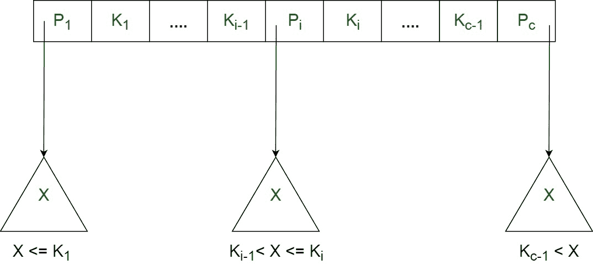
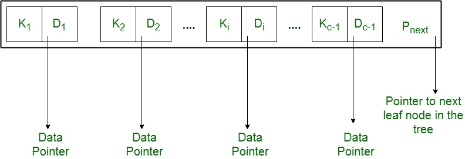
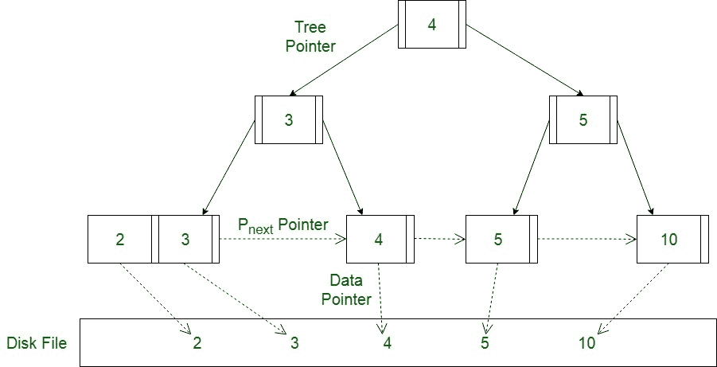

# B+树介绍

> 原文：[https://www.geeksforgeeks.org/introduction-of-b-tree/](https://www.geeksforgeeks.org/introduction-of-b-tree/)

为了实现动态多级索引，一般采用 [B 树](https://www.geeksforgeeks.org/b-tree-set-1-introduction-2/)和 B+树。然而，用于索引的 B 树的缺点是，它将对应于特定键值的数据指针（指向包含键值的磁盘文件块的指针）与该键值一起存储在 B 树的节点中。这种技术大大减少了可以打包到 B 树节点中的条目数量，从而有助于增加 B 树中的级别数量，因此增加了记录的搜索时间。

B+树通过仅在树的叶节点存储数据指针消除了上述缺点。因此，B+树的叶节点结构与 B 树的内部节点结构有很大不同。这里可以注意到，由于数据指针只出现在叶节点，叶节点必须存储所有键值以及它们对应的指向磁盘文件块的数据指针，以便访问它们。此外，叶节点被链接以提供对记录的有序访问。因此，叶节点形成第一级索引，内部节点形成多级索引的其他级。叶节点的一些键值也出现在内部节点中，只是作为控制记录搜索的媒介。

从上面的讨论可以明显看出，B+树不同于 B-树，它有两个顺序，“a”和“B”，一个用于内部节点，另一个用于外部（或叶）节点。

## 顺序为‘a’的 B+树的内部节点结构如下：

1.  每个内部节点的形式为：
    `<P1, K1, P2, K2, ….., Pc-1, Kc-1, Pc>`
    其中 `c <= a`，每个 `Pi` 为树指针（即指向树的另一个节点），每个 `Ki` 为键值（参考图-I）。
2.  每个内部节点都有：`K1 < K2 < …. < Kc-1`
3.  对于由 `Pi` 指向的子树中的每个搜索字段值“X”，以下条件成立：
    `Ki-1 < X <= Ki`，对于 `1 < i < c` 和，
    `Ki-1 < X`，对于 `i = c`
    （参考图一）
4.  每个内部节点最多有“a”个树指针。
5.  根节点至少有两个树指针，而其他内部节点每个都至少有一个树指针。
6.  如果任何内部节点有“c”指针，`c <= a`，那么它就有“c–1”键值。

**示意图-I**

## 序为‘B’的 B+树的叶节点结构如下：

1.  每个叶节点的形式为：
    `<<K1, D1>, <K2, D2>, ….., <Kc-1, Dc-1>, Pnext>`
    其中 `c <= b` 并且每个 `Di` 是数据指针（即指向键值为 `Ki` 的磁盘中的实际记录或者指向包含该记录的磁盘文件块），以及每个 `Ki` 是键值。
2.  每个叶节点有：`K1 < K2 < …. < Kc-1`，`c <= b`
3.  每个叶节点至少有 `⌈b/2⌉` 个值。
4.  所有叶节点都在同一级别。

**示意图-二**

使用 `Pnext` 指针遍历所有叶节点是可行的，就像链表一样，从而实现对存储在磁盘中的记录的有序访问。

## B+树示意图

## 优势

与具有相同‘l’级的 B-树相比，具有‘l’级的 B+树可以在其内部节点中存储更多条目。这突出了对任何给定关键字的搜索时间的显著改进。具有较低的级别和存在 `Pnext` 指针意味着 B+树在从磁盘访问记录时非常快速和有效。