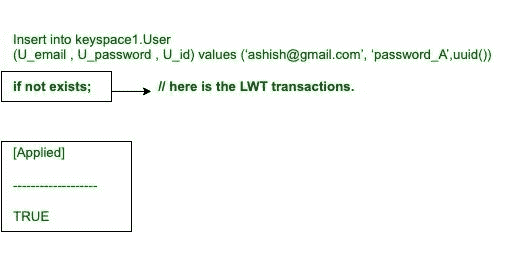
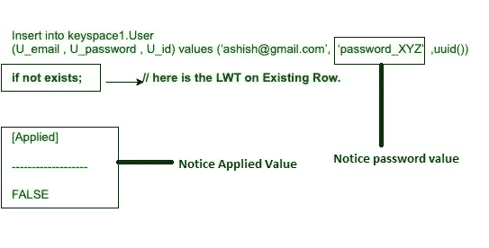
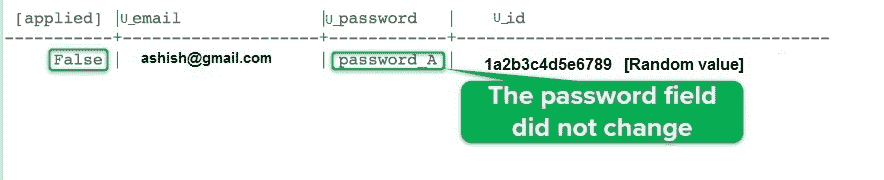
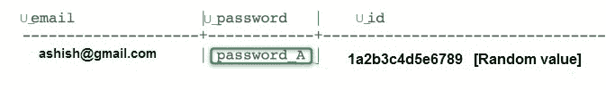
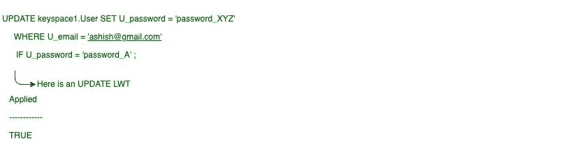

# 卡珊德拉轻量级事务

> 原文：[https://www.geeksforgeeks.org/lightweight-transactions-in-cassandra/](https://www.geeksforgeeks.org/lightweight-transactions-in-cassandra/)

在本文中，我们将在 [Cassandra](https://www.geeksforgeeks.org/introduction-to-apache-cassandra/) 中讨论轻量级事务（`LWT`），这也有助于提高性能。

有时插入或更新操作必须是唯一的，这需要先读后写。先读后写对性能有影响——明智使用！`CQL` 轻量级事务（`LWT`）通过在插入和更新中使用 `IF` 子句解决了这类问题。

## 创建关键空间

```sql
CREATE KEYSPACE IF NOT EXISTS keyspace1 
WITH replication = {'class': 'SimpleStrategy', 
                    'replication_factor' : 2}; 
```

## 创建表格

```sql
CREATE TABLE User (
U_email text,
U_password int,      
U_id UUID,
PRIMARY KEY (email)
); 
```

## 阅读使用了以下 CQL 查询

```sql
SELECT * 
FROM keyspace1.User 
WHERE U_email = ‘ashish@gmail.com’; 
```

**输出：**

| U_email | u _ 密码 | U_id |
| --- | --- | --- |
|  |  |  |

**【0 行】**

## 要将数据插入表中，请使用以下 CQL 查询

```sql
INSERT INTO keyspace1.User (U_email, U_password, U_id) 
VALUES (‘ashish@gmail.com’, ‘password_A’, UUID()) 
IF NOT EXISTS; 
```

让我们看看。



<center>**Figure –** LWT in Cassandra</center>

现在，`LWT` 创造了这个世界。

```sql
SELECT * 
FROM keyspace1.User 
WHERE U_email = ‘ashish@gmail.com’; 
```

**输出：**

| U_email | u _ 密码 | U_id |
| --- | --- | --- |
| ashish@gmail.com | 密码 | 1a2b3c4d5e6789 |

**[1 行] LWT created the row**

## 现有行上的 LWT

```sql
INSERT INTO keyspace1.User (U_email, U_password, U_id) 
VALUES (‘ashish@gmail.com’, ‘password_XYZ’, UUID()) 
IF NOT EXISTS;  
```

让我们看看，



<center>**Figure –** LWT on existing row</center>

以下是上述 `CQL` 查询的输出。



```sql
SELECT * 
FROM keyspace1.User 
WHERE U_email = ‘ashish@gmail.com’; 
```

**输出：**



<center>**Figure –** The row did not change</center>

## 更新行时的轻量级事务（LWT）

更新现有行的 `CQL` 查询，现在我们将 `LWT` 应用于此。更新现有行的 `CQL` 查询。

```sql
UPDATE keyspace1.User SET U_password = 'password_XYZ' 
WHERE U_email = 'ashish@gmail.com'
IF U_password = 'password_A' ; 
```

运算符可用于更新命令：

```sql
=, <, >, >=, != and IN 
```

让我们看看，

