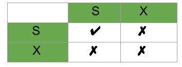

# 数据库管理系统中基于锁的并发控制协议

> 原文：[https://www.geeksforgeeks.org/lock-based-concurrency-control-protocol-in-dbms/](https://www.geeksforgeeks.org/lock-based-concurrency-control-protocol-in-dbms/)

首先，我希望你熟悉一些与交易相关的概念。

*   什么是[可恢复时间表](https://www.geeksforgeeks.org/dbms-recoverability-of-schedules/)？
*   什么是级联回滚和无级联计划？
*   确定调度是否是冲突可串行化的。

现在，我们都知道交易必须遵循的四个属性。是的，你说得对，我指的是 [**酸性**属性](https://www.geeksforgeeks.org/acid-properties-in-dbms/)。并发控制技术用于确保同时执行事务的*隔离*(或非干扰)属性得到维护。

*我想在大家面前提出的一个微不足道的问题，(我知道大家肯定知道这一点，但还是)如果可能会导致不可恢复的 Schedule、不一致性等问题，以及更多的威胁，为什么认为我们应该有事务的交错执行。为什么不让它成为连续的时间表，我们可以平静地生活，没有任何并发症。*

是的，性能对效率的影响太大了，这是不能接受的。
因此，数据库可以提供一种机制来确保调度是冲突的，或者是视图可序列化和可恢复的(最好也是无级联的)。在一个时间表执行后测试它的可串行化显然*已经太晚了！*
所以我们需要保证可串行化的并发控制协议。

**并发控制协议:** 允许并发调度，但要确保调度是冲突/视图可序列化的，并且是可恢复的，甚至可能是无级联的。
这些协议在创建优先图时不检查优先图，相反，协议规定了避免不可排序计划的原则。
不同的并发控制协议在允许的并发量和强加的开销之间提供了不同的优势。
我们将学习一些对 GATE CS 很重要的协议。这个话题的问题经常被问到，建议学习这个概念。(在本系列文章的最后，我将尝试列出这个概念的所有理论方面，以便学生快速修改，他们可能会在一个地方找到材料。)现在，让我们开始吧：

## 不同类别的协议

*   **基于锁定的协议**
    *   基本 2-PL
    *   保守的 2-PL
    *   严格 2-PL
    *   严格的 2-PL
*   **基于图形的协议**
*   **时间戳排序协议**
*   **多粒度协议**
*   **多版本协议**

对于 GATE，我们将关注前三个协议。

## 基于锁的协议

锁是一个与数据项相关联的变量，它描述了数据项关于可应用于它的可能操作的状态。它们通过并发事务同步对数据库项目的访问。该协议要求所有数据项必须以互斥的方式访问。让我向您介绍两种常用的锁，以及该协议中遵循的一些术语。

1.  **共享锁:** 也称为只读锁。顾名思义，它可以在事务之间共享，因为持有此锁时，事务没有更新数据项数据的权限。使用锁定指令请求锁定。
2.  **排他锁(X):** 数据项既可以读也可以写。这是独占的，不能在同一数据项上同时持有。使用锁 X 指令请求锁 X。

### 锁定兼容性矩阵



*   如果所请求的锁与其他事务已经持有的锁兼容，则事务可以被授予该项目的锁。
*   任何数量的事务都可以持有一个项目的共享锁，但是如果任何事务持有该项目的排他锁(`X`)，则没有其他事务可以持有该项目的任何锁。
*   如果锁无法被授予，请求锁的事务将被挂起，直到其他事务持有的所有不兼容锁都被释放。然后锁被授予。

### 升级/降级锁

持有物品锁的交易 `A` 在一定条件下允许将锁状态从一种状态变为另一种状态。
*   升级: 如果 `T_i` 是元素 `A` 上唯一持有 `S` 锁的交易，`S(A)` 可以升级为 `X(A)`
*   降级: 当我们觉得不再想在数据项 `A` 上写时，我们可以将 `X(A)` 降级为 `S(A)`，因为我们在 `A` 上持有 `X` 锁，所以我们不需要检查任何条件。

那么，到目前为止，我们已经了解了锁的类型以及如何应用它们。但是等等，如果我们的问题可以避免，那么生活就会变得如此简单！如果你已经在操作系统下完成了进程同步，你必须熟悉一个一致的问题，饥饿和死锁！我们将很快讨论它们，但正如您所知，我们必须应用锁，但它们必须遵循一组协议来避免这种不良问题。很快，我们将使用 2 阶段锁定(`2-PL`)，它将使用锁的概念来避免死锁。因此，应用简单的锁定，我们可能不会总是产生 `Serializable` 结果，它可能会导致死锁不一致。

## 简单锁定的问题

考虑部分时间表:

```
|      | **T1** | **T2** |
|------|--------|--------|
| 1    | lock-X(B) |        |
| 2    | Read(B)   |        |
| 3    | B:=B-50   |        |
| 4    | Write(B)  |        |
| 5    |        | lock-S(A) |
| 6    |        | Read(A)   |
| 7    |        | lock-S(B) |
| 8    | lock-X(A) |        |
| 9    | ……      | ……      |
```

### 死锁

考虑上述执行阶段。现在，`T1` 持有 `B` 上的排他锁，`T2` 持有 `A` 上的共享锁。考虑语句 7，`T2` 请求 `B` 上的锁，而在语句 8 `T1` 请求 `A` 上的锁。正如您可能注意到的，这造成了**死锁**，因为没有人可以继续执行它们。

### 饥饿

如果并发控制管理器设计不当，**饥饿**也是可能的。例如：一个事务可能正在等待一个项目的 `X` 锁，而一系列其他事务请求并被授予同一个项目的 `S` 锁。如果并发控制管理器设计得当，这是可以避免的。

唷…我希望你现在已经熟悉为什么我们应该学习并发控制协议了。此外，您应该熟悉基于锁的协议的基础知识和简单锁的问题。
接下来我们将讨论 `2-PL` 及其类别、实现以及使用它们的优点和缺陷。关于基于锁的协议的问题在 GATE 中很常见，我们还将进一步讨论基于图的、时间戳和关于托马斯写规则的一些有趣的问题。在那之前，快乐学习。