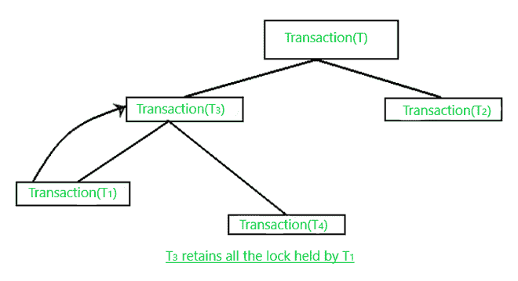
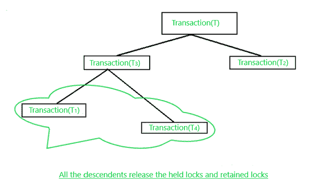
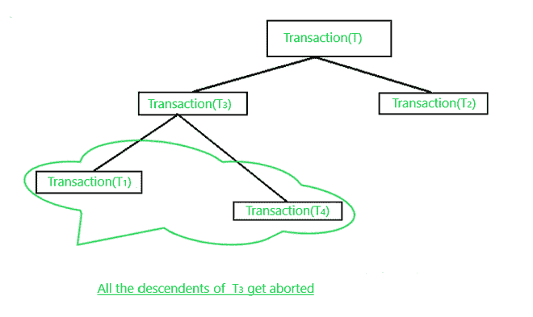

# MOSS 并发控制协议(数据库分布式锁定)

> 原文: [https://www.geeksforgeeks.org/moss-concurrency-control-protocol-distributed-locking-in-database/](https://www.geeksforgeeks.org/moss-concurrency-control-protocol-distributed-locking-in-database/)

这是一个在分布式数据库环境中用来控制并发性的协议，下面我们来了解一下在应用 `MOSS` 并发控制协议时需要牢记的规则和规定。

## MOSS 并发控制协议规则

**a)** 主要用于处理基于继承的嵌套(分层)事务。

**b)** 考虑一个事务(`T`)以某种模式(`M`)获取数据项(`X`)的锁。

**c)** 事务(`T`)在模式(`M`)下保持锁定，直到它终止。

**d)** 当 `T` 的任何子事务(`T1`)提交时，其父事务将占用或继承该锁并保留，直到所有子事务都无法完成。

**e)** 如果事务持有数据项(`X`)的锁，那么它有权以相应的模式访问被锁定的数据项(`X`)。然而，如果一个事务保留了来自任何其他子事务(后代)的锁，那么它就无效。

**f)** 保留锁只是一种占位符，表示不在对应层级的子事务不能获取锁，但后代可以获取锁。

**g)** 一旦事务成为后代子事务 `S` 的锁的保持器，它就保持保持器，直到事务完成。

## 关于本协议的通用锁定规则

**a)** 子事务(`T1`)可以获取数据项(`X`)的读锁，如果:

**a.1)** 没有其他子事务(后代)持有 `X` 上的写锁，并且

**a.2)** 在 `X` 上保留了写锁的所有子事务都是子事务的祖先。

**b)** 子事务(`T1`)可以获取数据项(`X`)上的写锁，如果:

**b.1)** 没有其他子交易持有 `X` 上的读/写锁，并且

**b.2)** 在 `X` 上保留了读/写锁的所有子事务都是 `T1` 的祖先。

**c)** 当一个子事务(`T1`)完成执行时，`T1` 的父代以与 `T1` 相同的方式继承(保留)由 `T1` 持有的锁。

**图 c**

**d)** 当子事务的顶级(`T3`)提交其所有后代的释放时，持有的锁和保留的锁一起被释放。

**图 d**

**e)** 当子事务(`T3`)中止时，它会释放所有保持的锁以及保留的锁。源自中止事务的所有子事务也被中止，如果它们已经开始执行，则必须从头开始。

**图 e**