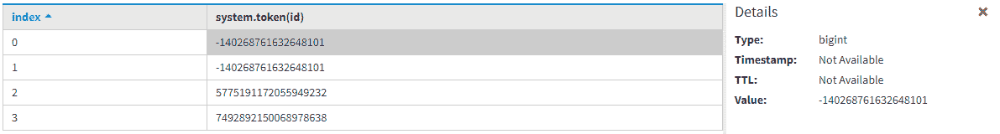

# 卡珊德拉中具有 TOKEN 功能的分割器

> 原文：[https://www.geeksforgeeks.org/partitioners-with-the-token-function-in-cassandra/](https://www.geeksforgeeks.org/partitioners-with-the-token-function-in-cassandra/)

在本文中，我们将使用分割器讨论 `TOKEN` 函数如何在 [Cassandra](https://www.geeksforgeeks.org/introduction-to-apache-cassandra/) 中工作。卡珊德拉查询语言支持 3 种不同类型的分区器。

## CQL 的分割器

```
1. Murmur3Partitioner
2. RandomPartitioner
3. ByteOrderedPartitioner
```

我们一个一个来讨论。

### Murmur3Partitioner

是 Cassandra 3.0 中默认的分区器。如果我们使用 `TOKEN` 函数，那么它会基于 `MurmurHash` 哈希值在集群上分发数据。提供良好的性能和快速散列也很有用。

### RandomPartitioner

是 Cassandra 1.2 之前的默认分区器。它通过使用 MD5 哈希值在整个集群中分发数据。

### ByteOrderedPartitioner

在 Cassandra Query Language 中，`ByteOrderedPartitioner` 基于关键字节的词典顺序在集群上分发数据。它用于在 Cassandra Query Language 中进行有序分区。它对于向后兼容性也很有用。

下面给出的表格有助于理解，让我们来看看。

| 分区器名称 | 数据类型 | 基于在集群上分发数据 |
| :--- | :--- | :--- |
| Murmur3Partitioner | bigint | MurmurHash 哈希值 |
| RandomPartitioner | varint | MD5 哈希值 |
| ByteOrderedPartitioner | blob | 按关键字节排列的数据 |

让我们使用分区键来理解 `Token` 函数，并基于 `TOKEN(partitionKey)` 返回查询。首先我们创建表格。

```
CREATE TABLE User_info
(
    Id int,
    Name text,
    Address text,
    PRIMARY KEY(Id, Name)
);
```

要将数据插入表 `User_info`，请使用以下 CQL 查询：

```
INSERT INTO User_info (Id, Name, Address)
VALUES (301, 'Ashish', 'Delhi');
INSERT INTO User_info (Id, Name, Address)
VALUES (302, 'Rana', 'Mumbai');
INSERT INTO User_info (Id, Name, Address)
VALUES (303, 'Abi', 'Noida');
INSERT INTO User_info (Id, Name, Address)
VALUES (302, 'me', 'Noida');
```

让我们看看。

```
SELECT *
FROM User_info;
```

| Id | Name | Address |
| :--- | :--- | :--- |
| 301 | Ashish | Delhi |
| 302 | me | Noida |
| 302 | Rana | Mumbai |
| 303 | Abi | Noida |

通过使用 `TOKEN` 函数。

```
SELECT TOKEN(Id)
FROM User_info;
```



[从业者参考](https://docs.datastax.com/en/cassandra/3.0/cassandra/architecture/archPartitionerAbout.html)，[`TOKEN` 功能参考](https://cassandra.apache.org/doc/latest/cql/functions.html#token-partition-function)。