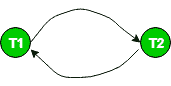
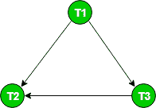

# 测试数据库管理系统中冲突可串行化的优先图

> 原文：[https://www.geeksforgeeks.org/precedence-graph-for-testing-conflict-serializability-in-dbms/](https://www.geeksforgeeks.org/precedence-graph-for-testing-conflict-serializability-in-dbms/)

先决条件：[冲突可串行化](https://www.geeksforgeeks.org/conflict-serializability/)

## 优先图或序列化图

**优先图**或**序列化图**通常用于测试计划的冲突可序列化性。它是由一组节点 `V = {T1, T2, T3, ..., Tn}` 和一组定向边 `E = {e1, e2, e3, ..., em}` 组成的有向图 `(V, E)`。该图包含每个事务 `Ti` 的一个节点。边 `ei` 为 `Tj -> Tk` 形式，其中 `Tj` 为 `ei` 的起始节点，`Tk` 为 `ei` 的终止节点。如果 `Tj` 中的操作之一出现在 `Tk` 中的一些冲突操作之前，则在节点 `Tj` 到 `Tk` 之间构建边 `ei`。

## 算法步骤

该算法可以写成：

1.  在图表中为计划中的每个参与事务创建一个节点 `T`。
2.  对于相互冲突的操作 `read_item(X)` 和 `write_item(X)` – 如果事务 `Tj` 在 `Ti` 执行 `write_item(X)` 之后执行 `read_item(X)`，则在图中绘制一条从 `Ti` 到 `Tj` 的边。
3.  对于冲突操作 `write_item(X)` 和 `read_item(X)` – 如果事务 `Tj` 在 `Ti` 执行 `read_item(X)` 之后执行 `write_item(X)`，则在图中从 `Ti` 到 `Tj` 绘制一条边。
4.  对于相互冲突的操作 `write_item(X)` 和 `write_item(X)` – 如果事务 `Tj` 在 `Ti` 执行 `write_item(X)` 之后执行 `write_item(X)`，则在图中绘制一条从 `Ti` 到 `Tj` 的边。
5.  **如果优先图**中没有循环，则调度 `S` 是可串行化的。

如果优先图中没有循环，这意味着我们可以构造一个与调度 `S` 冲突等价的串行调度 `S'`。串行调度 `S'` 可以通过非循环优先图的[拓扑排序](https://www.geeksforgeeks.org/topological-sorting-indegree-based-solution/)找到。此类计划可以超过 1 个。

## 示例

例如，考虑时间表 `S`：

```
S : r1(x) r1(y) w2(x) w1(x) r2(y)
```

**创建优先图：**

1.  制作交易 `T1` 和 `T2` 对应的两个节点。
    
2.  对于冲突对 `r1(x)` `w2(x)`，其中 `r1(x)` 发生在 `w2(x)` 之前，绘制一条从 `T1` 到 `T2` 的边。
    
3.  对于冲突对 `w2(x)` `w1(x)`，其中 `w2(x)` 发生在 `w1(x)` 之前，绘制一条从 `T2` 到 `T1` 的边。
    

由于该图是循环的，我们可以断定它是**不是任何调度序列调度的冲突可串行化**。让我们尝试使用拓扑排序从这个图中推断出一个连续的时间表。边 `T1 -> T2` 告诉 `T1` 应该在线性排序中排在 `T2` 之前。边 `T2 -> T1` 告诉 `T2` 应该在线性排序中排在 `T1` 之前。所以，我们无法预测任何特定的顺序（当图形是循环的）。因此，无法从该图中获得序列时间表。

考虑一下 `S1` 的另一个时间表：

```
S1: r1(x) r3(y) w1(x) w2(y) r3(x) w2(x)
```

该计划的图表如下：



因为该图是非循环的，所以调度是冲突可串行化的。对这个图执行拓扑排序会给我们一个可能的串行调度，它与调度 `S1` 是冲突等价的。在拓扑排序中，我们首先选择 In 度为 0 的节点，即 `T1`。接下来是 `T3` 和 `T2`。所以，**S1 是冲突可串行化的**，因为它是**冲突等效的**到**串行时间表 T1 T3 T2**。

资料来源：操作系统书，西尔伯沙茨，高尔文和加涅

本文由**萨罗尼·巴韦贾**供稿。如果你喜欢 GeeksforGeeks 并想投稿，你也可以使用 [write.geeksforgeeks.org](https://write.geeksforgeeks.org) 写一篇文章或者把你的文章邮寄到 `review-team@geeksforgeeks.org`。看到你的文章出现在极客博客主页上，帮助其他极客。