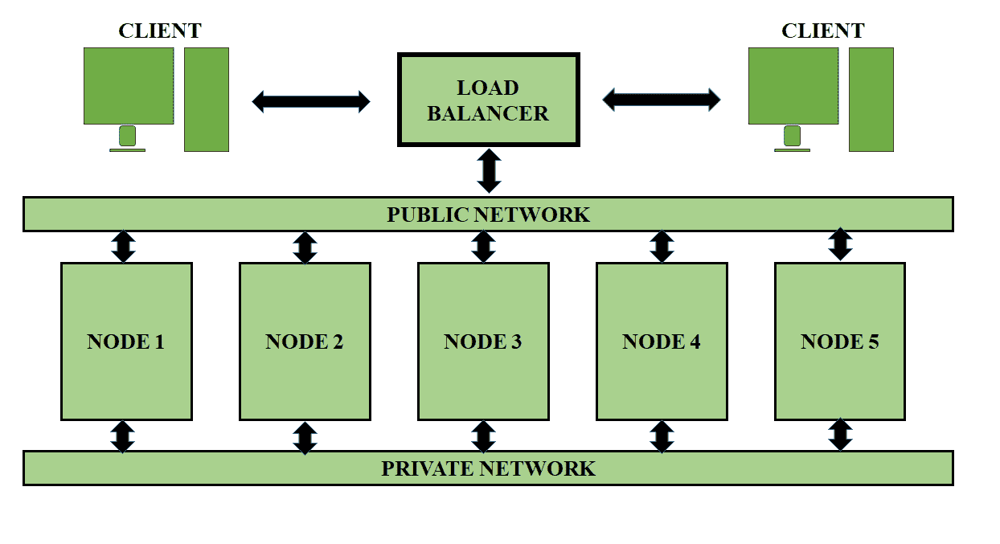

# 惠普 Vertica 中的查询执行

> 原文：[https://www.geeksforgeeks.org/query-execution-in-hp-vertica/](https://www.geeksforgeeks.org/query-execution-in-hp-vertica/)

## 查询计划概述

SQL 查询是针对表编写的。为了执行查询，`Vertica` 数据库生成`查询计划`。`查询计划`是用于确定每个步骤的执行路径与资源成本的步骤序列。`查询计划`中每一步计算的成本是对所用资源的估计，如下所示：

*   数据分布统计
*   磁盘空间
*   网络带宽
*   中央处理器速度
*   跨集群的数据分割

## 查询执行过程

当您提交查询时，`发起者`选择要使用的预测，优化和计划查询执行。规划和优化很快，最多需要几毫秒。

基于所选的预测，优化器生成的`查询计划`被分解为`小计划`。这些`小计划`被分发到其他节点，称为`执行者`。节点并行处理`微型计划`，中间穿插数据移动操作。

查询执行继续进行，中间结果集（行）根据需要流经节点之间的网络连接。

## 最后阶段的工作

在执行`查询计划`的最后阶段，一些总结工作在`发起者`处完成，例如：

*   在分组操作中组合结果
*   合并来自所有`执行器`的多个排序的部分结果集
*   格式化结果以返回客户端

一些小查询，例如对复制维度表的查询，可以在本地执行。在这些类型的查询中，查询规划避免了不必要的网络通信。