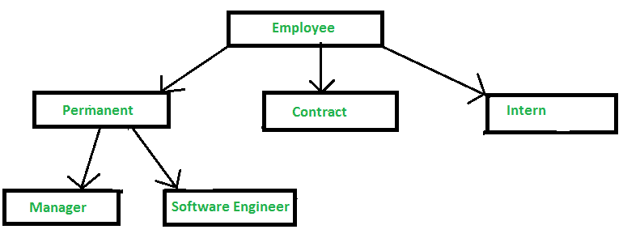
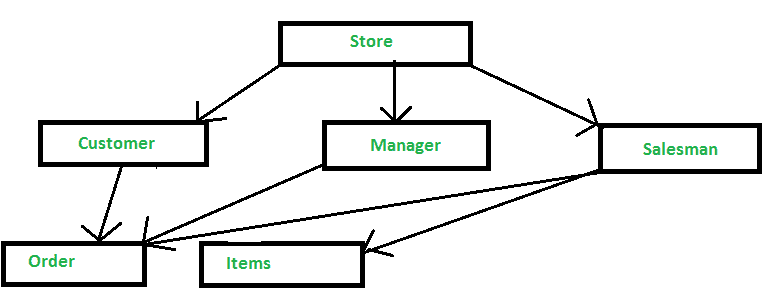
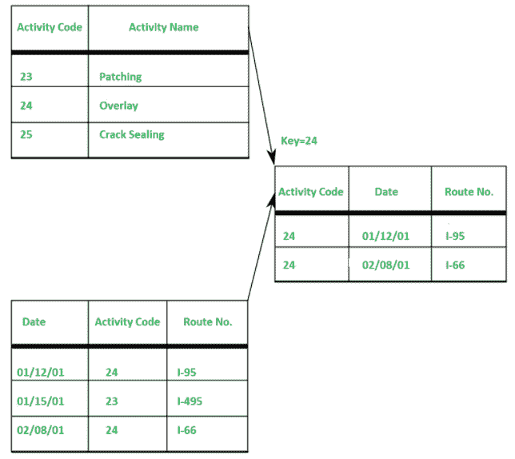

# 基于记录的数据模型

> 原文：[`https://www.geeksforgeeks.org/record-based-data-model/`](https://www.geeksforgeeks.org/record-based-data-model/)

[`数据模型`](https://www.geeksforgeeks.org/data-models-in-dbms/)是组织数据元素并告诉它们如何相互关联以及与现实世界实体的属性关联的模型。数据模型的基本目的是确保存储在数据模型中的数据被完全理解。

此外，它有三种类型：

1.  Physical Data Model
2.  Record-Based Data Model
3.  Object-Oriented Data Model

物理数据模型现在已经不常使用了。在此，我们将详细研究`基于记录的数据模型`。

## 基于记录的数据模型

当[`数据库`](https://www.geeksforgeeks.org/what-is-database/)是以某种固定格式组织的几条记录时，这种模型被称为基于记录的数据模型。在每种记录类型中，它都有固定数量的字段或属性，并且每个字段通常都有固定的长度。

此外，它被分为三种类型：

### 1. Hierarchical Data Model

在分层类型中，模型数据由记录集合表示。其中，数据之间的关系由链接表示。在此模型中，使用了树形数据结构。

它是由`IBM`在20世纪60年代开发的，用于管理复杂制造项目的大量数据。分层数据模型的基本逻辑结构是上下颠倒的“树”。

**优势：**
简单性、数据完整性、数据安全性、效率、易于获得专业知识。

**缺点：**
复杂、不灵活、缺乏数据独立性、缺乏查询工具、[`数据操作语言`](https://www.geeksforgeeks.org/dml-full-form/)、缺乏标准。

### 2. Network Data Model

在网络类型中，模型数据由记录集合表示。其中，数据之间的关系由链接表示。此模型中使用了图数据结构。它允许一个记录有多个父节点。

例如，像`Facebook`、`Instagram`等社交媒体网站。

**优势：**
简单性、数据完整性、数据独立性、数据库标准。

**缺点：**
系统复杂，缺乏结构独立性。

### 3. Relational Data Model

关系数据模型使用表来表示数据以及这些数据之间的关系。每个表都有多个列，每列由一个唯一的名称标识。它是一个低级模型。

**优势：**
结构独立、简单、易于设计、实现、特别查询能力。

**缺点：**
硬件开销，设计容易导致设计不良。