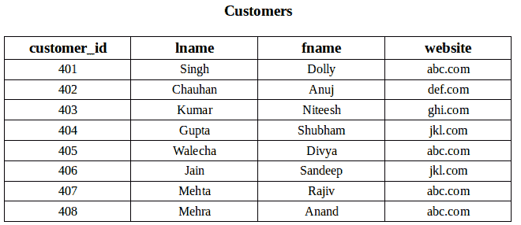
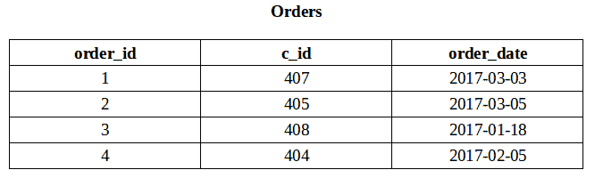
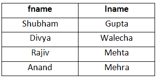
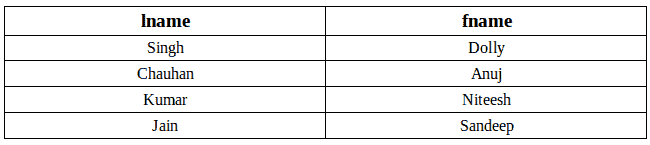
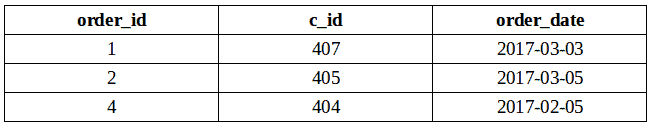
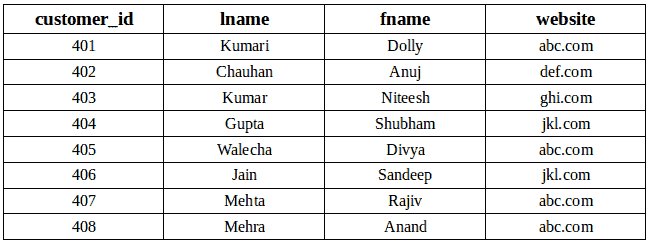

# SQL | EXISTS

> 原文: [https://www.geeksforgeeks.org/sql-exists/](https://www.geeksforgeeks.org/sql-exists/)

SQL 中的 `EXISTS` 条件用于检查相关嵌套查询的结果是否为空（不包含元组）。`EXISTS` 的结果是布尔值“真”或“假”。它可以用在 `SELECT`、`UPDATE`、`INSERT` 或 `DELETE` 语句中。

## 语法

```sql
SELECT column_name(s) 
FROM table_name
WHERE EXISTS 
  (SELECT column_name(s) 
   FROM table_name
   WHERE condition);
```

## 示例

考虑以下两种关系“客户”（`Customers`）和“订单”（`Orders`）。



### 1. 在 SELECT 语句中使用 EXISTS 条件

获取至少下过一次订单的客户的姓名。

```sql
SELECT fname, lname 
FROM Customers 
WHERE EXISTS (SELECT * 
              FROM Orders 
              WHERE Customers.customer_id = Orders.c_id);
```

输出:


### 2. 与 NOT 一起使用 EXISTS

获取尚未下过任何订单的客户的姓名。

```sql
SELECT lname, fname
FROM Customers
WHERE NOT EXISTS (SELECT * 
                  FROM Orders 
                  WHERE Customers.customer_id = Orders.c_id);
```

输出:


### 3. 在 DELETE 语句中使用 EXISTS 条件

从订单表（`Orders`）中删除所有姓氏为 ‘Mehra’ 的客户的记录。

```sql
DELETE 
FROM Orders
WHERE EXISTS (SELECT *
              FROM Customers
              WHERE Customers.customer_id = Orders.cid
              AND Customers.lname = 'Mehra');
```

```sql
SELECT * FROM Orders;
```

输出:


### 4. 在 UPDATE 语句中使用 EXISTS 条件

将客户表（`Customers`）中 `customer_id` 为 401 的客户的姓氏更新为 ‘Kumari’。

```sql
UPDATE Customers
SET lname = 'Kumari'
WHERE EXISTS (SELECT *
              FROM Customers
              WHERE customer_id = 401);
```

```sql
SELECT * FROM Customers;
```

输出:


本文由 **[Anuj Chauhan](https://www.facebook.com/anuj0503)** 供稿。如果你喜欢 GeeksforGeeks 并想投稿，你也可以使用 [contribute.geeksforgeeks.org](http://www.contribute.geeksforgeeks.org) 写一篇文章或者把你的文章邮寄到 `contribute@geeksforgeeks.org`。看到你的文章出现在极客博客主页上，帮助其他极客。

如果你发现任何不正确的地方，或者你想分享更多关于上面讨论的话题的信息，请写评论。