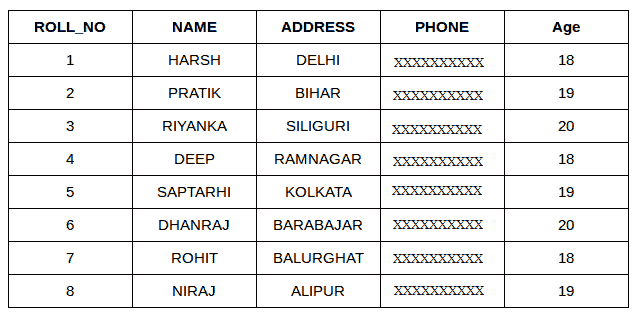
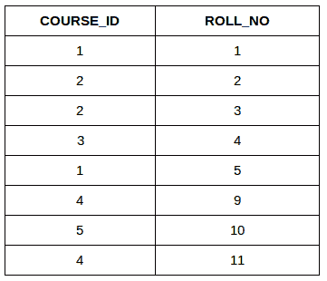
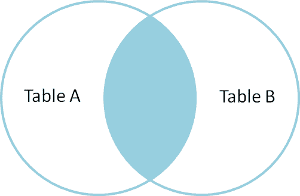
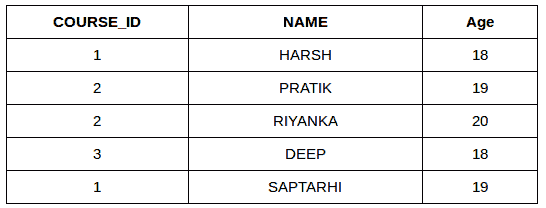
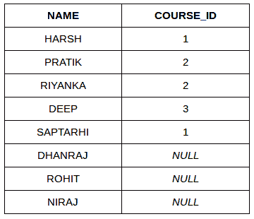
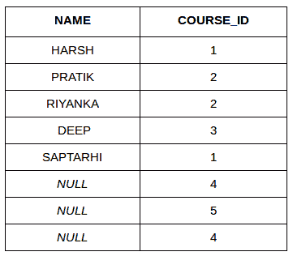
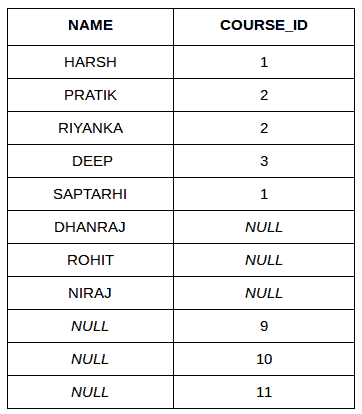

# SQL | 联接（内部、左侧、右侧和完全联接）

> 原文：[https://www.geeksforgeeks.org/sql-join-set-1-inner-left-right-and-full-joins/](https://www.geeksforgeeks.org/sql-join-set-1-inner-left-right-and-full-joins/)

SQL Join 语句用于根据两个或多个表之间的公共字段组合它们的数据或行。不同类型的连接有：

*   内部连接
*   左连接
*   右连接
*   完全连接

考虑下面的两个表格：

**学生**

[](https://media.geeksforgeeks.org/wp-content/cdn-uploads/table1-3.png)

**学生课程**

[](https://media.geeksforgeeks.org/wp-content/uploads/table5.png)

最简单的连接是内部连接。

## 1. INNER JOIN

`INNER JOIN` 关键字从两个表中选取所有满足条件的行。该关键字将通过组合两个表中满足条件（即公共字段的值相同）的所有行来创建结果集。

**语法**：

```sql
SELECT table1.column1, table1.column2, table2.column1, ...
FROM table1
INNER JOIN table2
ON table1.matching_column = table2.matching_column;
```

*   `table1`：第一张表。
*   `table2`：第二张表。
*   `matching_column`：两个表共有的列。

**注**：我们也可以写 `JOIN` 代替 `INNER JOIN`。`JOIN` 与 `INNER JOIN` 相同。



**示例查询（内部连接）**

*   此查询将显示选修不同课程的学生的姓名和年龄。

```sql
SELECT StudentCourse.COURSE_ID, Student.NAME, Student.AGE FROM Student
INNER JOIN StudentCourse
ON Student.ROLL_NO = StudentCourse.ROLL_NO;
```

**输出**：

[](https://media.geeksforgeeks.org/wp-content/uploads/table22.png)

## 2. LEFT JOIN

此连接返回连接中左侧表的所有行，以及右侧表的匹配行。对于右侧没有匹配行的行，结果集将包含 `null`。`LEFT JOIN` 也称为 `LEFT OUTER JOIN`。

**语法**：

```sql
SELECT table1.column1, table1.column2, table2.column1, ...
FROM table1
LEFT JOIN table2
ON table1.matching_column = table2.matching_column;
```

*   `table1`：第一张表。
*   `table2`：第二张表。
*   `matching_column`：两个表共有的列。

**注**：我们也可以用 `LEFT OUTER JOIN` 代替 `LEFT JOIN`，两者相同。

[](https://i.stack.imgur.com/VkAT5.png)

**示例查询（左连接）**：

```sql
SELECT Student.NAME, StudentCourse.COURSE_ID
FROM Student
LEFT JOIN StudentCourse
ON StudentCourse.ROLL_NO = Student.ROLL_NO;
```

**输出**：

[](https://media.geeksforgeeks.org/wp-content/uploads/table31.png)

## 3. RIGHT JOIN

`RIGHT JOIN` 类似于 `LEFT JOIN`。此连接返回连接中右侧表的所有行，以及左侧表的匹配行。对于左侧没有匹配行的行，结果集将包含 `null`。`RIGHT JOIN` 也称为 `RIGHT OUTER JOIN`。

**语法**：

```sql
SELECT table1.column1, table1.column2, table2.column1, ...
FROM table1
RIGHT JOIN table2
ON table1.matching_column = table2.matching_column;
```

*   `table1`：第一张表。
*   `table2`：第二张表。
*   `matching_column`：两个表共有的列。

**注**：我们也可以用 `RIGHT OUTER JOIN` 代替 `RIGHT JOIN`，两者相同。

**示例查询（右连接）**：

```sql
SELECT Student.NAME, StudentCourse.COURSE_ID
FROM Student
RIGHT JOIN StudentCourse
ON StudentCourse.ROLL_NO = Student.ROLL_NO;
```

**输出**：

[](https://media.geeksforgeeks.org/wp-content/uploads/table6.png)

## 4. FULL JOIN

`FULL JOIN` 通过组合 `LEFT JOIN` 和 `RIGHT JOIN` 的结果来创建结果集。结果集将包含两个表中的所有行。对于没有匹配的行，结果集将包含 `NULL` 值。

**语法**：

```sql
SELECT table1.column1, table1.column2, table2.column1, ...
FROM table1
FULL JOIN table2
ON table1.matching_column = table2.matching_column;
```

*   `table1`：第一张表。
*   `table2`：第二张表。
*   `matching_column`：两个表共有的列。


**示例查询（完全连接）**：

```sql
SELECT Student.NAME, StudentCourse.COURSE_ID
FROM Student
FULL JOIN StudentCourse
ON StudentCourse.ROLL_NO = Student.ROLL_NO;
```

**输出**：

[](https://media.geeksforgeeks.org/wp-content/uploads/table7.png)

[左 JOIN（视频）](https://youtu.be/LCbO2U3jzU0)
[右 JOIN（视频）](https://youtu.be/JOAe-yua6Jw)
[全 JOIN（视频）](https://youtu.be/WmqAKSBupsE)
[SQL | JOIN（笛卡尔 JOIN，Self Join）](https://www.geeksforgeeks.org/sql-join-cartesian-join-self-join/)

本文由 [**哈什·阿加瓦尔**](https://www.facebook.com/harsh.agarwal.16752) 供稿。如果你喜欢 GeeksforGeeks 并想投稿，你也可以使用 [contribute.geeksforgeeks.org](http://www.contribute.geeksforgeeks.org) 写一篇文章或者把你的文章邮寄到 `contribute@geeksforgeeks.org`。看到你的文章出现在极客博客主页上，帮助其他极客。

如果你发现任何不正确的地方，或者你想分享更多关于上面讨论的话题的信息，请写评论。