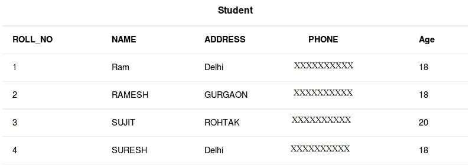

# SQL 选择查询

> 原文: [https://www.geeksforgeeks.org/sql-select-query/](https://www.geeksforgeeks.org/sql-select-query/)

`SELECT` 是 SQL 中最常用的语句。SQL 中的 `SELECT` 语句用于从数据库中检索或获取数据。我们可以获取整个表，也可以根据特定的规则获取。返回的数据存储在结果表中。这个结果表也被称为结果集。

使用 `SELECT` 命令语句的 `SELECT` 子句，我们可以指定要在查询结果中显示的列，还可以选择在结果表上方显示哪些列标题。

`SELECT` 子句是数据库服务器计算的 `SELECT` 语句的第一个子句，也是最后一个子句之一。这样做的原因是，在我们能够确定最终结果集中包含什么之前，我们需要知道最终结果集中可能包含的所有可能的列。

## 样表

[](https://media.geeksforgeeks.org/wp-content/cdn-uploads/table.jpg)

## 基本语法

```sql
SELECT column1, column2 FROM table_name;
```

- `column1`, `column2`: 表的字段名。
- `table_name`: 我们要从中获取数据的表。

该查询将返回表中包含字段 `column1`、`column2` 的所有行。

- 要获取整个表或表中的所有字段：

```sql
SELECT * FROM table_name;
```

- 查询从表 `Student` 中获取字段 `ROLL_NO`, `NAME`, `AGE`：

```sql
SELECT ROLL_NO, NAME, AGE FROM Student;
```

输出：

| **ROLL_NO** | **NAME** | **AGE** |
| :--- | :--- | :--- |
| 1 | RAM | 18 |
| 2 | RAMESH | 18 |
| 3 | SUJIT | 20 |
| 4 | SURESH | 18 |

- 从表 `Student` 中获取所有字段：

```sql
SELECT * FROM Student;
```

输出：

| **ROLL_NO** | **NAME** | **ADDRESS** | **PHONE** | **AGE** |
| :--- | :--- | :--- | :--- | :--- |
| 1 | RAM | Delhi | XXXXXXXXXX | 18 |
| 2 | RAMESH | Gurgaon | XXXXXXXXXX | 18 |
| 3 | SUJIT | Rohtak | XXXXXXXXXX | 20 |
| 4 | SURESH | Delhi | XXXXXXXXXX | 18 |

本文由 [**哈什·阿加瓦尔**](https://www.facebook.com/harsh.agarwal.16752) 供稿。如果你喜欢 GeeksforGeeks 并想投稿，你也可以使用 [contribute.geeksforgeeks.org](http://www.contribute.geeksforgeeks.org) 写一篇文章或者把你的文章邮寄到 `contribute@geeksforgeeks.org`。看到你的文章出现在极客博客主页上，帮助其他极客。

如果你发现任何不正确的地方，或者你想分享更多关于上面讨论的话题的信息，请写评论。