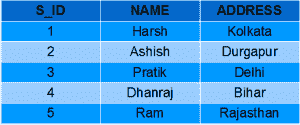
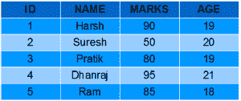
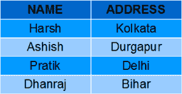
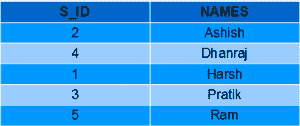
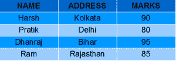
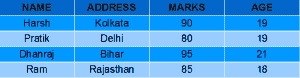
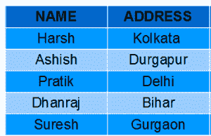

# SQL 视图

> 原文: [https://www.geeksforgeeks.org/sql-views/](https://www.geeksforgeeks.org/sql-views/)

SQL 中的视图是一种虚拟表。视图也有行和列，就像数据库中的真实表一样。我们可以通过从数据库中的一个或多个表中选择字段来创建视图。视图可以包含表的所有行，也可以包含基于特定条件的特定行。

在本文中，我们将学习如何创建、删除和更新视图。

## 样表

学生详细信息

[](https://media.geeksforgeeks.org/wp-content/uploads/Screenshot-57.png)

学生成绩

[](https://media.geeksforgeeks.org/wp-content/uploads/Screenshot-58.png)

## 创建视图

我们可以使用 `CREATE VIEW` 语句创建视图。可以从单个表或多个表创建视图。

### 语法

```sql
CREATE VIEW view_name AS
SELECT column1, column2.....
FROM table_name
WHERE condition;
```

- `view_name`: 视图的名称
- `table_name`: 表的名称
- `condition`: 选择行的条件

### 示例

#### 从单个表创建视图

在此示例中，我们将从表 `StudentDetails` 创建一个名为 `DetailsView` 的视图。

查询：

```sql
CREATE VIEW DetailsView AS
SELECT NAME, ADDRESS
FROM StudentDetails
WHERE S_ID < 5;
```

要查看视图中的数据，我们可以像查询表一样查询视图。

```sql
SELECT * FROM DetailsView;
```

输出：
[](https://media.geeksforgeeks.org/wp-content/uploads/Screenshot-571.png)

在此示例中，我们将从表 `StudentDetails` 创建一个名为 `StudentNames` 的视图。

查询：

```sql
CREATE VIEW StudentNames AS
SELECT S_ID, NAME
FROM StudentDetails
ORDER BY NAME;
```

如果我们现在查询该视图：

```sql
SELECT * FROM StudentNames;
```

输出：
[](https://media.geeksforgeeks.org/wp-content/uploads/Screenshot-64.png)

#### 从多个表创建视图

在此示例中，我们将从两个表 `StudentDetails` 和 `StudentMarks` 创建一个名为 `MarksView` 的视图。要从多个表创建视图，我们只需在 `SELECT` 语句中包含多个表即可。

查询：

```sql
CREATE VIEW MarksView AS
SELECT StudentDetails.NAME, StudentDetails.ADDRESS, StudentMarks.MARKS
FROM StudentDetails, StudentMarks
WHERE StudentDetails.NAME = StudentMarks.NAME;
```

要显示视图 `MarksView` 的数据：

```sql
SELECT * FROM MarksView;
```

输出：
[](https://media.geeksforgeeks.org/wp-content/uploads/Screenshot-591.png)

## 删除视图

我们已经了解了如何创建视图，但是如果不再需要已创建的视图怎么办？显然我们会想要删除它。SQL 允许我们删除现有的视图。我们可以使用 `DROP` 语句删除视图。

### 语法

```sql
DROP VIEW view_name;
```

- `view_name`: 我们想要删除的视图的名称。

例如，如果我们想删除视图 `MarksView`，我们可以这样做：

```sql
DROP VIEW MarksView;
```

## 更新视图

更新视图需要满足某些条件。如果这些条件中的任何一个**不满足**，那么我们将不被允许更新视图。

1.  用于创建视图的 `SELECT` 语句不应包含 `GROUP BY` 子句或 `ORDER BY` 子句。
2.  `SELECT` 语句不应该有 `DISTINCT` 关键字。
3.  视图应该具有所有非空值。
4.  不应使用嵌套查询或复杂查询创建视图。
5.  应该从单个表创建视图。如果视图是使用多个表创建的，那么我们将不被允许更新视图。

### 使用 CREATE OR REPLACE VIEW

我们可以使用 `CREATE OR REPLACE VIEW` 语句在视图中添加或删除字段。

语法：

```sql
CREATE OR REPLACE VIEW view_name AS
SELECT column1, column2,..
FROM table_name
WHERE condition;
```

例如，如果我们想更新视图 `MarksView` 并将字段 `AGE` 从 `StudentMarks` 表添加到该视图中，我们可以这样做：

```sql
CREATE OR REPLACE VIEW MarksView AS
SELECT StudentDetails.NAME, StudentDetails.ADDRESS, StudentMarks.MARKS, StudentMarks.AGE
FROM StudentDetails, StudentMarks
WHERE StudentDetails.NAME = StudentMarks.NAME;
```

如果我们现在从 `MarksView` 获取所有数据，如下所示：

```sql
SELECT * FROM MarksView;
```

输出：
[](https://media.geeksforgeeks.org/wp-content/uploads/Screenshot-60.png)

### 在视图中插入行

我们可以像在表中一样在视图中插入一行。我们可以使用 SQL 的 `INSERT INTO` 语句在视图中插入一行。

语法：

```sql
INSERT INTO view_name(column1, column2, column3,..) 
VALUES(value1, value2, value3..);
```

- `view_name`: 视图的名称

示例：
在下面的示例中，我们将在视图 `DetailsView` 中插入一个新行，该视图是我们在上面的“从单个表创建视图”示例中创建的。

```sql
INSERT INTO DetailsView(NAME, ADDRESS)
VALUES("Suresh","Gurgaon");
```

如果我们现在从 `DetailsView` 中获取所有数据：

```sql
SELECT * FROM DetailsView;
```

输出：
[](https://media.geeksforgeeks.org/wp-content/uploads/Screenshot-62.png)

### 从视图中删除行

从视图中删除行与从表中删除行一样简单。我们可以使用 SQL 的 `DELETE` 语句从视图中删除行。此外，从视图中删除行会先从实际表中删除该行，然后更改才会反映在视图中。

语法：

```sql
DELETE FROM view_name
WHERE condition;
```

- `view_name`: 我们想要从中删除行的视图的名称
- `condition`: 选择行的条件

示例：
在本例中，我们将从视图 `DetailsView` 中删除最后一行，该视图是我们在上面插入行的示例中刚刚添加的。

```sql
DELETE FROM DetailsView
WHERE NAME="Suresh";
```

如果我们现在从 `DetailsView` 中获取所有数据：

```sql
SELECT * FROM DetailsView;
```

输出：
[](https://media.geeksforgeeks.org/wp-content/uploads/Screenshot-571.png)

## 带检查选项

SQL 中的 `WITH CHECK OPTION` 子句对于视图来说是一个非常有用的子句。它适用于可更新的视图。如果视图不可更新，那么在 `CREATE VIEW` 语句中包含这个子句就没有任何意义。

- `WITH CHECK OPTION` 子句用于防止在视图中插入不满足 `CREATE VIEW` 语句中 `WHERE` 子句条件的行。
- 如果我们在 `CREATE VIEW` 语句中使用了 `WITH CHECK OPTION` 子句，并且如果 `UPDATE` 或 `INSERT` 语句不满足条件，那么它们将返回一个错误。

示例：
在下面的示例中，我们使用带有检查选项子句的 `StudentDetails` 表创建了一个视图 `SampleView`。

```sql
CREATE VIEW SampleView AS
SELECT S_ID, NAME
FROM  StudentDetails
WHERE NAME IS NOT NULL
WITH CHECK OPTION;
```

在此视图中，如果我们现在尝试在 `NAME` 列中插入一个空值的新行，那么它将给出一个错误，因为该视图是在 `NAME` 列的条件为 `NOT NULL` 的情况下创建的。
例如，虽然视图是可更新的，但是下面对该视图的查询也是无效的：

```sql
INSERT INTO SampleView(S_ID)
VALUES(6);
```

**注**: `NAME` 列默认值为 `NULL`。

## 视图的用途

由于以下原因，一个好的数据库应该包含视图：

1.  **限制数据访问** – 视图通过限制对表的一组预定行和列的访问，提供了额外的表安全级别。
2.  **隐藏数据复杂性** – 视图可以隐藏多表连接中存在的复杂性。
3.  **为用户简化命令** – 视图允许用户从多个表中选择信息，而不需要用户实际知道如何执行连接。
4.  **存储复杂查询** – 视图可用于存储复杂查询。
5.  **重命名列** – 视图也可以用于重命名列，而不会影响基表，前提是视图中的列数必须与 `SELECT` 语句中指定的列数相匹配。因此，重命名有助于隐藏基表的列名。
6.  **多视图工具** – 可以为不同的用户在同一张表上创建不同的视图。

本文由 [**哈什·阿加瓦尔**](https://www.facebook.com/harsh.agarwal.16752) 供稿。如果你喜欢 GeeksforGeeks 并想投稿，你也可以使用 [contribute.geeksforgeeks.org](http://www.contribute.geeksforgeeks.org) 写一篇文章或者把你的文章邮寄到 contribute@geeksforgeeks.org。看到你的文章出现在极客博客主页上，帮助其他极客。

如果你发现任何不正确的地方，或者你想分享更多关于上面讨论的话题的信息，请写评论。