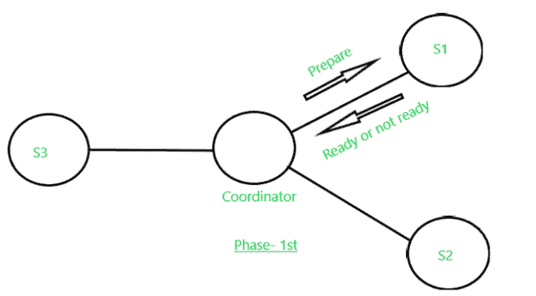
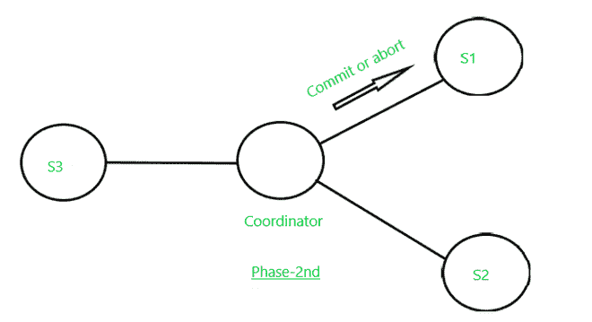

# 两阶段提交协议(分布式事务管理)

> 原文: [https://www.geeksforgeeks.org/two-phase-commit-protocol-distributed-transaction-management/](https://www.geeksforgeeks.org/two-phase-commit-protocol-distributed-transaction-management/)

假设我们有一组杂货店，其中所有商店的负责人都想查询所有商店的可用消毒剂库存，以便将库存从一个商店转移到另一个商店，从而平衡所有商店的消毒剂库存数量。该任务通过单个交易 `T` 执行，即在 `n` 商店的组件 `T_n`，以及与经理所在的 `T_0` 相对应的商店 `S_0`。由 `T` 执行的下列活动顺序如下:

**a)** 交易组件 `(T) T_0` 在总部(总公司)创建。

**b)** `T_0` 向所有商店发送消息，要求他们创建组件 `T_i`。

**c)** 每隔 `T_i` (在店内) `I` 执行一次查询，以发现可用消毒剂库存数量，并将该数量报告给 `T_0`。

**d)** 各门店收到指令，更新库存水平，并在需要时发货至其他门店。

但是在这个过程的执行过程中，我们可能会面临一些问题:

**1)** 原子性属性可能被违反，因为任何商店 (`S_n`) 可能被指示两次发送可能使数据库处于不一致状态的库存。为了确保原子性，属性事务必须在所有站点提交，或者必须在所有站点中止。

**2)** 但是 `T_n` 店的系统可能会死机，来自 `T_0` 的指令由于任何网络问题和任何其他原因 `T_n` 都不会收到。那么问题来了，分布式事务运行时会发生什么，是中止还是提交？是否恢复？

## 两阶段提交协议

该协议设计的核心意图是解决上述问题，假设我们有多个分布式数据库，这些数据库从不同的服务器(站点)运行假设 `S_1`，`S_2`，`S_3`，…，`S_n`。其中每一个 `S_i` 对所有相应的活动和转换进行单独的日志记录 `T` 也被分为子转换 `T_1`，`T_2`，`T_3`，…，`T_n` 和各 `T_i` 被分配给 `S_i`。所有这些都由每个 `S_i` 的独立事务管理器维护。我们指派任何人作为协调员。

### 关于本协议需要考虑的几点

**a)** 在两阶段提交中，我们假设每个站点记录该站点的操作，但没有全局日志。

**b)** 协调器 (`C_i`) 在确认分布式事务将中止还是提交方面起着至关重要的作用。

**c)** 在这个协议中消息在协调器 (`C_i`) 和其他站点之间发送。发送每条消息时，都会在每个发送站点记录其日志，以便在必要时进行恢复。

### 本协议的两个阶段如下

## 第一阶段

**a)** 首先，协调人 (`C_i`) 将一个日志记录 `<准备 T>` 放在其现场的日志记录上。

**b)** 然后，协调器 (`C_i`) 向执行交易 (`T`) 的所有站点发送 `准备 T` 消息。

**c)** 每个站点的事务管理器在收到此消息时 `准备 T` 决定是提交还是中止其组件(部分)`T`。如果组件尚未完成其活动，站点可以延迟，但最终必须发送响应。

**d)** 如果站点不想提交，那么必须在日志记录上写 `<no T>`，本地事务管理器发送消息 `中止 T` 到 `C_i`。

**e)** 如果站点要提交，必须在日志记录上写 `<ready T>`，本地事务管理器发送消息 `ready T` 给 `C_i`。一旦 `C_i` 处的 `就绪 T` 消息被发送后，除了协调器 (`C_i`) 之外，没有什么可以阻止它提交其部分事务 `T`。

**第一阶段的消息传递**

## 第二阶段

第二阶段开始于从所有协同执行事务 `T` 的站点接收到协调器 (`C_i`) 的响应 `中止 T` 或 `提交 T`。然而，有可能某些站点没有响应；它可能已关闭，或者已被网络断开。在这种情况下，在给出一个合适的超时时间后，它会将该站点视为已经发送了 `中止测试`。交易的结果取决于以下几点:

**a)** 如果协调器从 `T` 的所有参与站点接收到 `就绪 T`，则它决定 `提交 T`。然后，协调器在其站点日志记录中写入 `<提交测试>`，并向测试中涉及的所有站点发送消息 `提交测试`

**b)** 如果某个站点收到 `提交 T` 消息，则该站点提交 `T` 的组件，并将其写入日志记录 `<提交 T>` 中。

**c)** 如果站点收到 `中止 T` 的消息，则中止 `T` 并写入日志记录 `<中止 T>`。

**d)** 然而，如果协调器已经从一个或多个站点接收到 `中止 T`，则它在其站点记录 `<中止 T>`，然后将 `中止 T` 消息发送到事务 `T` 中涉及的所有站点

**第二阶段消息传递**

## 劣势

**a)** 两阶段提交协议的主要缺点是当协调器站点故障可能导致阻塞时，因此提交或中止事务 (`T`) 的决定可能必须推迟，直到协调器恢复。

**b)** 阻塞问题: 考虑一个场景，如果一个事务 (`T`) 持有活动站点数据项的锁，但是在执行过程中，如果协调器出现故障，并且活动站点除了 `<` 之外没有保留额外的日志记录，则像 `<` 一样重新读取 `T` `中止>` 或 `<提交>`。所以，就变得无法确定做出了什么决定(是否 `<提交> / <中止>`)。因此，在这种情况下，最终决定被延迟，直到协调器被恢复或修复。在某些情况下，这可能需要一天或很长时间才能恢复，在此期间，锁定的数据项对于其他事务仍然不可访问 (`T_i`)。这个问题被称为阻塞问题。