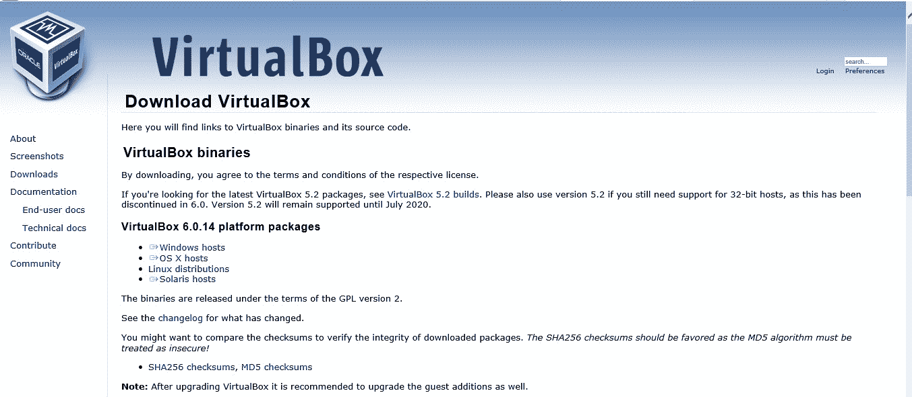
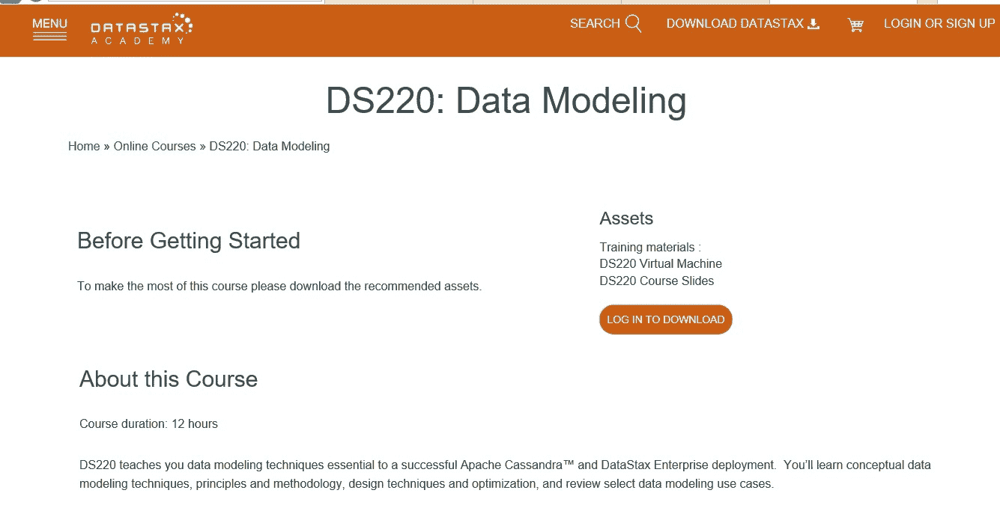
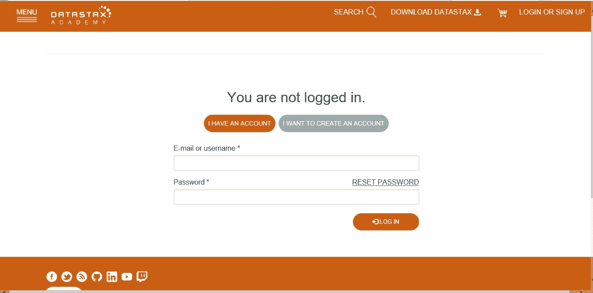
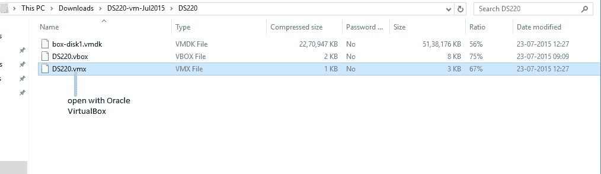
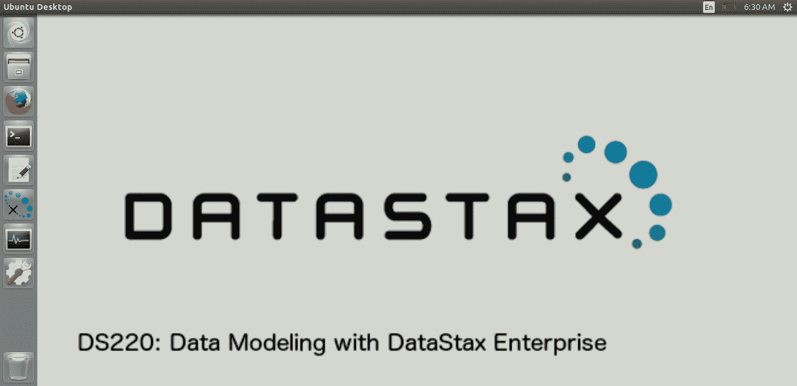
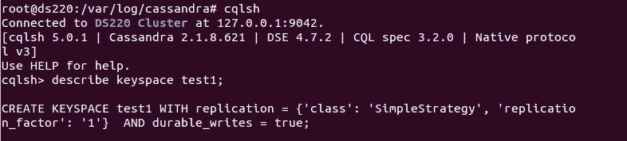

# 卡珊德拉 CQL 查询虚拟机安装

> 原文：[https://www.geeksforgeeks.org/virtual-machine-installation-for-cassandra-cql-query/](https://www.geeksforgeeks.org/virtual-machine-installation-for-cassandra-cql-query/)

在本文中，我们将讨论如何安装虚拟机来运行 Cassandra，并可以逐步执行 CQL 查询。遵循下面给出的步骤。

## Step-1:
首先下载并安装任意一个虚拟机。这里我们将讨论 Oracle Virtual Box。[下载 VirtualBox](https://www.virtualbox.org/wiki/Downloads)



`Figure –` Oracle VirtualBox

## 步骤-2:
安装 `VirtualBox` 后。去 DataStax Academy 下载 `DS220` 虚拟机。这里有一个链接可以转到 DataStax Academy `DS220` 课程。[DS220 数据建模课程](https://academy.datastax.com/resources/ds220-data-modeling)



`Figure –` DS220 DataStax Academy page

## Step-3:
登录以访问并下载 `DS220` 资源。如果您没有账户，请先创建账户，然后使用您的凭证登录。[DS220 登录页面](https://academy.datastax.com/user/login?destination=node/6102)



`Figure –` DS220 login page

## Step-4:
下载 `DS220` 资源后，您将获得诸如 `box-disk1.vmdk`、`DS220.vbox`、`DS220.vmx` 等文件，然后使用 Oracle Virtual Box 打开 `DS220.vmx` 文件。



`Figure –` DS220 resources

## 步骤-5:
使用 Oracle Virtual Box 打开 `DS220.vmx` 文件后。您将在 Oracle Virtual Box 中看到添加的 `DS220` 虚拟机。然后最后打开 `Virtual Box`，然后双击添加的 `DS220` 虚拟机。双击后，打开 Linux 虚拟机需要几分钟时间。忽略窗口顶部菜单栏上的一些弹出菜单。

## Step-6:
最后，Linux 窗口虚拟机将会打开。让我们看一看。



`Figure –` Linux virtual machine with cqlsh

## Step-7:
现在打开终端，并使用以下命令更改目录。

```
cd /var/log/Cassandra
```

为了打开 `cqlsh` shell，使用了下面的 CQL 查询。

```
cqlsh
```

让我们看看，



`Figure –` connect to cqlsh

**注意：** 如果您对上述步骤有任何问题，请用描述来评论您的问题，我会尽力解决您的问题。