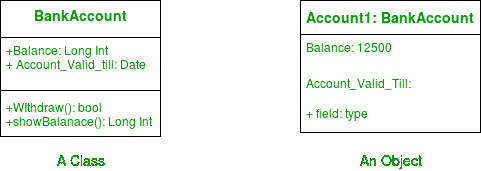
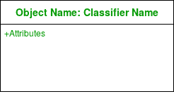
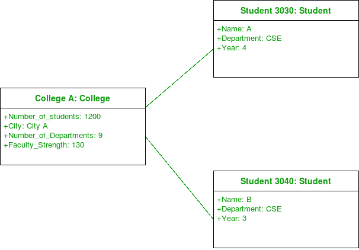
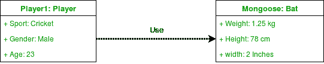
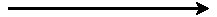
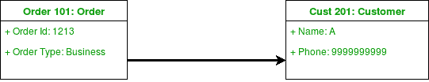
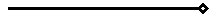
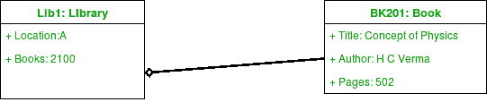
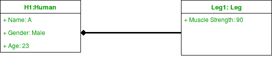

# 统一建模语言(UML) |对象图

> 原文：[https://www.geeksforgeeks.org/unified-modeling-language-uml-object-diagrams/](https://www.geeksforgeeks.org/unified-modeling-language-uml-object-diagrams/)

一个`对象图`可以被称为系统中的实例以及它们之间存在的关系的截图。因为对象图描述了对象被实例化时的行为，所以我们能够研究系统在特定时刻的行为。对象图对于描述和理解系统的功能需求至关重要。
换句话说，“统一建模语言(UML)中的对象图”，是显示在特定时间建模的系统的结构的完整或部分视图的图。

## 对象和类图的区别

对象图类似于类图，只是它显示了系统中类的实例。我们利用类图来描述实际的分类器及其关系。另一方面，对象图表示特定时间点的类的具体实例以及它们之间的关系。

## 什么是量词？

在 UML 中，分类器指的是一组具有一些共同特征的元素，比如方法、属性和操作。分类器可以被认为是一个抽象的元类，它为一组具有共同静态和动态特征的实例划定了边界。例如，我们在 UML 中将类、对象、组件或部署节点称为分类器，因为它们定义了一组公共属性。

对象图是一种结构图，它使用类似于类图的符号。我们能够通过实例化分类器来设计对象图。

`对象图`使用真实世界示例来描绘特定时间点的系统的性质和结构。由于我们能够使用对象中可用的数据，对象图提供了对象之间存在的关系的更清晰的视图。

图 – 一个类及其对应的对象

## 对象图中使用的符号

### 1. 对象或实例规格说明

当我们在系统中实例化一个分类器时，我们创建的对象代表一个存在于系统中的实体。我们可以通过创建多个实例规格说明来表示对象随时间的变化。我们使用矩形来表示对象图中的一个对象。一个对象通常在对象图中链接到其他对象。

图 – 物体的符号

例如 – 在下图中，学生类的两个对象链接到学院类的一个对象。

图 – 使用一个链接和 3 个对象的对象图

### 2. 链接

我们使用链接来表示两个对象之间的关系。

图 – 链接符号

我们代表链接两端的参与者人数。我们使用术语关联来表示两个分类器之间的关系。术语链接用于指定两个实例规范或对象之间的关系。我们用实线来表示两个物体之间的联系。

| 注释 | 意义 |
| --- | --- |
| `0..1` | 零还是一 |
| `one` | 只有一个 |
| `0..*` | 零或更多 |
| `*` | 零或更多 |
| `1..*` | 一个或多个 |
| `seven` | 只有七个 |
| `0..2` | 零或两个 |
| `4..7` | 四点到七点 |

### 3. 依赖关系

我们使用依赖关系来显示一个元素何时依赖于另一个元素。

图 – 为依存关系的符号

类图、组件图、部署图和对象图使用依赖关系。依赖关系用于描述系统中依赖实体和独立实体之间的关系。一个元素的定义或结构的任何变化都可能导致另一个元素的变化。这是两个对象之间的一种单向关系。
依赖关系是用关键字（有时在尖括号内）指定的各种类型。

抽象、绑定、实现、替换和使用是 UML 中使用的依赖关系类型。
例如 – 下图中，`Player` 类的一个对象依赖（或使用）`Bat` 类的一个对象。

图 – 使用依赖关系的对象图

### 4. 关联

关联是两个对象（或类）之间的引用关系。

图 – 为关联符号

每当一个对象使用另一个对象时，它就被称为关联。当一个对象引用另一个对象的成员时，我们使用关联。关联可以是单向的或双向的。我们用箭头表示联想。
例如 – `订单`类的对象与`客户`类的对象相关联。

图 – 使用关联的对象图

### 5. 聚合

聚合代表一种“拥有”关系。

图 – 表示聚合

聚合是一种特定的关联形式。聚合比普通关联更具体。这是一种代表部分整体或部分关系的关联。这是一种亲子关系，但不是继承。当所包含对象的生命周期不强烈依赖于容器对象的生命周期时，就会发生聚合。

图 – 使用聚合的对象图

例如 —— 图书馆与书籍有聚合关系。图书馆有书或者书是图书馆的一部分。书籍的存在独立于图书馆的存在。在实现时，聚合和关联之间没有太大区别。我们在包含对象上使用一个空心菱形，用一条线将它与包含的对象连接起来。

### 6. 组合

组合是一种关联类型，其中子对象不能独立于父对象而存在。

图 – 构图符号

组合也是一种特殊的关联。也是一种亲子关系，但不是继承。以一个男孩 Gurkaran 为例：Gurkaran 由腿和胳膊组成。在这里，古尔卡兰与他的腿和胳膊有一种构成关系。在这里，如果没有它们的父对象的存在，腿和手臂就不能存在。所以每当孩子不可能独立存在的时候，我们就用一种组合关系。我们在包含对象上使用一个填充菱形，用一条线将它连接到包含对象。

图 – 使用构图的物体图

例如 – 在下图中，考虑对象 `Bank1`。在这里，没有银行的存在，账户就不能存在。

图 – 银行是由账户组成的

## 关联和依赖的区别

关联和依赖在用法上经常混淆。混乱的一个来源是 UML 1 中临时链接的使用。元模型现在在 UML 2 中以不同的方式处理，这个问题已经解决了。

系统中有大量的依赖关系。我们只代表那些对理解系统至关重要的信息。我们需要明白，每一个关联本身都暗示着一种依赖。然而，我们不喜欢单独画它。关联意味着一种类似于一般化的依赖。

## 如何绘制对象图

1.  为系统绘制所有必要的类图。
2.  确定需要系统快照的关键时间点。
3.  确定涵盖系统关键功能的对象。
4.  确定绘制的对象之间的关系。

## 对象图的用途

*   使用原型实例和真实数据为系统的静态设计（类似于类图）或结构建模。
*   帮助我们理解系统应该向用户提供的功能。
*   理解对象之间的关系。
*   可视化、记录、构建和设计一个静态框架，展示系统生命动态故事中的对象实例及其关系。
*   通过使用对象图作为特定的测试用例来验证类图的完整性和准确性。
*   发现特定实例之间的事实和依赖关系，并描述分类器的特定示例。

本文由 [安基特·贾恩](https://www.facebook.com/profile.php?id=100000412091676) 供稿。如果你喜欢 GeeksforGeeks 并想投稿，你也可以使用 [contribute.geeksforgeeks.org](http://www.contribute.geeksforgeeks.org) 写一篇文章或者把你的文章邮寄到 `contribute@geeksforgeeks.org`。看到你的文章出现在极客博客主页上，帮助其他极客。

如果你发现任何不正确的地方，或者你想分享更多关于上面讨论的话题的信息，请写评论。